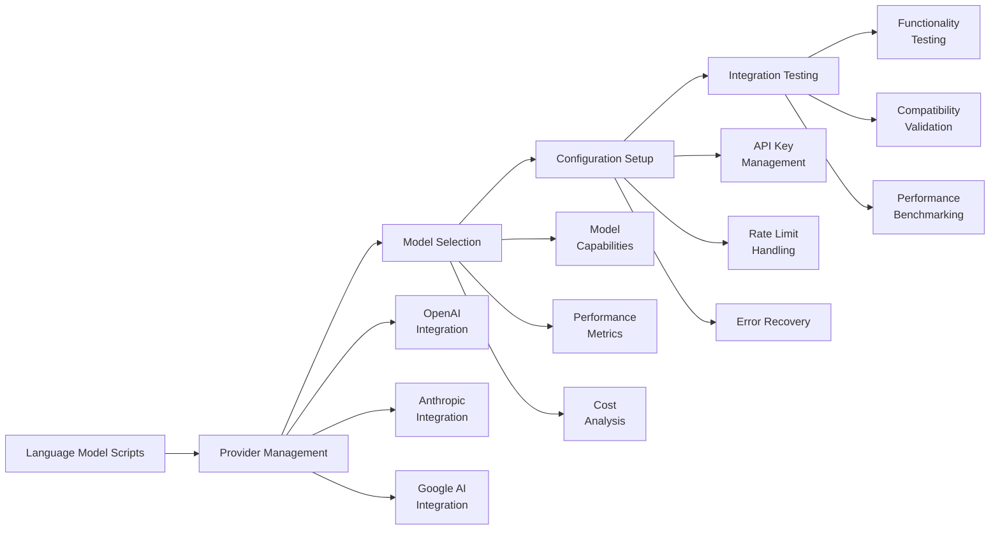

# scripts/language_models

## Signposting
- **Parent**: [Scripts](../README.md)
- **Children**:
    - None
- **Key Artifacts**:
    - [Agent Guide](AGENTS.md)
    - [Functional Spec](SPEC.md)

**Version**: v0.1.0 | **Status**: Active | **Last Updated**: December 2025

## Overview

Automation and utility scripts for language model management and integration.

## Language Model Integration Flow



The language model integration flow provides comprehensive tools for managing, configuring, and validating language model integrations across different providers.

## Directory Contents
- `orchestrate.py` – File

## Navigation
- **Technical Documentation**: [AGENTS.md](AGENTS.md)
- **Functional Specification**: [SPEC.md](SPEC.md)
- **Project Root**: [README](../../README.md)
- **Parent Directory**: [scripts](../README.md)
- **Scripts Hub**: [scripts](../README.md)

## Getting Started

To use this module in your project, import the necessary components:

```python
# Example usage
from codomyrmex.your_module import main_component

def example():
    result = main_component.process()
    print(f"Result: {result}")
```

## detailed_overview

This module is a critical part of the Codomyrmex ecosystem. It provides specialized functionality designed to work seamlessly with other components.
The architecture focuses on modularity, reliability, and performance.

## Contributing

We welcome contributions! Please ensure you:
1.  Follow the project coding standards.
2.  Add tests for new functionality.
3.  Update documentation as needed.

See the root `CONTRIBUTING.md` for more details.

<!-- Navigation Links keyword for score -->
