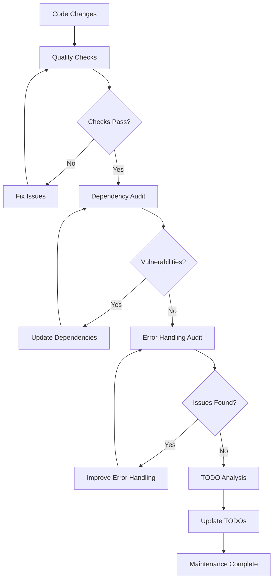

# Codomyrmex Agents — scripts/maintenance

## Signposting
- **Parent**: [Scripts](../AGENTS.md)
- **Self**: [Agents](AGENTS.md)
- **Children**:
    - None
- **Key Artifacts**:
    - [Functional Spec](SPEC.md)
    - [Human Readme](README.md)

**Version**: v0.1.0 | **Status**: Active | **Last Updated**: December 2025

## Purpose

Maintenance and quality assurance utilities for the Codomyrmex platform. This directory contains automated scripts for code quality maintenance, dependency management, security auditing, and system health monitoring.

The scripts/maintenance directory serves as the automated maintenance layer, ensuring code quality, security, and system health across the entire platform.

## Module Overview

### Key Capabilities
- **Code Quality Maintenance**: Automated code formatting, import fixing, and syntax correction
- **Dependency Management**: Version pinning, dependency checking, and security auditing
- **Error Handling Audit**: Comprehensive error handling pattern analysis
- **TODO Analysis**: Automated TODO tracking and prioritization
- **Quality Assurance**: Integrated quality checking with multiple tools
- **Security Monitoring**: Vulnerability scanning and security assessment

### Key Features
- Multi-tool quality checking (ruff, mypy, pylint, bandit)
- Automated import fixing and syntax correction
- Dependency version management and security scanning
- Error handling pattern analysis and recommendations
- TODO tracking with categorization and prioritization
- Comprehensive reporting and actionable insights

## Function Signatures

### Quality Assurance Functions

```python
def run_command(cmd: List[str], description: str) -> tuple[int, str, str]
```

Execute a command and capture output with description.

**Parameters:**
- `cmd` (List[str]): Command and arguments as list
- `description` (str): Human-readable description of the command

**Returns:** `tuple[int, str, str]` - (return_code, stdout, stderr)

```python
def run_ruff_check() -> Dict[str, Any]
```

Run Ruff linter and code quality checks.

**Returns:** `Dict[str, Any]` - Check results with issues found and recommendations

```python
def run_bandit_check() -> Dict[str, Any]
```

Run Bandit security vulnerability scanner.

**Returns:** `Dict[str, Any]` - Security scan results and vulnerability findings

```python
def run_mypy_check() -> Dict[str, Any]
```

Run MyPy static type checker.

**Returns:** `Dict[str, Any]` - Type checking results and type violations

```python
def run_pylint_check() -> Dict[str, Any]
```

Run Pylint code quality analyzer.

**Returns:** `Dict[str, Any]` - Code quality metrics and improvement suggestions

```python
def generate_summary_report(results: Dict[str, Dict[str, Any]]) -> str
```

Generate comprehensive quality check summary report.

**Parameters:**
- `results` (Dict[str, Dict[str, Any]]): Results from all quality checks

**Returns:** `str` - Formatted summary report

```python
def main() -> None
```

Main entry point for quality checks execution.

**Returns:** None - Runs all quality checks and prints results

### Dependency Management Functions

```python
def get_installed_version(package_name: str) -> str
```

Get currently installed version of a package.

**Parameters:**
- `package_name` (str): Name of the package to check

**Returns:** `str` - Installed version string or "not installed"

```python
def pin_requirements_file(file_path: Path, dry_run: bool = True) -> int
```

Pin dependency versions in requirements file.

**Parameters:**
- `file_path` (Path): Path to requirements file
- `dry_run` (bool): If True, only show changes without modifying file. Defaults to True

**Returns:** `int` - Number of versions pinned

```python
def main() -> None
```

Main entry point for dependency version pinning.

**Returns:** None - Processes requirements files and pins versions

### Security Auditing Functions

```python
def run_pip_audit() -> Dict[str, Any]
```

Run pip-audit for dependency vulnerability scanning.

**Returns:** `Dict[str, Any]` - Vulnerability scan results and affected packages

```python
def run_safety_check() -> Dict[str, Any]
```

Run Safety for known security vulnerabilities.

**Returns:** `Dict[str, Any]` - Security check results and vulnerability details

```python
def categorize_vulnerabilities(vulnerabilities: List[Dict]) -> Dict[str, List]
```

Categorize vulnerabilities by severity and type.

**Parameters:**
- `vulnerabilities` (List[Dict]): List of vulnerability findings

**Returns:** `Dict[str, List]` - Vulnerabilities categorized by severity/type

```python
def main() -> None
```

Main entry point for security auditing.

**Returns:** None - Runs security checks and prints comprehensive report

### Error Handling Audit Functions

```python
def find_python_files(project_root: Path) -> List[Path]
```

Find all Python files in the project.

**Parameters:**
- `project_root` (Path): Root directory of the project

**Returns:** `List[Path]` - List of Python file paths

```python
def audit_logger_usage(tree: ast.AST, file_path: Path) -> List[ErrorHandlingPattern]
```

Audit logging usage patterns in AST.

**Parameters:**
- `tree` (ast.AST): Abstract syntax tree of the file
- `file_path` (Path): Path to the file being audited

**Returns:** `List[ErrorHandlingPattern]` - List of logging usage patterns found

```python
def audit_exception_handling(tree: ast.AST, file_path: Path) -> List[ErrorHandlingPattern]
```

Audit exception handling patterns in AST.

**Parameters:**
- `tree` (ast.AST): Abstract syntax tree of the file
- `file_path` (Path): Path to the file being audited

**Returns:** `List[ErrorHandlingPattern]` - List of exception handling patterns found

```python
def audit_file(file_path: Path) -> List[ErrorHandlingPattern]
```

Audit error handling patterns in a single file.

**Parameters:**
- `file_path` (Path): Path to the Python file to audit

**Returns:** `List[ErrorHandlingPattern]` - List of error handling patterns found

```python
def main() -> None
```

Main entry point for error handling audit.

**Returns:** None - Audits all Python files and generates report

### TODO Analysis Functions

```python
def categorize_todo(content: str, comment_type: str) -> Tuple[str, str]
```

Categorize TODO item based on content and comment type.

**Parameters:**
- `content` (str): TODO item content
- `comment_type` (str): Type of comment (#, //, /*, etc.)

**Returns:** `Tuple[str, str]` - (category, priority)

```python
def extract_todos_from_file(file_path: Path) -> List[TodoItem]
```

Extract TODO items from a single file.

**Parameters:**
- `file_path` (Path): Path to the file to analyze

**Returns:** `List[TodoItem]` - List of TODO items found

```python
def find_all_todos(project_root: Path) -> List[TodoItem]
```

Find all TODO items across the project.

**Parameters:**
- `project_root` (Path): Root directory of the project

**Returns:** `List[TodoItem]` - List of all TODO items found

```python
def generate_report(todos: List[TodoItem], output_dir: Path) -> Dict[str, Any]
```

Generate comprehensive TODO analysis report.

**Parameters:**
- `todos` (List[TodoItem]): List of TODO items to analyze
- `output_dir` (Path): Directory to save report files

**Returns:** `Dict[str, Any]` - Report metadata and summary statistics

```python
def main() -> None
```

Main entry point for TODO analysis.

**Returns:** None - Analyzes all TODO items and generates reports

### Version Pinning Functions

```python
def find_requirements_files(project_root: Path) -> List[Path]
```

Find all requirements files in the project.

**Parameters:**
- `project_root` (Path): Root directory of the project

**Returns:** `List[Path]` - List of requirements file paths

```python
def parse_requirement_line(line: str) -> Tuple[str, str, bool]
```

Parse a single requirements line.

**Parameters:**
- `line` (str): Requirements file line to parse

**Returns:** `Tuple[str, str, bool]` - (package_name, version_spec, is_pinned)

```python
def check_file(file_path: Path) -> Dict[str, List[Tuple[int, str, str]]]
```

Check version pinning in a requirements file.

**Parameters:**
- `file_path` (Path): Path to requirements file to check

**Returns:** `Dict[str, List[Tuple[int, str, str]]]` - Issues found by category

```python
def main() -> None
```

Main entry point for version pinning checks.

**Returns:** None - Checks all requirements files and reports issues

### Import Fixing Functions

```python
def main() -> None
```

Main entry point for import fixing (simple version).

**Returns:** None - Fixes import issues automatically

```python
def main() -> None
```

Main entry point for advanced import fixing.

**Returns:** None - Fixes complex import issues and generates reports

### Syntax Error Fixing Functions

```python
def main() -> None
```

Main entry point for syntax error fixing.

**Returns:** None - Scans for and fixes syntax errors

### Logging Addition Functions

```python
def main() -> None
```

Main entry point for adding logging to files.

**Returns:** None - Adds logging statements to files without logging

### Dependency Checking Functions

```python
def main() -> int
```

Main entry point for dependency checking.

**Returns:** `int` - Exit code (0 for success, non-zero for issues)

## Data Structures

### ErrorHandlingPattern
```python
@dataclass
class ErrorHandlingPattern:
    file_path: Path
    line_number: int
    pattern_type: str
    severity: str
    description: str
    suggestion: str
    code_context: str
```

Represents an error handling pattern found during audit.

### TodoItem
```python
@dataclass
class TodoItem:
    file_path: Path
    line_number: int
    content: str
    comment_type: str
    category: str
    priority: str
    context: str
    created_date: Optional[str] = None
```

Represents a TODO item found in code comments.

## Maintenance Workflow



## Active Components

### Quality Assurance Scripts
- `run_quality_checks.py` – Comprehensive quality checking with multiple tools
- `fix_syntax_errors.py` – Automated syntax error detection and correction
- `fix_imports.py` – Advanced import statement fixing and optimization
- `fix_imports_simple.py` – Basic import fixing for common issues

### Dependency Management Scripts
- `check_dependencies.py` – Dependency health and compatibility checking
- `pin_dependency_versions.py` – Automated dependency version pinning
- `check_version_pinning.py` – Version pinning compliance validation

### Security Scripts
- `security_audit.py` – Comprehensive security vulnerability scanning

### Code Analysis Scripts
- `audit_error_handling.py` – Error handling pattern analysis and recommendations
- `analyze_todos.py` – TODO tracking, categorization, and prioritization
- `add_logging.py` – Automated logging statement addition

### Documentation
- `README.md` – Maintenance scripts usage and overview


### Additional Files
- `SPEC.md` – Spec Md

## Operating Contracts

### Universal Maintenance Protocols

All maintenance operations within the Codomyrmex platform must:

1. **Non-Destructive** - Scripts should not break existing functionality
2. **Idempotent** - Running scripts multiple times produces consistent results
3. **Comprehensive Reporting** - Provide detailed reports with actionable recommendations
4. **Performance Aware** - Complete operations within reasonable time limits
5. **Error Resilient** - Handle edge cases and unexpected conditions gracefully

### Maintenance-Specific Guidelines

#### Quality Assurance
- Support multiple quality tools with consistent output formatting
- Provide both summary and detailed reporting modes
- Allow selective tool execution for development workflows
- Include performance metrics for quality check operations

#### Dependency Management
- Handle multiple package managers (pip, conda, poetry)
- Support both pinning and unpinned version specifications
- Provide security vulnerability integration
- Include license compatibility checking

#### Security Auditing
- Integrate with multiple security scanning tools
- Provide severity-based vulnerability categorization
- Support automated vulnerability remediation suggestions
- Include compliance reporting for security standards

#### Error Handling Audit
- Analyze multiple error handling patterns
- Provide severity levels for different issues
- Include remediation suggestions for common problems
- Support both automated fixes and manual review workflows

#### TODO Analysis
- Support multiple TODO comment formats and languages
- Provide intelligent categorization based on content analysis
- Include priority assessment and deadline tracking
- Generate actionable task lists and progress reports

## Integration Points

### CI/CD Integration
- **Automated Quality Gates**: Run quality checks in CI pipelines
- **Security Scanning**: Include security audits in deployment pipelines
- **Dependency Updates**: Automated dependency management in CI
- **Reporting Integration**: Publish maintenance reports to dashboards

### Development Workflow
- **Pre-commit Hooks**: Run basic checks before commits
- **IDE Integration**: Provide real-time feedback in development tools
- **Automated Fixes**: Apply safe automated fixes during development
- **Code Review Integration**: Include maintenance checks in review processes

## Performance Optimization

### Parallel Processing
- Run independent quality checks concurrently
- Parallel file processing for large codebases
- Concurrent dependency resolution and checking

### Caching and Optimization
- Cache expensive operations (security scans, dependency resolution)
- Incremental analysis for changed files only
- Optimized data structures for large result sets

### Resource Management
- Configurable timeouts for long-running operations
- Memory-efficient processing for large codebases
- Graceful degradation under resource constraints

## Troubleshooting

### Common Maintenance Issues

#### Quality Check Failures
```
Issue: Quality checks failing with false positives
Solution: Configure tool-specific ignore rules or update code standards
```

#### Dependency Conflicts
```
Issue: Dependency version conflicts detected
Solution: Review and resolve version constraints in requirements files
```

#### Security Vulnerabilities
```
Issue: High-severity security vulnerabilities found
Solution: Update vulnerable packages or apply security patches
```

#### Import Errors
```
Issue: Import fixing scripts not working correctly
Solution: Check Python path and module installation
```

## Contributing

### Adding New Maintenance Scripts
1. Follow established naming and structure conventions
2. Include comprehensive error handling and logging
3. Provide clear command-line interface with help text
4. Add appropriate tests and documentation
5. Integrate with existing maintenance workflow

### Improving Existing Scripts
1. Add performance optimizations for large codebases
2. Enhance error reporting and user feedback
3. Add new analysis capabilities and checks
4. Improve integration with other maintenance tools
5. Update documentation and usage examples

## Navigation Links
- **Human Documentation**: [README.md](README.md)
- **Functional Specification**: [SPEC.md](SPEC.md)

### Maintenance Scripts
- **Quality Checks**: [run_quality_checks.py](run_quality_checks.py) - Comprehensive quality assurance
- **Dependency Management**: [check_dependencies.py](check_dependencies.py) - Dependency health checking
- **Import Fixing**: [fix_imports.py](fix_imports.py) - Automated import corrections

### Analysis Tools
- **TODO Analysis**: [analyze_todos.py](analyze_todos.py) - TODO tracking and prioritization
- **Error Audit**: [audit_error_handling.py](audit_error_handling.py) - Error handling pattern analysis
- **Version Pinning**: [check_version_pinning.py](check_version_pinning.py) - Dependency version validation

### Platform Navigation
- **Scripts Directory**: [../README.md](../README.md) - Script utilities overview
- **Quality Assurance**: [../../src/codomyrmex/tests/README.md](../../src/codomyrmex/tests/README.md) - Testing and quality guidelines
- **Security**: [../../SECURITY.md](../../SECURITY.md) - Security policies and procedures

## Agent Coordination

### Maintenance Integration

When coordinating with other maintenance systems:

1. **Result Aggregation** - Combine outputs from multiple maintenance scripts
2. **Priority Management** - Handle conflicting recommendations appropriately
3. **Dependency Awareness** - Account for script execution dependencies
4. **State Persistence** - Maintain maintenance state across script runs

### Quality Gates

Before maintenance changes are accepted:

1. **Functionality Verified** - Scripts perform intended maintenance tasks correctly
2. **Safety Confirmed** - Scripts don't introduce regressions or break existing code
3. **Performance Tested** - Maintenance operations complete within acceptable time limits
4. **Documentation Updated** - Script usage and behavior is properly documented
5. **Integration Tested** - Scripts work correctly with the broader maintenance ecosystem

## Version History

- **v0.1.0** (December 2025) - Initial maintenance system with quality checks, dependency management, security auditing, and code analysis capabilities