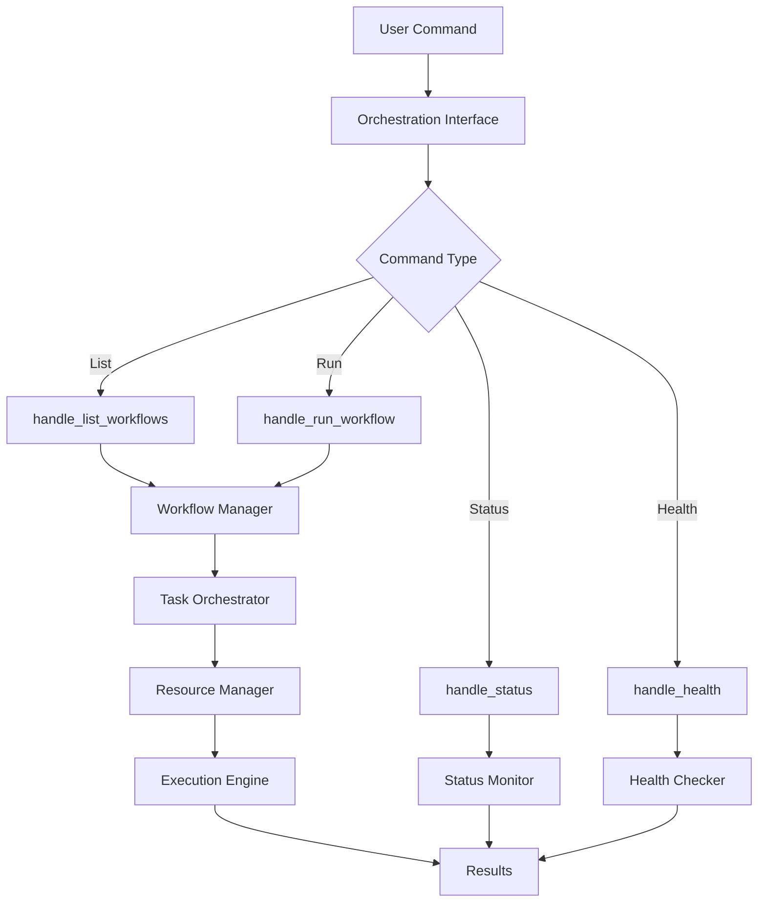

# Codomyrmex Agents — scripts/project_orchestration

**Version**: v0.1.0 | **Status**: Active | **Last Updated**: December 2025

## Purpose

Project orchestration utilities for the Codomyrmex platform. This directory contains scripts and demonstrations for workflow orchestration, project management, and task coordination using the Codomyrmex project orchestration capabilities.

The scripts/project_orchestration directory serves as the demonstration and utility layer for project workflow management and orchestration.

## Module Overview

### Key Capabilities
- **Workflow Orchestration**: Automated project workflow execution
- **Project Management**: Multi-project coordination and tracking
- **Task Coordination**: Dependency-based task scheduling and execution
- **Resource Management**: Resource allocation and monitoring
- **Performance Monitoring**: Workflow performance analysis and optimization
- **Health Monitoring**: System health checks and status reporting

### Key Features
- Interactive workflow demonstration
- Comprehensive example workflows
- Command-line orchestration interface
- Project status monitoring and reporting
- Resource allocation and optimization
- Performance metrics and analytics

## Function Signatures

### Orchestration Interface Functions

```python
def handle_list_workflows(args: Any) -> None
```

List available workflows in the system.

**Parameters:**
- `args` (Any): Command line arguments

**Returns:** None - Prints list of available workflows

```python
def handle_run_workflow(args: Any) -> None
```

Execute a specified workflow.

**Parameters:**
- `args` (Any): Command line arguments containing workflow name and parameters

**Returns:** None - Executes workflow and displays results

```python
def handle_list_projects(args: Any) -> None
```

List all managed projects.

**Parameters:**
- `args` (Any): Command line arguments

**Returns:** None - Prints list of projects with status information

```python
def handle_status(args: Any) -> None
```

Display system status and health information.

**Parameters:**
- `args` (Any): Command line arguments

**Returns:** None - Prints comprehensive system status

```python
def handle_health(args: Any) -> None
```

Perform health check on orchestration system.

**Parameters:**
- `args` (Any): Command line arguments

**Returns:** None - Prints health check results

```python
def main() -> None
```

Main entry point for orchestration command-line interface.

**Returns:** None - Runs interactive orchestration interface

### Demo Functions

```python
def demo_header(title: str) -> None
```

Display formatted demo header.

**Parameters:**
- `title` (str): Header title to display

**Returns:** None - Prints formatted header to console

```python
def demo_pause(message: str = "Press Enter to continue...") -> None
```

Pause demo execution for user interaction.

**Parameters:**
- `message` (str): Pause message to display. Defaults to "Press Enter to continue..."

**Returns:** None - Waits for user input

```python
def demo_system_discovery() -> None
```

Demonstrate system discovery capabilities.

**Returns:** None - Runs system discovery demo

```python
def demo_capability_analysis(discovery: Any) -> None
```

Demonstrate capability analysis features.

**Parameters:**
- `discovery` (Any): Discovery object to analyze

**Returns:** None - Runs capability analysis demo

```python
def demo_interactive_features() -> None
```

Demonstrate interactive orchestration features.

**Returns:** None - Runs interactive features demo

```python
def demo_status_reporting() -> None
```

Demonstrate status reporting capabilities.

**Returns:** None - Runs status reporting demo

```python
def demo_exports_and_reports() -> None
```

Demonstrate export and reporting features.

**Returns:** None - Runs exports and reports demo

```python
def main() -> None
```

Main entry point for project orchestration demo.

**Returns:** None - Runs comprehensive orchestration demonstration

### Example Workflow Functions

```python
def example_1_basic_workflow_creation() -> None
```

Demonstrate basic workflow creation and execution.

**Returns:** None - Creates and executes basic workflow

```python
def example_2_project_management() -> None
```

Demonstrate project management capabilities.

**Returns:** None - Creates and manages sample project

```python
def example_3_task_orchestration() -> None
```

Demonstrate task orchestration with dependencies.

**Returns:** None - Creates and executes dependent tasks

```python
def example_4_resource_management() -> None
```

Demonstrate resource allocation and management.

**Returns:** None - Manages resources across workflow execution

```python
def example_5_complex_workflow() -> None
```

Demonstrate complex multi-stage workflow execution.

**Returns:** None - Executes complex workflow with multiple stages

```python
def example_6_performance_monitoring() -> None
```

Demonstrate performance monitoring and metrics collection.

**Returns:** None - Monitors and reports workflow performance

```python
def example_7_health_check() -> None
```

Demonstrate system health checking capabilities.

**Returns:** None - Performs comprehensive health assessment

```python
def main() -> None
```

Main entry point for workflow examples.

**Returns:** None - Runs all workflow examples in sequence

### Comprehensive Demo Functions

```python
def create_sample_project(project_path: Path) -> None
```

Create a sample project structure for demonstration.

**Parameters:**
- `project_path` (Path): Path where to create the sample project

**Returns:** None - Creates sample project files and structure

```python
def unsafe_eval_function(expression: str) -> Any
```

Evaluate Python expression (for demonstration purposes).

**Parameters:**
- `expression` (str): Python expression to evaluate

**Returns:** `Any` - Result of expression evaluation

```python
def main() -> None
```

Main entry point for comprehensive workflow demonstration.

**Returns:** None - Runs comprehensive workflow demo

## Data Structures

### WorkflowConfig
```python
@dataclass
class WorkflowConfig:
    name: str
    description: str
    steps: list[WorkflowStep]
    resources: dict[str, Any]
    timeout: int
    retry_policy: RetryPolicy
```

Configuration for workflow execution.

### ProjectInfo
```python
@dataclass
class ProjectInfo:
    id: str
    name: str
    path: Path
    status: ProjectStatus
    created_at: datetime
    updated_at: datetime
    workflows: list[str]
```

Information about a managed project.

### TaskInfo
```python
@dataclass
class TaskInfo:
    id: str
    name: str
    status: TaskStatus
    priority: TaskPriority
    dependencies: list[str]
    assigned_resources: list[str]
    execution_time: Optional[float]
    error_message: Optional[str]
```

Information about a workflow task.

### ResourceAllocation
```python
@dataclass
class ResourceAllocation:
    resource_type: str
    allocated_amount: float
    total_capacity: float
    utilization_percentage: float
    allocation_time: datetime
```

Resource allocation tracking information.

### PerformanceMetrics
```python
@dataclass
class PerformanceMetrics:
    workflow_name: str
    execution_time: float
    cpu_usage: float
    memory_usage: float
    tasks_completed: int
    tasks_failed: int
    resource_utilization: dict[str, float]
```

Performance metrics for workflow execution.

## Orchestration Architecture



## Active Components

### Core Orchestration Scripts
- `orchestrate.py` – Command-line orchestration interface
- `demo.py` – Interactive demonstration of orchestration capabilities
- `examples.py` – Comprehensive workflow examples

### Example Workflows
- `examples/comprehensive_workflow_demo.py` – Full-featured workflow demonstration
- `examples/` – Directory containing additional workflow examples

### Documentation
- `README.md` – Orchestration overview and usage guide
- `examples/README.md` – Workflow examples documentation

## Operating Contracts

### Universal Orchestration Protocols

All project orchestration within the Codomyrmex platform must:

1. **Dependency Management** - Respect task dependencies and execution order
2. **Resource Awareness** - Monitor and manage resource allocation
3. **Error Recovery** - Handle failures gracefully with appropriate recovery strategies
4. **Progress Tracking** - Provide real-time status and progress information
5. **Performance Monitoring** - Track execution metrics and performance indicators

### Orchestration-Specific Guidelines

#### Workflow Execution
- Validate workflow configurations before execution
- Provide detailed execution logs and status updates
- Support workflow pausing, resuming, and cancellation
- Implement proper cleanup on workflow completion or failure

#### Project Management
- Maintain project state consistency across executions
- Support concurrent project management operations
- Provide project lifecycle management (create, update, archive)
- Implement project dependency resolution

#### Task Coordination
- Handle complex dependency graphs efficiently
- Support parallel task execution where possible
- Implement task timeout and retry mechanisms
- Provide task-level progress and status reporting

#### Resource Management
- Monitor resource utilization in real-time
- Implement resource allocation optimization
- Support dynamic resource scaling
- Provide resource usage analytics and reporting

## Performance Optimization

### Execution Optimization
- Parallel task execution for independent tasks
- Resource-aware scheduling algorithms
- Workflow caching for repeated executions
- Optimized dependency graph resolution

### Monitoring and Metrics
- Real-time performance monitoring
- Resource utilization tracking
- Execution time analysis
- Bottleneck identification and reporting

### Scalability Features
- Support for large workflow graphs
- Memory-efficient task management
- Configurable concurrency limits
- Distributed execution support

## Troubleshooting

### Common Orchestration Issues

#### Workflow Execution Failures
```
Issue: Workflow execution failing with errors
Solution: Check task dependencies, validate resource availability, review error logs
```

#### Resource Conflicts
```
Issue: Resource allocation conflicts between tasks
Solution: Review resource requirements, adjust allocation policies, implement queuing
```

#### Performance Degradation
```
Issue: Workflow execution becoming slower over time
Solution: Monitor resource utilization, optimize task scheduling, implement caching
```

#### Dependency Resolution
```
Issue: Task dependency resolution failing
Solution: Validate dependency graph, check task definitions, resolve circular dependencies
```

## Contributing

### Adding New Workflow Examples
1. Create example function following naming conventions
2. Include comprehensive error handling and validation
3. Add detailed comments explaining each step
4. Include example output and expected results
5. Update documentation and README files

### Improving Orchestration
1. Optimize execution algorithms for better performance
2. Add support for new workflow patterns
3. Enhance monitoring and observability features
4. Improve error handling and recovery mechanisms
5. Add support for distributed execution

## Navigation Links

### Core Orchestration Scripts
- **Command Interface**: [orchestrate.py](orchestrate.py) - Command-line orchestration interface
- **Demo**: [demo.py](demo.py) - Interactive orchestration demonstration
- **Examples**: [examples.py](examples.py) - Workflow examples collection

### Example Workflows
- **Comprehensive Demo**: [examples/comprehensive_workflow_demo.py](examples/comprehensive_workflow_demo.py) - Full workflow demonstration
- **Examples Directory**: [examples/](examples/) - Additional workflow examples

### Platform Navigation
- **Scripts Directory**: [../README.md](../README.md) - Scripts overview
- **Core Module**: [../../src/codomyrmex/project_orchestration/](../../src/codomyrmex/project_orchestration/) - Core orchestration module
- **Main Documentation**: [../../README.md](../../README.md) - Project documentation

## Agent Coordination

### Orchestration Integration

When coordinating with other orchestration systems:

1. **Workflow Compatibility** - Ensure workflow definitions are compatible
2. **Resource Coordination** - Coordinate resource allocation across systems
3. **Status Synchronization** - Maintain consistent status across different systems
4. **Event Propagation** - Propagate events between coordinated systems

### Quality Gates

Before orchestration changes are accepted:

1. **Workflow Validation** - Verify workflow execution works correctly
2. **Resource Management** - Ensure proper resource allocation and cleanup
3. **Error Handling** - Comprehensive error handling and recovery
4. **Performance Tested** - Performance meets requirements under load
5. **Documentation Updated** - Changes reflected in examples and documentation

## Version History

- **v0.1.0** (December 2025) - Initial project orchestration system with workflow execution, project management, task coordination, and performance monitoring capabilities
