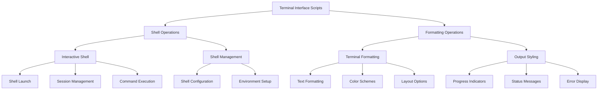

# scripts/terminal_interface

**Version**: v0.1.0 | **Status**: Active | **Last Updated**: December 2025

## Overview

Terminal interface automation scripts providing command-line tools for interactive shell operations and terminal formatting management within the Codomyrmex platform.

## Terminal Interface Operations

The terminal interface operations provide comprehensive command-line tools for shell management and output formatting across different terminal environments.

## Directory Contents
- `orchestrate.py` – File

## Navigation
- **Project Root**: [README](../../../README.md)
- **Parent Directory**: [scripts](../README.md)
- **Scripts Hub**: [scripts](../../../scripts/README.md)
