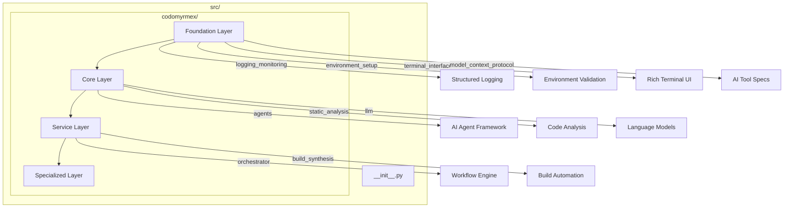

# Source Code

**Version**: v0.1.0 | **Status**: Active | **Last Updated**: January 2026

## Overview

This directory contains the core source code for the Codomyrmex platform. The main package is `codomyrmex/`, which houses 60+ specialized modules organized in a layered architecture.

## Architecture



## Directory Structure

| Path | Description |
|------|-------------|
| `codomyrmex/` | Main package containing all modules |
| `codomyrmex/__init__.py` | Package exports and version |
| `codomyrmex/agents/` | AI agent framework and providers |
| `codomyrmex/llm/` | LLM infrastructure (Ollama, etc.) |
| `codomyrmex/utils/` | Core utilities and ScriptBase |
| `codomyrmex/tests/` | Unit and integration tests |

## Layer Overview

### Foundation Layer

Essential infrastructure used by all modules:

- `logging_monitoring/` - Centralized logging
- `environment_setup/` - Dependency validation
- `model_context_protocol/` - AI communication standards
- `terminal_interface/` - Rich terminal UI

### Core Layer

Primary development capabilities:

- `agents/` - AI agent integrations
- `static_analysis/` - Code quality
- `coding/` - Code execution sandbox
- `llm/` - Language model infrastructure

### Service Layer

Higher-level orchestration:

- `orchestrator/` - Workflow engine
- `build_synthesis/` - Build automation
- `ci_cd_automation/` - Pipeline management
- `documentation/` - Doc generation

### Specialized Layer

Domain-specific modules:

- `cerebrum/` - Reasoning engine
- `spatial/` - 3D/4D modeling
- `fpf/` - Functional programming framework

## Quick Start

```python
# Import from the main package
from codomyrmex.logging_monitoring import get_logger
from codomyrmex.utils import run_command, ScriptBase
from codomyrmex.agents import AgentOrchestrator

# Initialize logging
logger = get_logger(__name__)
logger.info("Codomyrmex initialized")
```

## Navigation

- **Parent**: [../README.md](../README.md) - Project root
- **Main Package**: [codomyrmex/README.md](codomyrmex/README.md)
- **Tests**: [codomyrmex/tests/README.md](codomyrmex/tests/README.md)
- **Agent Guide**: [AGENTS.md](AGENTS.md)
