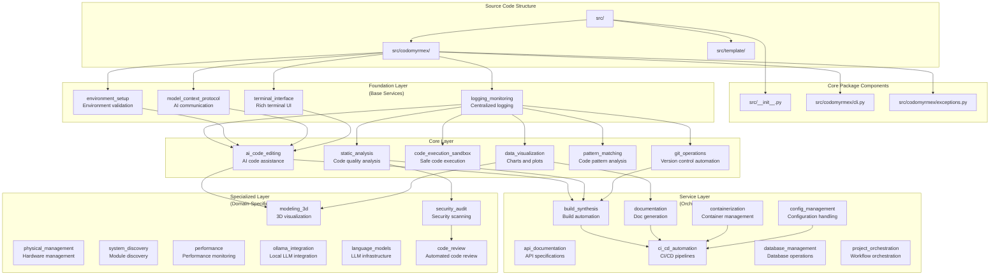
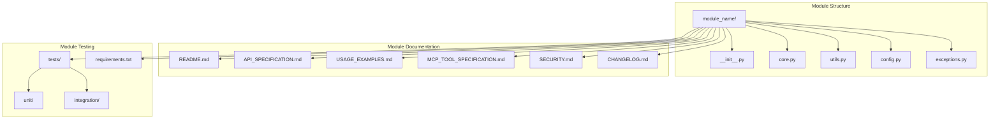
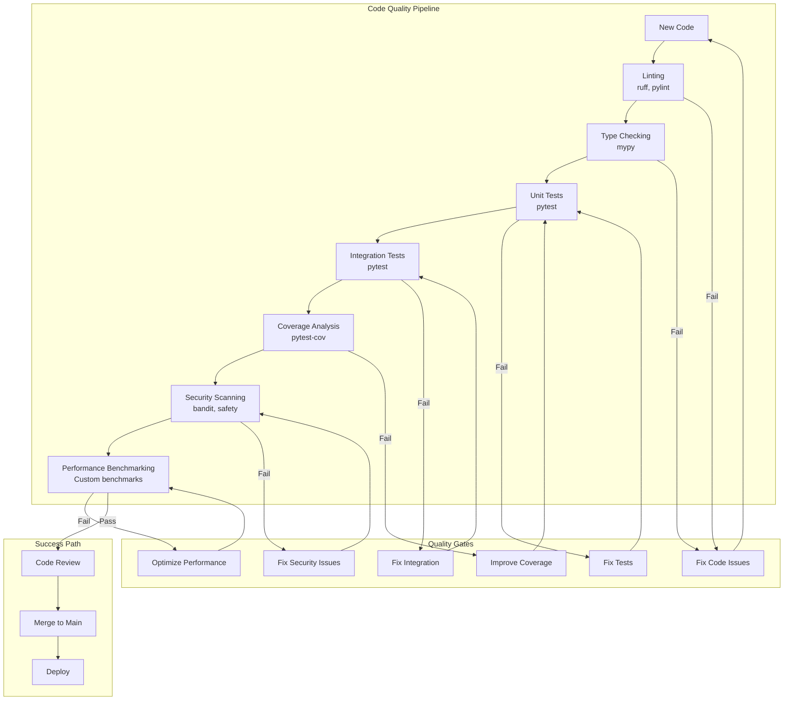
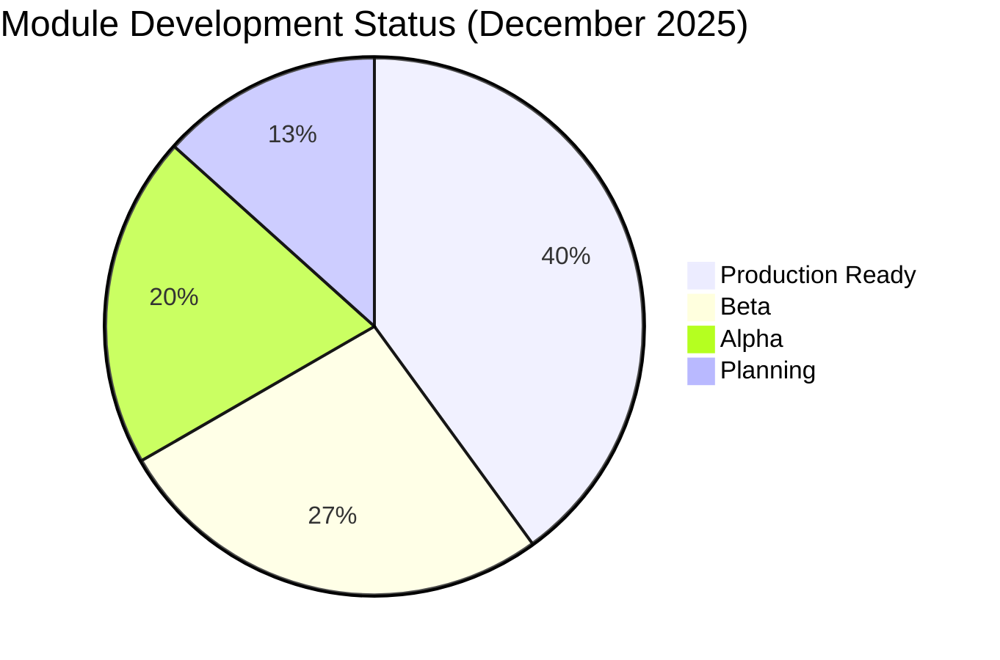
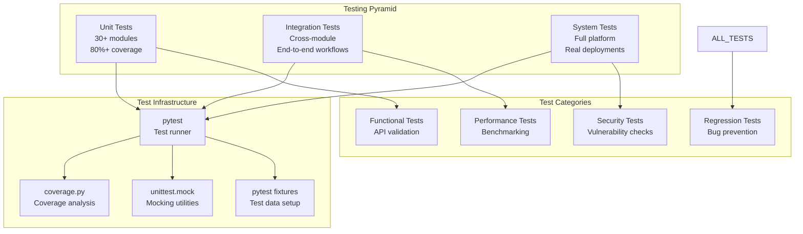
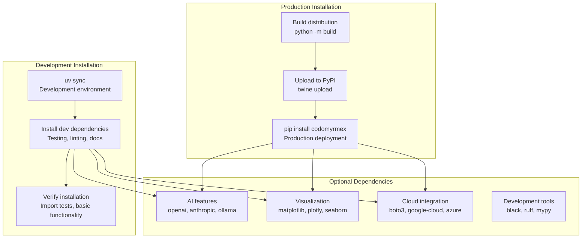

# src

## Signposting
- **Parent**: [Root](../README.md)
- **Children**:
    - [codomyrmex](codomyrmex/README.md) - Main package
    - [template](template/README.md) - Scaffolding templates
- **Related**:
    - [Tests](../testing/README.md)
    - [Docs](../docs/README.md)

**Version**: v0.1.0 | **Status**: Active | **Last Updated**: December 2025

## Overview

This is the source code coordination document for the core Codomyrmex platform implementation. It defines the modular source code architecture that provides all platform capabilities through independent, well-tested modules.

The src directory contains the Python package implementation with module system, API interfaces, and agent coordination capabilities.

## Package Architecture

## Module System Architecture

## Module Dependency Flow

```mermaid
graph TD
    subgraph "Foundation Layer"
        LOGGING[logging_monitoring]
        ENV[environment_setup]
        MCP[model_context_protocol]
        TERMINAL[terminal_interface]
    end

    subgraph "Core Layer"
        AI_EDITING[ai_code_editing]
        STATIC_ANALYSIS[static_analysis]
        CODE_EXEC[code_execution_sandbox]
        DATA_VIZ[data_visualization]
        PATTERN_MATCH[pattern_matching]
        GIT_OPS[git_operations]
        CODE_REVIEW[code_review]
        SECURITY_AUDIT[security_audit]
        OLLAMA[ollama_integration]
        LANG_MODELS[language_models]
        PERFORMANCE[performance]
    end

    subgraph "Service Layer"
        BUILD_SYNTHESIS[build_synthesis]
        DOCUMENTATION[documentation]
        API_DOCS[api_documentation]
        CI_CD[ci_cd_automation]
        CONTAINER[containerization]
        DATABASE[database_management]
        CONFIG_MGMT[config_management]
        PROJECT_ORCHESTRATION[project_orchestration]
    end

    subgraph "Specialized Layer"
        MODELING_3D[modeling_3d]
        PHYSICAL_MGMT[physical_management]
        SYSTEM_DISCOVERY[system_discovery]
        MODULE_TEMPLATE[module_template]
    end

    %% Foundation dependencies (all modules depend on foundation)
    AI_EDITING -.-> LOGGING
    STATIC_ANALYSIS -.-> LOGGING
    CODE_EXEC -.-> LOGGING
    DATA_VIZ -.-> LOGGING
    PATTERN_MATCH -.-> LOGGING
    GIT_OPS -.-> LOGGING
    CODE_REVIEW -.-> LOGGING
    SECURITY_AUDIT -.-> LOGGING
    OLLAMA -.-> LOGGING
    LANG_MODELS -.-> LOGGING
    PERFORMANCE -.-> LOGGING
    BUILD_SYNTHESIS -.-> LOGGING
    DOCUMENTATION -.-> LOGGING
    API_DOCS -.-> LOGGING
    CI_CD -.-> LOGGING
    CONTAINER -.-> LOGGING
    DATABASE -.-> LOGGING
    CONFIG_MGMT -.-> LOGGING
    PROJECT_ORCHESTRATION -.-> LOGGING
    MODELING_3D -.-> LOGGING
    PHYSICAL_MGMT -.-> LOGGING
    SYSTEM_DISCOVERY -.-> LOGGING
    MODULE_TEMPLATE -.-> LOGGING

    AI_EDITING -.-> ENV
    STATIC_ANALYSIS -.-> ENV
    CODE_EXEC -.-> ENV
    DATA_VIZ -.-> ENV
    PATTERN_MATCH -.-> ENV
    GIT_OPS -.-> ENV
    CODE_REVIEW -.-> ENV
    SECURITY_AUDIT -.-> ENV
    OLLAMA -.-> ENV
    LANG_MODELS -.-> ENV
    PERFORMANCE -.-> ENV
    BUILD_SYNTHESIS -.-> ENV
    DOCUMENTATION -.-> ENV
    API_DOCS -.-> ENV
    CI_CD -.-> ENV
    CONTAINER -.-> ENV
    DATABASE -.-> ENV
    CONFIG_MGMT -.-> ENV
    PROJECT_ORCHESTRATION -.-> ENV
    MODELING_3D -.-> ENV
    PHYSICAL_MGMT -.-> ENV
    SYSTEM_DISCOVERY -.-> ENV
    MODULE_TEMPLATE -.-> ENV

    AI_EDITING -.-> MCP
    AI_EDITING -.-> TERMINAL

    %% Core layer interconnections
    AI_EDITING --> CODE_EXEC
    AI_EDITING --> PATTERN_MATCH
    STATIC_ANALYSIS --> PATTERN_MATCH
    STATIC_ANALYSIS --> CODE_REVIEW
    BUILD_SYNTHESIS --> STATIC_ANALYSIS
    BUILD_SYNTHESIS --> GIT_OPS
    CODE_REVIEW --> STATIC_ANALYSIS
    CI_CD --> BUILD_SYNTHESIS
    CI_CD --> SECURITY_AUDIT
    CONTAINER --> PHYSICAL_MGMT
    PROJECT_ORCHESTRATION --> BUILD_SYNTHESIS
    PROJECT_ORCHESTRATION --> DOCUMENTATION

    %% Service layer connections
    DATA_VIZ --> MODELING_3D
    DATABASE --> BUILD_SYNTHESIS
    CONFIG_MGMT -.-> ENV
```

## Code Quality Assurance

## Directory Contents
- `__init__.py` – Package initialization and public API exports
- `codomyrmex/` – Main package with 30+ specialized modules
- `template/` – Code generation templates and scaffolding

## Module Maturity Overview

| Maturity Level | Description | Module Count | Examples |
|----------------|-------------|--------------|----------|
| **Production Ready** | Fully tested, stable APIs, production use | 12 | logging_monitoring, environment_setup, terminal_interface |
| **Beta** | Core functionality complete, API stabilization | 8 | ai_code_editing, static_analysis, code_execution_sandbox |
| **Alpha** | Basic functionality, APIs may change | 6 | modeling_3d, physical_management, system_discovery |
| **Planning** | Requirements gathering, initial design | 4 | Future specialized modules |

## Testing Architecture

## Package Distribution

## Navigation
- **Technical Documentation**: [AGENTS.md](AGENTS.md)
- **Functional Specification**: [SPEC.md](SPEC.md)
- **Project Root**: [README](../README.md)
- **Package Documentation**: [src/codomyrmex/README.md](codomyrmex/README.md)
- **API Reference**: [docs/reference/api.md](../docs/reference/api.md)
- **Testing**: [testing/README.md](../testing/README.md)
