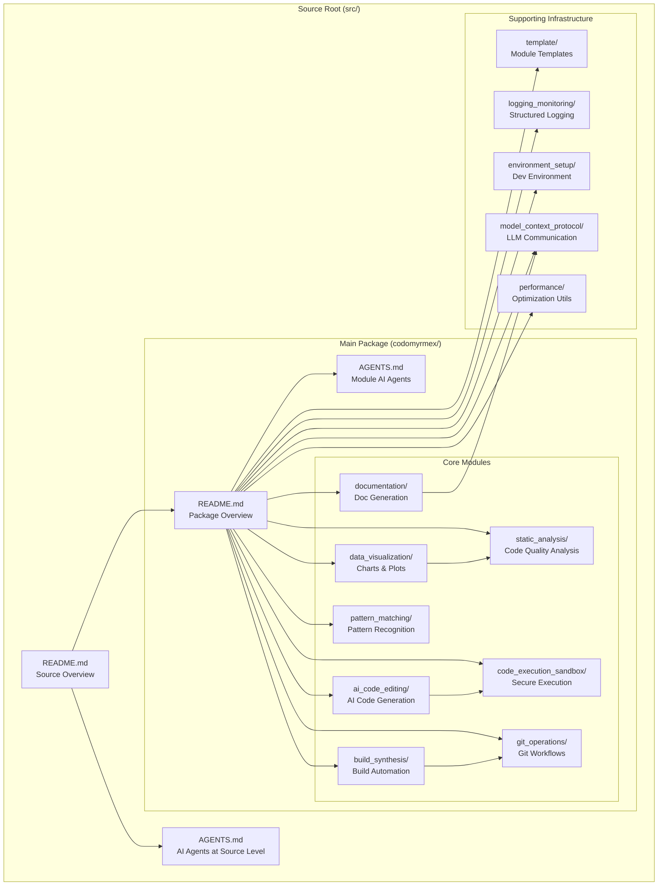

# Codomyrmex Source Code

This directory contains the complete source code for the Codomyrmex project - a modular, extensible coding workspace that integrates cutting-edge tools for AI-assisted development, code analysis, testing, and documentation.

## Directory Structure Overview

```
src/
├── codomyrmex/          # Main package - Core modules and functionality
│   ├── ai_code_editing/          # AI-powered code generation and editing
│   ├── build_synthesis/          # Build automation and code synthesis
│   ├── code_execution_sandbox/   # Secure code execution environment
│   ├── data_visualization/       # Plotting and visualization tools
│   ├── documentation/            # Documentation website generation
│   ├── environment_setup/        # Development environment management
│   ├── git_operations/           # Git workflow automation
│   ├── logging_monitoring/       # Structured logging system
│   ├── model_context_protocol/   # LLM interaction protocols
│   ├── module_template/          # Module creation templates
│   ├── pattern_matching/         # Advanced pattern matching utilities
│   ├── static_analysis/          # Code quality and security analysis
│   ├── system_discovery/         # System introspection tools
│   ├── terminal_interface/       # CLI and terminal utilities
│   ├── performance/              # Performance optimization utilities
│   └── output/                   # Generated artifacts and outputs
└── template/            # Project templates and boilerplate code
```

## Source Code Navigation

### **📊 Source Structure Visualization**



### 🔥 Core Modules Quick Access
| Module | Description | Status | Quick Links |
|--------|-------------|--------|-------------|
| **[codomyrmex/](./codomyrmex/)** | Main package directory | ✅ Active | [README](./codomyrmex/README.md) \| [AGENTS](./codomyrmex/AGENTS.md) |
| **[template/](./template/)** | Project templates | 🔧 Development | [README](./template/README.md) |

### 📦 Package Information
- **Package Name**: `codomyrmex`
- **Version**: `0.1.0`
- **Python Requirement**: 3.10+
- **Installation**: `pip install -e .` (from project root)

## Key Features

### 🤖 AI-Enhanced Development
- **AI Code Editing**: Advanced code generation with OpenAI, Anthropic, and Google models
- **Model Context Protocol**: Standardized LLM interaction framework
- **Smart Code Analysis**: Pattern matching and static analysis integration

### 🛠️ Development Tools
- **Secure Execution**: Sandboxed code execution environment
- **Build Automation**: Comprehensive build and synthesis tools
- **Environment Management**: Automated setup and dependency handling

### 📊 Visualization & Analysis
- **Data Visualization**: Rich plotting with Matplotlib, Seaborn, Plotly
- **Static Analysis**: Code quality, security scanning, and metrics
- **Git Operations**: Advanced repository management and workflow automation
- **System Discovery**: Comprehensive system introspection and capability mapping

### 📚 Documentation & Monitoring
- **Documentation Website**: Docusaurus-powered documentation generation
- **Structured Logging**: Multi-language logging with SLF4J, Loguru, and more
- **Performance Optimization**: Lazy loading, caching, and performance monitoring

## Getting Started

### Quick Start Commands
```bash
# From project root
cd src/codomyrmex

# Check module status
python -c "import codomyrmex; print(codomyrmex.__version__)"

# Run environment checks  
python environment_setup/env_checker.py

# Example usage
python -c "from codomyrmex.data_visualization import create_line_plot; import numpy as np; x=np.linspace(0,10,100); create_line_plot(x, np.sin(x), title='Demo', output_path='demo.png')"
```

### Module-Specific Setup
Each module contains comprehensive documentation:
- **README.md**: Overview and usage instructions
- **API_SPECIFICATION.md**: Programmatic interfaces
- **MCP_TOOL_SPECIFICATION.md**: Model Context Protocol tools
- **USAGE_EXAMPLES.md**: Practical examples
- **docs/**: Detailed technical documentation

## Development Standards

### Code Organization [[memory:7401890]]
- All outputs are organized into number-prepended subfolders in `@output/`
- Modular architecture with clear separation of concerns
- Comprehensive test coverage with real implementations (no mocks)

### Documentation Philosophy [[memory:7401883]]
- Clear, coherent code examples with real methods
- "Show not tell" approach - code demonstrates capabilities
- Understated descriptions that let functionality speak for itself

### Testing Approach [[memory:7401885]]
- Test-driven development (TDD) with unified modular approach
- Real data analysis and implementations
- Iterative test suite execution until all tests pass

### Package Management [[memory:7401880]]
- Always use latest package versions
- Avoid pinning to old specific requirements
- Leverage cutting-edge tools for optimal performance

## Integration Examples

### Basic Module Import
```python
from codomyrmex.logging_monitoring import setup_logging, get_logger
from codomyrmex.data_visualization import create_scatter_plot
from codomyrmex.static_analysis import analyze_code_quality

# Initialize logging
setup_logging()
logger = get_logger(__name__)

# Use multiple modules together
logger.info("Starting analysis workflow")
# ... your code here
```

### AI-Enhanced Workflow
```python
from codomyrmex.ai_code_editing import generate_code_snippet
from codomyrmex.code_execution_sandbox import execute_code
from codomyrmex.static_analysis import run_security_scan

# Generate code with AI
code = generate_code_snippet("Create a data processing function")

# Execute safely
result = execute_code(code, language="python")

# Analyze security
scan_results = run_security_scan(code)
```

## Contributing

### Module Development
1. Use the `module_template/` as a starting point
2. Follow the established patterns in existing modules
3. Ensure comprehensive testing and documentation
4. Add module to `__init__.py` exports

### Code Quality
- All modules integrate with `logging_monitoring`
- Security-sensitive modules (like `code_execution_sandbox`) require extra review
- Follow `.cursorrules` for coding standards
- Use `static_analysis` tools for quality checks

## 🔗 Navigation & Cross-References

### **📚 Complete Documentation Hub**
- **[Main Project README](../README.md)**: Project overview with user journey map and quick start
- **[Documentation Hub](../docs/README.md)**: Complete documentation structure with navigation diagrams
- **[Package Documentation](./codomyrmex/README.md)**: Comprehensive module status matrix and integration patterns

### **🚀 User Pathways**
- **[Installation Guide](../docs/getting-started/installation.md)**: Complete setup instructions for all use cases
- **[Quick Start Guide](../docs/getting-started/quickstart.md)**: 5-minute getting started with examples
- **[User Journey Map](../README.md#user-journey-map)**: Visual guide to documentation navigation

### **🏗️ System Understanding**
- **[System Architecture](../docs/project/architecture.md)**: Complete architecture with Mermaid diagrams
- **[Module System Overview](../docs/modules/overview.md)**: Module layers and dependency structure
- **[Module Relationships](../docs/modules/relationships.md)**: Inter-module dependencies with visual diagrams

### **🔧 Development & Contribution**
- **[Contributing Guide](../docs/project/contributing.md)**: How to contribute effectively to the project
- **[Development Setup](../docs/development/environment-setup.md)**: Complete development environment setup
- **[Documentation Guidelines](../docs/development/documentation.md)**: Writing and maintaining documentation
- **[Module Creation Tutorial](../docs/getting-started/tutorials/creating-a-module.md)**: Step-by-step module development

### **📖 Reference Documentation**
- **[CLI Reference](../docs/reference/cli.md)**: Complete command-line interface documentation
- **[API Reference](../docs/reference/api.md)**: Comprehensive API index linking all module APIs  
- **[Troubleshooting Guide](../docs/reference/troubleshooting.md)**: Common issues and comprehensive solutions

### **📂 Source Navigation**
- **[Package Overview](./codomyrmex/README.md)**: Main package with module status matrix and quick access table
- **[Template System](./template/README.md)**: Module template system and usage guidelines

### **⚡ Quick Links by User Type**

| User Type | Primary Resources | Next Steps |
|-----------|------------------|------------|
| **New Users** | [Installation](../docs/getting-started/installation.md) → [Quick Start](../docs/getting-started/quickstart.md) → [Examples](../scripts/examples/README.md) | Try interactive examples |
| **API Users** | [API Reference](../docs/reference/api.md) → [CLI Reference](../docs/reference/cli.md) → [Package Overview](./codomyrmex/README.md) | Explore module APIs |
| **Contributors** | [Contributing](../docs/project/contributing.md) → [Development Setup](../docs/development/environment-setup.md) → [Architecture](../docs/project/architecture.md) | Start contributing |
| **Module Developers** | [Module Tutorial](../docs/getting-started/tutorials/creating-a-module.md) → [Template Guide](./template/README.md) → [Module Overview](../docs/modules/overview.md) | Create new modules |

---

*Last Updated: Auto-generated from source analysis*  
*For the most current information, see individual module README files*
