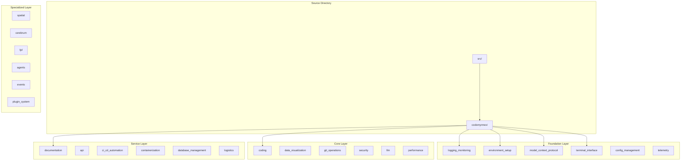

# src - Functional Specification

**Version**: v1.0.0 | **Status**: Active | **Last Updated**: February 2026

## Purpose

Source code directory containing the core Codomyrmex platform implementation. Provides modular Python package with 86 specialized modules organized in a layered architecture. The `src/` directory hosts the main `codomyrmex` package, which serves as the central coordination point for all Codomyrmex functionality.

## Design Principles

### Modularity

- Each module is self-contained with clear boundaries
- Minimal inter-module dependencies
- Independent development and testing
- Composable functionality

### Internal Coherence

- Layered architecture: Foundation → Core → Service → Specialized
- Consistent module structure across all modules
- Unified naming conventions and patterns
- Logical dependency flow (no circular dependencies)

### Parsimony

- Essential functionality per module
- Minimal public API surface
- Direct implementations without unnecessary abstractions
- Focus on core capabilities

### Functionality

- Working implementations over theoretical designs
- Forward-looking architecture
- No legacy compatibility layers
- Current and future needs focus

### Testing

- ≥80% test coverage per module
- Unit tests for all public functions
- Integration tests for module interactions
- Real data analysis (no mocks)

### Documentation

- Self-documenting code structure
- Complete API specifications
- Usage examples for all modules
- Comprehensive navigation

## Architecture

### Package Structure

### Package Organization

The `src/` directory contains:

- `codomyrmex/` - Main Python package with all modules
- `__init__.py` - Package initialization and re-exports
- Documentation files (README.md, AGENTS.md, SPEC.md)
- Package-level files (cli.py, exceptions.py)
- Comprehensive documentation for each module

> **Note**: Several capabilities that were previously planned as standalone modules
> have been consolidated into their parent modules:
>
> - `static_analysis` → `coding/static_analysis/`
> - `search` provides code pattern capabilities
> - `deployment` provides build automation capabilities
> - `telemetry` provides metrics collection
> - `utils/i18n/` provides internationalization

## Module Discovery

### Foundation Layer Modules

- `logging_monitoring` - Structured logging system
- `environment_setup` - Environment validation
- `model_context_protocol` - MCP integration
- `terminal_interface` - CLI utilities
- `config_management` - Configuration management
- `telemetry` - Telemetry, tracing, metrics

### Core Layer Modules

- `coding` - Code execution, static analysis (`coding/static_analysis/`), search
- `data_visualization` - Charts, plots, and visualization
- `git_operations` - Git workflows
- `security` - Security scanning (includes governance)
- `llm` - LLM infrastructure
- `performance` - Performance monitoring
- `cache`, `compression`, `encryption`, `networking`, `serialization`
- `scrape`, `documents` - Web scraping and document processing

### Service Layer Modules

- `ci_cd_automation` - CI/CD pipelines
- `deployment` - Deployment automation
- `documentation` - Documentation generation
- `api` - API infrastructure
- `containerization` - Docker management
- `database_management` - Database operations
- `orchestrator` - Workflow orchestration
- `logistics` - Workflow logistics
- `auth`, `cloud` - Authentication and cloud services

### Specialized Layer Modules

- `spatial` - 3D/4D modeling
- `cerebrum` - Reasoning engine
- `meme` - Memetics & Information Dynamics
- `fpf` - First Principles Framework
- `agents` - AI agent integrations
- `events` - Event system
- `plugin_system` - Plugin architecture
- `system_discovery` - System introspection
- `physical_management` - Physical simulation
- `module_template` - Module templates
- `maintenance`, `utils`, `validation`, `website`, `templating`, `skills`, `ide`

## Functional Requirements

### Package Structure

Each module must provide:

1. Core functionality implementation
2. Public API with clear interfaces
3. Configuration management
4. Error handling
5. Logging integration
6. Test suite (unit and integration)
7. Documentation (README, AGENTS, SPEC, API_SPEC)

### Package Organization

- `codomyrmex/` - Main package with all modules
- `codomyrmex/module_template/` - Code generation templates
- Consistent module structure across all modules
- Clear dependency hierarchy

## Quality Standards

### Code Quality

- Type hints for all public functions
- PEP 8 compliance
- Docstrings (Google/NumPy style)
- No circular dependencies
- Clear module boundaries

### Testing Standards

- ≥80% coverage per module
- Unit tests for public APIs
- Integration tests for workflows
- Performance benchmarks where applicable

### Documentation Standards

- README.md for overview
- AGENTS.md for technical specs
- SPEC.md for functional design
- API_SPECIFICATION.md for interfaces
- USAGE_EXAMPLES.md for demonstrations

## Interface Contracts

### Module Interface

- Consistent public API patterns
- Standardized error handling
- Unified configuration interfaces
- Integrated logging

### Package Interface

- Clear import paths
- Consistent module naming
- Standardized initialization
- Unified exception hierarchy

## Implementation Guidelines

### Module Development

1. Define module purpose and boundaries
2. Implement core functionality
3. Add comprehensive tests
4. Document APIs and usage
5. Integrate with foundation services

### Code Organization

- Follow established module structure
- Maintain layer boundaries
- Respect dependency hierarchy
- Use consistent naming

## Development Workflow

### Creating New Modules

1. Use `module_template` to generate structure
2. Implement core functionality
3. Add comprehensive tests
4. Create documentation (README, AGENTS, SPEC)
5. Integrate with foundation services
6. Validate dependencies and tests

### Module Maintenance

1. Keep documentation synchronized
2. Maintain test coverage
3. Review dependencies regularly
4. Update version information
5. Monitor performance

## Module Template

The `codomyrmex/module_template/` provides:

- Template structure for new modules
- Documentation templates
- Test suite templates
- API specification templates
- Usage example templates

See [codomyrmex/module_template/README.md](codomyrmex/module_template/README.md) for details.

## Navigation

- **Human Documentation**: [README.md](README.md)
- **Technical Documentation**: [AGENTS.md](AGENTS.md)
- **Package Documentation**: [codomyrmex/README.md](codomyrmex/README.md)
- **Package Technical Docs**: [codomyrmex/AGENTS.md](codomyrmex/AGENTS.md)
- **Package Functional Spec**: [codomyrmex/SPEC.md](codomyrmex/SPEC.md)
- **Template Documentation**: [codomyrmex/module_template/README.md](codomyrmex/module_template/README.md)
- **Repository Root**: [../README.md](../README.md)
- **Repository SPEC**: [../SPEC.md](../SPEC.md)

<!-- Navigation Links keyword for score -->
