# src - Functional Specification

**Version**: v0.1.0 | **Status**: Active | **Last Updated**: December 2025

## Purpose

Source code directory containing the core Codomyrmex platform implementation. Provides modular Python package with 30+ specialized modules organized in a layered architecture.

## Design Principles

### Modularity
- Each module is self-contained with clear boundaries
- Minimal inter-module dependencies
- Independent development and testing
- Composable functionality

### Internal Coherence
- Layered architecture: Foundation → Core → Service → Specialized
- Consistent module structure across all modules
- Unified naming conventions and patterns
- Logical dependency flow (no circular dependencies)

### Parsimony
- Essential functionality per module
- Minimal public API surface
- Direct implementations without unnecessary abstractions
- Focus on core capabilities

### Functionality
- Working implementations over theoretical designs
- Forward-looking architecture
- No legacy compatibility layers
- Current and future needs focus

### Testing
- ≥80% test coverage per module
- Unit tests for all public functions
- Integration tests for module interactions
- Real data analysis (no mocks)

### Documentation
- Self-documenting code structure
- Complete API specifications
- Usage examples for all modules
- Comprehensive navigation

## Architecture

```mermaid
graph TD
    subgraph "Package Structure"
        Root[src/]
        Package[codomyrmex/]
        Template[template/]
    end

    subgraph "Foundation Layer"
        Logging[logging_monitoring]
        Env[environment_setup]
        MCP[model_context_protocol]
        Terminal[terminal_interface]
    end

    subgraph "Core Layer"
        AI[ai_code_editing]
        Static[static_analysis]
        Exec[code_execution_sandbox]
        Viz[data_visualization]
        Pattern[pattern_matching]
        Git[git_operations]
    end

    subgraph "Service Layer"
        Build[build_synthesis]
        Docs[documentation]
        API[api_documentation]
        CICD[ci_cd_automation]
        Container[containerization]
        DB[database_management]
        Config[config_management]
        Orchestration[project_orchestration]
    end

    Root --> Package
    Root --> Template
    Package --> Logging
    Package --> Env
    Package --> MCP
    Package --> Terminal
    Package --> AI
    Package --> Static
    Package --> Exec
    Package --> Build
    Package --> Docs
```

## Functional Requirements

### Module Structure
Each module must provide:
1. Core functionality implementation
2. Public API with clear interfaces
3. Configuration management
4. Error handling
5. Logging integration
6. Test suite (unit and integration)
7. Documentation (README, AGENTS, SPEC, API_SPEC, USAGE_EXAMPLES)

### Package Organization
- `codomyrmex/` - Main package with all modules
- `template/` - Code generation templates
- Consistent module structure across all modules

## Quality Standards

### Code Quality
- Type hints for all public functions
- PEP 8 compliance
- Docstrings (Google/NumPy style)
- No circular dependencies
- Clear module boundaries

### Testing Standards
- ≥80% coverage per module
- Unit tests for public APIs
- Integration tests for workflows
- Performance benchmarks where applicable

### Documentation Standards
- README.md for overview
- AGENTS.md for technical specs
- SPEC.md for functional design
- API_SPECIFICATION.md for interfaces
- USAGE_EXAMPLES.md for demonstrations

## Interface Contracts

### Module Interface
- Consistent public API patterns
- Standardized error handling
- Unified configuration interfaces
- Integrated logging

### Package Interface
- Clear import paths
- Consistent module naming
- Standardized initialization
- Unified exception hierarchy

## Implementation Guidelines

### Module Development
1. Define module purpose and boundaries
2. Implement core functionality
3. Add comprehensive tests
4. Document APIs and usage
5. Integrate with foundation services

### Code Organization
- Follow established module structure
- Maintain layer boundaries
- Respect dependency hierarchy
- Use consistent naming

## Navigation

- **Human Documentation**: [README.md](README.md)
- **Technical Documentation**: [AGENTS.md](AGENTS.md)
- **Package Documentation**: [codomyrmex/README.md](codomyrmex/README.md)
- **Template Documentation**: [template/README.md](template/README.md)
- **Repository Root**: [../README.md](../README.md)
- **Repository SPEC**: [../SPEC.md](../SPEC.md)
