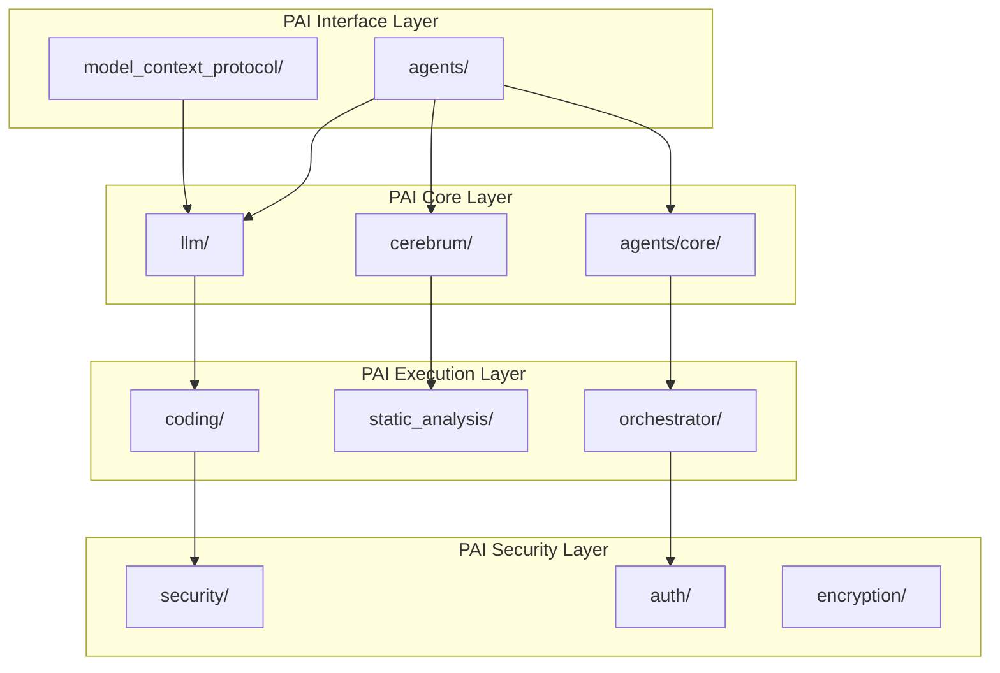
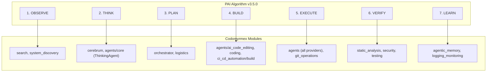

# Personal AI Infrastructure — src/codomyrmex

**Version**: v1.3.0 | **Status**: Active | **Last Updated**: July 2026

## Overview

This document describes the Personal AI Infrastructure (PAI) capabilities provided by the Codomyrmex source modules. These modules form the technical foundation for building AI-augmented development workflows.

## PAI Module Map

The Codomyrmex modules provide PAI capabilities across several domains:

### AI Model Integration

| Module | PAI Capability | Description |
| :--- | :--- | :--- |
| [llm/](llm/) | Model Management | Local (Ollama) and cloud model integration |
| [model_context_protocol/](model_context_protocol/) | Tool Standards | Standardized AI tool interfaces |
| [agents/](agents/) | Agent Framework | Multi-provider AI agent orchestration |
| [agents/core/](agents/core/) | ThinkingAgent | Chain-of-Thought reasoning engine (`think`, `get_last_trace`) |

### Intelligent Code Operations

| Module | PAI Capability | Description |
| :--- | :--- | :--- |
| [agents/ai_code_editing/](agents/ai_code_editing/) | AI Code Editing | Automated refactoring, generation, review |
| [static_analysis/](static_analysis/) | Code Intelligence | Quality analysis and pattern detection |
| [search/](search/) | Pattern Recognition | Code pattern identification |
| [coding/](coding/) | Safe Execution | Sandboxed AI code execution |

### Knowledge & Reasoning

| Module | PAI Capability | Description |
| :--- | :--- | :--- |
| [cerebrum/](cerebrum/) | Reasoning Engine | Case-based reasoning, active inference surprise signals |
| [agentic_memory/](agentic_memory/) | Memory Systems | Persistent memory systems, Obsidian vault sync |
| [graph_rag/](graph_rag/) | Knowledge Graph | Multi-hop Graph RAG retrieval |
| [search/](search/) | Document Search | Full-text, indexed, and fuzzy search |

### Workflow Automation

| Module | PAI Capability | Description |
| :--- | :--- | :--- |
| [orchestrator/](orchestrator/) | Workflow Engine | DAG-based task orchestration |
| [events/](events/) | Event System | Pub/sub for agent communication |
| [logistics/](logistics/) | Task Management | Scheduling and coordination |
| [plugin_system/](plugin_system/) | Extensibility | Dynamic capability extension |

### Development Tools

| Module | PAI Capability | Description |
| :--- | :--- | :--- |
| [ide/](ide/) | IDE Integration | IDE control and automation (VSCode, Antigravity) |
| [terminal_interface/](terminal_interface/) | CLI/TUI | Rich terminal interfaces |

### Security & Privacy

| Module | PAI Capability | Description |
| :--- | :--- | :--- |
| [security/](security/) | Security Analysis | Vulnerability scanning for AI outputs |
| [agents/pai/](agents/pai/) | Trust Gateway | Trust-gated execution (UNTRUSTED/VERIFIED/TRUSTED) |
| [encryption/](encryption/) | Data Protection | Secure data handling |
| [auth/](auth/) | Access Control | Authentication and authorization |

## PAI Architecture in Codomyrmex


```mermaid
graph TB
    subgraph paiInterface ["PAI Interface Layer"]
        Agents["agents/"]
        MCP["model_context_protocol/"]
    end

    subgraph paiCore ["PAI Core Layer"]
        LLM["llm/"]
        Cerebrum["cerebrum/"]
        AgentsCore["agents/core/"]
    end

    subgraph paiExecution ["PAI Execution Layer"]
        Coding["coding/"]
        Static["static_analysis/"]
        Orchestrator["orchestrator/"]
    end

    subgraph paiSecurity ["PAI Security Layer"]
        Security["security/"]
        Auth["auth/"]
        Encryption["encryption/"]
    end

    Agents --> LLM
    Agents --> Cerebrum
    Agents --> AgentsCore
    MCP --> LLM
    LLM --> Coding
    Cerebrum --> Static
    AgentsCore --> Orchestrator
    Coding --> Security
    Orchestrator --> Auth
```

## PAI Algorithm Phase Mapping

When used with the [PAI system](../../PAI.md) (`~/.claude/PAI/`), these modules map to specific Algorithm phases:


```mermaid
graph TB
    subgraph Algorithm ["PAI Algorithm v3.5.0"]
        OBSERVE["1. OBSERVE"]
        THINK["2. THINK"]
        PLAN["3. PLAN"]
        BUILD["4. BUILD"]
        EXECUTE["5. EXECUTE"]
        VERIFY["6. VERIFY"]
        LEARN["7. LEARN"]
    end

    subgraph Modules ["Codomyrmex Modules"]
        PM["search, system_discovery"]
        CB["cerebrum, agents/core (ThinkingAgent)"]
        OR["orchestrator, logistics"]
        CE["agents/ai_code_editing, coding, ci_cd_automation/build"]
        AG["agents (all providers), git_operations"]
        SA["static_analysis, security, testing"]
        AM["agentic_memory, logging_monitoring"]
    end

    OBSERVE --> PM
    THINK --> CB
    PLAN --> OR
    BUILD --> CE
    EXECUTE --> AG
    VERIFY --> SA
    LEARN --> AM
```

| Phase | Modules Used | What They Provide |
| :--- | :--- | :--- |
| **OBSERVE** | `search`, `system_discovery` | Codebase understanding, pattern recognition, file discovery |
| **THINK** | `cerebrum`, `agents/core` (ThinkingAgent) | Case-based reasoning, Chain-of-Thought reasoning traces |
| **PLAN** | `orchestrator`, `logistics` | DAG-based workflow construction, scheduling |
| **BUILD** | `agents/ai_code_editing/`, `coding`, `ci_cd_automation/build` | Code generation, sandbox execution, multi-language builds |
| **EXECUTE** | `agents/` (all providers), `coding`, `git_operations` | Agent dispatch, sandboxed execution, version control |
| **VERIFY** | `static_analysis`, `security`, `testing` | Code quality, vulnerability scanning, test execution |
| **LEARN** | `agentic_memory`, `logging_monitoring` | Long-term memory capture, structured logging |

The authoritative bridge document is [`/PAI.md`](../../PAI.md) at the project root.

## Key PAI Patterns

### 1. AI-Assisted Code Review

```python
from pathlib import Path
from codomyrmex.static_analysis import scan_imports, check_layer_violations, audit_exports
from codomyrmex.security import analyze_directory_security  # Security scanning

src = Path("src/codomyrmex")

# Combine static analysis and security scanning
edges = scan_imports(src)
violations = check_layer_violations(edges)
export_findings = audit_exports(src)
security_findings = analyze_directory_security(str(src))

# Review results
for v in violations:
    print(f"Layer violation: {v['src']} → {v['dst']}: {v['reason']}")
for f in export_findings:
    print(f"Export issue: {f['module']}: {f['detail']}")
for s in security_findings:
    print(f"Security [{s.severity}]: {s.file_path}:{s.line_number} {s.description}")
```

### 2. Knowledge-Augmented Generation

```python
import os

from codomyrmex.cerebrum import Case, CerebrumEngine
from codomyrmex.llm.providers import Message, ProviderType, get_provider

# Use case-based reasoning to enhance AI generation
cerebrum = CerebrumEngine()
cerebrum.add_case(
    Case(case_id="fix-42", features={"error": "ImportError"}, outcome="re-export in __init__")
)

# Reason over similar past cases
reasoning = cerebrum.reason(Case(case_id="current", features={"error": "ImportError"}))

# Generate with context via LLM provider
provider = get_provider(ProviderType.ANTHROPIC, api_key=os.environ["ANTHROPIC_API_KEY"])
response = provider.complete(
    messages=[
        Message(role="system", content=f"Similar past cases suggest: {reasoning.prediction}"),
        Message(role="user", content=user_request),
    ]
)
print(response.content)
```

### 3. Autonomous Workflow

```python
import asyncio

from codomyrmex.events import Event, EventBus, EventType
from codomyrmex.orchestrator import Workflow

events = EventBus()

# Define AI-driven workflow, triggered when an analysis finishes
def auto_review(event: Event) -> None:
    workflow = Workflow("ai_review_pipeline", event_bus=events)
    workflow.add_task("review", run_review, kwargs={"code": event.data})
    asyncio.run(workflow.run())

events.subscribe(EventType.ANALYSIS_COMPLETE, auto_review)

# Workflow executes autonomously with AI agents
```

## PAI Configuration

### Environment Variables

```bash
# AI Model Configuration
export OLLAMA_HOST="http://localhost:11434"
export OPENAI_API_KEY="sk-..."  # Optional  # pragma: allowlist secret
export ANTHROPIC_API_KEY="sk-..."  # Optional  # pragma: allowlist secret

# PAI Settings
export CODOMYRMEX_PAI_LOCAL_ONLY=true  # Privacy mode
export CODOMYRMEX_PAI_AUDIT_LOG=true   # Log AI actions
```

### Configuration Files

| File | Purpose |
| :--- | :--- |
| `config/llm/providers.yaml` | AI model provider settings |
| `config/llm/models.yaml` | Model-specific configurations |
| `config/security/api_keys.yaml` | Secure credential storage |

## Module PAI Documentation

Each major module has PAI-specific documentation:

- [agents/PAI.md](agents/PAI.md) - Agent PAI capabilities
- [llm/PAI.md](llm/PAI.md) - LLM integration
- [cerebrum/PAI.md](cerebrum/PAI.md) - Reasoning engine

## Signposting

### Navigation

- **Self**: [PAI.md](PAI.md)
- **Parent**: [../../PAI.md](../../PAI.md) - Root PAI documentation
- **Siblings**:
  - [AGENTS.md](AGENTS.md) - Agent coordination
  - [README.md](README.md) - Module overview

### Related PAI Documentation

- [agents/PAI.md](agents/PAI.md) - AI agent PAI features
- [llm/PAI.md](llm/PAI.md) - LLM PAI features
- [cerebrum/PAI.md](cerebrum/PAI.md) - Reasoning PAI features
