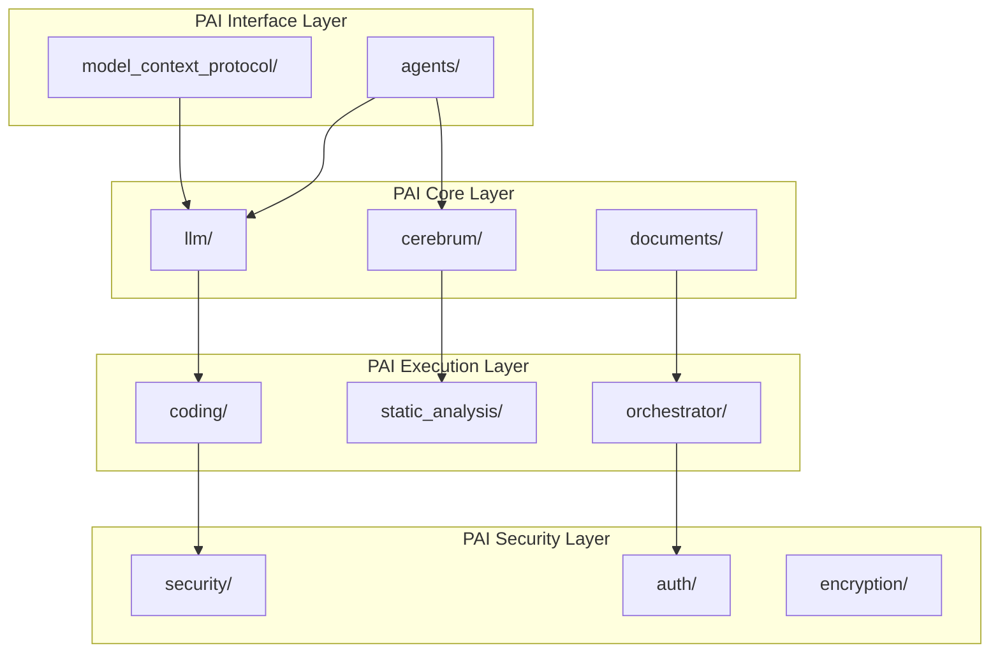
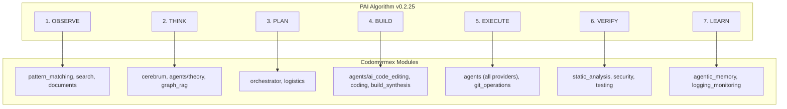

# Personal AI Infrastructure — src/codomyrmex

**Version**: v0.1.0 | **Status**: Active | **Last Updated**: February 2026

## Overview

This document describes the Personal AI Infrastructure (PAI) capabilities provided by the Codomyrmex source modules. These modules form the technical foundation for building AI-augmented development workflows.

## PAI Module Map

The Codomyrmex modules provide PAI capabilities across several domains:

### AI Model Integration

| Module | PAI Capability | Description |
| :--- | :--- | :--- |
| [llm/](llm/) | Model Management | Local (Ollama) and cloud model integration |
| [model_context_protocol/](model_context_protocol/) | Tool Standards | Standardized AI tool interfaces |
| [agents/](agents/) | Agent Framework | Multi-provider AI agent orchestration |
| [multimodal/](multimodal/) | Multimodal | Audio/Video/Image processing |

### Intelligent Code Operations

| Module | PAI Capability | Description |
| :--- | :--- | :--- |
| [agents/ai_code_editing/](agents/ai_code_editing/) | AI Code Editing | Automated refactoring, generation, review |
| [static_analysis/](static_analysis/) | Code Intelligence | Quality analysis and pattern detection |
| [pattern_matching/](pattern_matching/) | Pattern Recognition | Code pattern identification |
| [coding/](coding/) | Safe Execution | Sandboxed AI code execution |

- **Secure Cognitive Architecture**:
  - `identity`: Multi-persona management and bio-cognitive verification.
  - `wallet`: Self-custody and "Natural Ritual" recovery (ZKP).
  - `defense`: Active countermeasures and "Rabbit Hole" containment.
  - `market`: Reverse auctions and demand aggregation.
  - `privacy`: Metadata scrubbing and mixnet proxying.

### Knowledge & Reasoning

| Module | PAI Capability | Description |
| :--- | :--- | :--- |
| [cerebrum/](cerebrum/) | Reasoning Engine | Case-based and Bayesian reasoning |
| [documents/](documents/) | Knowledge Processing | Document analysis and retrieval |
| [graph_rag/](graph_rag/) | Graph RAG | Graph-based Retrieval Augmented Generation |
| [agentic_memory/](agentic_memory/) | Memory Systems | Long-term memory for agents |
| [fpf/](fpf/) | Functional Analysis | Functional programming transformations |

### Workflow Automation

| Module | PAI Capability | Description |
| :--- | :--- | :--- |
| [orchestrator/](orchestrator/) | Workflow Engine | DAG-based task orchestration |
| [events/](events/) | Event System | Pub/sub for agent communication |
| [logistics/](logistics/) | Task Management | Scheduling and coordination |
| [plugin_system/](plugin_system/) | Extensibility | Dynamic capability extension |

### Development Tools

| Module | PAI Capability | Description |
| :--- | :--- | :--- |
| [ide/](ide/) | IDE Integration | IDE control and automation (VSCode, Antigravity) |
| [terminal_interface/](terminal_interface/) | CLI/TUI | Rich terminal interfaces |

### Security & Privacy

| Module | PAI Capability | Description |
| :--- | :--- | :--- |
| [security/](security/) | Security Analysis | Vulnerability scanning for AI outputs |
| [encryption/](encryption/) | Data Protection | Secure data handling |
| [auth/](auth/) | Access Control | Authentication and authorization |

## PAI Architecture in Codomyrmex



## PAI Algorithm Phase Mapping

When used with the [PAI system](../../PAI.md) (`~/.claude/skills/PAI/`), these modules map to specific Algorithm phases:



| Phase | Modules Used | What They Provide |
|-------|-------------|------------------|
| **OBSERVE** | `pattern_matching`, `search`, `documents`, `system_discovery` | Codebase understanding, pattern recognition, file discovery |
| **THINK** | `cerebrum`, `agents/theory/`, `graph_rag` | Case-based reasoning, deliberative architecture, knowledge graphs |
| **PLAN** | `orchestrator`, `logistics` | DAG-based workflow construction, scheduling |
| **BUILD** | `agents/ai_code_editing/`, `coding`, `build_synthesis` | Code generation, sandbox execution, multi-language builds |
| **EXECUTE** | `agents/` (all providers), `coding`, `git_operations` | Agent dispatch, sandboxed execution, version control |
| **VERIFY** | `static_analysis`, `security`, `testing` | Code quality, vulnerability scanning, test execution |
| **LEARN** | `agentic_memory`, `logging_monitoring` | Long-term memory capture, structured logging |

The authoritative bridge document is [`/PAI.md`](../../PAI.md) at the project root.

## Key PAI Patterns

### 1. AI-Assisted Code Review

```python
from codomyrmex.agents import CodeEditor
from codomyrmex.static_analysis import CodeAnalyzer
from codomyrmex.security import SecurityScanner

# Combine AI and static analysis
analyzer = CodeAnalyzer()
editor = CodeEditor()
scanner = SecurityScanner()

# Review pipeline
analysis = analyzer.analyze(code)
ai_review = editor.review(code, context=analysis)
security = scanner.scan(code)
```

### 2. Knowledge-Augmented Generation

```python
from codomyrmex.cerebrum import CerebrumEngine, CaseBase
from codomyrmex.agents import ClaudeClient

# Use case-based reasoning to enhance AI generation
cerebrum = CerebrumEngine()
case_base = CaseBase.load("project_patterns")

# Get similar past cases
similar_cases = cerebrum.retrieve_similar(current_context)

# Generate with context
claude = ClaudeClient()
result = claude.generate(
    prompt=user_request,
    context=similar_cases.as_context()
)
```

### 3. Autonomous Workflow

```python
from codomyrmex.orchestrator import WorkflowEngine
from codomyrmex.events import EventBus

# Define AI-driven workflow
workflow = WorkflowEngine()
events = EventBus()

@events.on("code_committed")
async def auto_review(event):
    workflow.trigger("ai_review_pipeline", code=event.data)

# Workflow executes autonomously with AI agents
```

## PAI Configuration

### Environment Variables

```bash
# AI Model Configuration
export OLLAMA_HOST="http://localhost:11434"
export OPENAI_API_KEY="sk-..."  # Optional
export ANTHROPIC_API_KEY="sk-..."  # Optional

# PAI Settings
export CODOMYRMEX_PAI_LOCAL_ONLY=true  # Privacy mode
export CODOMYRMEX_PAI_AUDIT_LOG=true   # Log AI actions
```

### Configuration Files

| File | Purpose |
| :--- | :--- |
| `config/llm/providers.yaml` | AI model provider settings |
| `config/llm/models.yaml` | Model-specific configurations |
| `config/security/api_keys.yaml` | Secure credential storage |

## Module PAI Documentation

Each major module has PAI-specific documentation:

- [agents/PAI.md](agents/PAI.md) - Agent PAI capabilities
- [llm/PAI.md](llm/PAI.md) - LLM integration
- [cerebrum/PAI.md](cerebrum/PAI.md) - Reasoning engine

## Signposting

### Navigation

- **Self**: [PAI.md](PAI.md)
- **Parent**: [../../PAI.md](../../PAI.md) - Root PAI documentation
- **Siblings**:
  - [AGENTS.md](AGENTS.md) - Agent coordination
  - [README.md](README.md) - Module overview

### Related PAI Documentation

- [agents/PAI.md](agents/PAI.md) - AI agent PAI features
- [llm/PAI.md](llm/PAI.md) - LLM PAI features
- [cerebrum/PAI.md](cerebrum/PAI.md) - Reasoning PAI features
