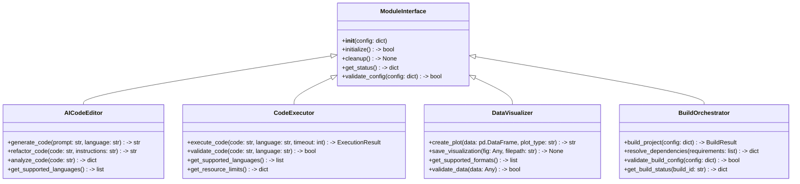
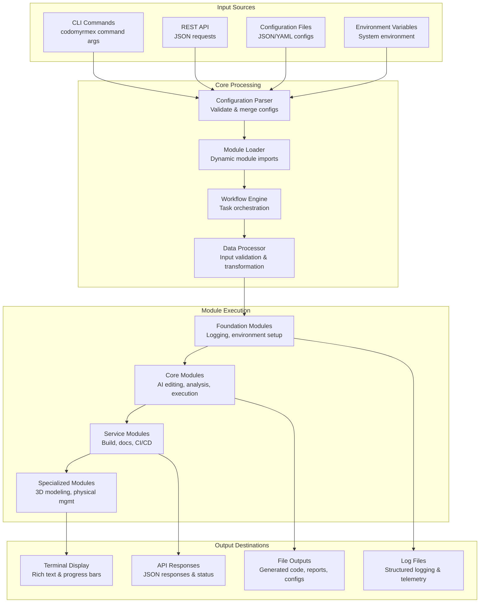
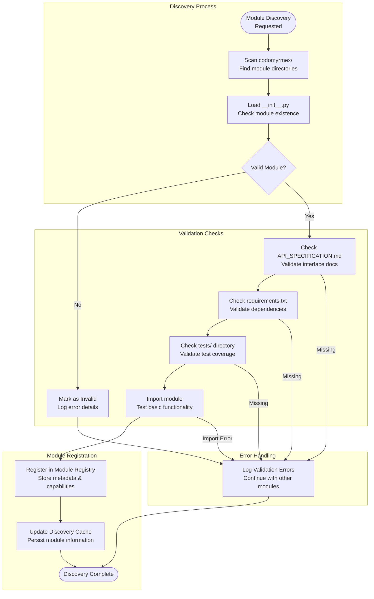

# src/codomyrmex

**Version**: v0.1.0 | **Status**: Active | **Last Updated**: December 2025

## Overview

Core package containing the Codomyrmex platform implementation. This directory houses all functional modules that provide the platform's capabilities, organized into a layered architecture for maintainability and extensibility.

The codomyrmex package serves as the central hub for all platform functionality, with modules that can be composed together to create complex workflows and applications.

## Package Architecture

```mermaid
graph TB
    subgraph "Package Structure"
        INIT[__init__.py<br/>Package initialization<br/>Public API exports]
        CLI[cli.py<br/>Command-line interface<br/>CLI argument parsing]
        EXCEPTIONS[exceptions.py<br/>Platform exceptions<br/>Error hierarchy]
        TESTS[tests/<br/>Integration tests<br/>Cross-module validation]
        TOOLS[tools/<br/>Utility tools<br/>Helper functions]
    end

    subgraph "Foundation Layer"
        LOGGING[logging_monitoring/<br/>Centralized logging<br/>Structured telemetry]
        ENV[environment_setup/<br/>Environment validation<br/>Dependency management]
        MCP[model_context_protocol/<br/>AI communication<br/>Tool specifications]
        TERMINAL[terminal_interface/<br/>Rich terminal UI<br/>Progress indicators]
    end

    subgraph "Core Layer"
        AI_EDITING[ai_code_editing/<br/>AI code assistance<br/>Multi-LLM support]
        STATIC_ANALYSIS[static_analysis/<br/>Code quality analysis<br/>Linting & metrics]
        CODE_EXEC[code_execution_sandbox/<br/>Safe code execution<br/>Multi-language support]
        DATA_VIZ[data_visualization/<br/>Charts & plots<br/>Multiple formats]
        PATTERN_MATCH[pattern_matching/<br/>Code pattern analysis<br/>AST processing]
        GIT_OPS[git_operations/<br/>Version control<br/>Git workflow automation]
        CODE_REVIEW[code_review/<br/>Automated review<br/>AI-powered analysis]
        SECURITY_AUDIT[security_audit/<br/>Security scanning<br/>Vulnerability detection]
        OLLAMA[ollama_integration/<br/>Local LLM integration<br/>Ollama client]
        LANG_MODELS[language_models/<br/>LLM infrastructure<br/>Model management]
        PERFORMANCE[performance/<br/>Performance monitoring<br/>Benchmarking]
    end

    subgraph "Service Layer"
        BUILD_SYNTHESIS[build_synthesis/<br/>Build automation<br/>Multi-language builds]
        DOCUMENTATION[documentation/<br/>Doc generation<br/>Website creation]
        API_DOCS[api_documentation/<br/>API documentation<br/>OpenAPI specs]
        CI_CD[ci_cd_automation/<br/>CI/CD pipelines<br/>Deployment automation]
        CONTAINER[containerization/<br/>Container management<br/>Docker & Kubernetes]
        DATABASE[database_management/<br/>Database operations<br/>Migrations & backups]
        CONFIG_MGMT[config_management/<br/>Configuration management<br/>Secret handling]
        PROJECT_ORCHESTRATION[project_orchestration/<br/>Workflow orchestration<br/>Task coordination]
    end

    subgraph "Specialized Layer"
        MODELING_3D[modeling_3d/<br/>3D visualization<br/>Scene rendering]
        PHYSICAL_MGMT[physical_management/<br/>Hardware monitoring<br/>Resource management]
        SYSTEM_DISCOVERY[system_discovery/<br/>Module discovery<br/>Health monitoring]
        MODULE_TEMPLATE[module_template/<br/>Module scaffolding<br/>Code generation]
        TEMPLATE[template/<br/>Code templates<br/>Snippet generation]
    end

    INIT --> LOGGING
    INIT --> ENV
    INIT --> MCP
    INIT --> TERMINAL

    LOGGING --> AI_EDITING
    ENV --> AI_EDITING
    MCP --> AI_EDITING
    TERMINAL --> AI_EDITING

    AI_EDITING --> CODE_EXEC
    AI_EDITING --> PATTERN_MATCH
    STATIC_ANALYSIS --> PATTERN_MATCH
    STATIC_ANALYSIS --> CODE_REVIEW
    BUILD_SYNTHESIS --> STATIC_ANALYSIS
    BUILD_SYNTHESIS --> GIT_OPS
    CODE_REVIEW --> STATIC_ANALYSIS
    CI_CD --> BUILD_SYNTHESIS
    CI_CD --> SECURITY_AUDIT
    CONTAINER --> PHYSICAL_MGMT
    PROJECT_ORCHESTRATION --> BUILD_SYNTHESIS
    PROJECT_ORCHESTRATION --> DOCUMENTATION

    DATA_VIZ --> MODELING_3D
    DATABASE --> BUILD_SYNTHESIS
    CONFIG_MGMT --> ENV
```



## Module Interface Standards



## Data Flow Architecture



## Exception Hierarchy

```mermaid
classDiagram
    Exception <|-- CodomyrmexError
    CodomyrmexError <|-- ConfigurationError
    CodomyrmexError <|-- ModuleError
    CodomyrmexError <|-- ExecutionError
    CodomyrmexError <|-- ValidationError
    CodomyrmexError <|-- DependencyError
    CodomyrmexError <|-- ResourceError
    CodomyrmexError <|-- SecurityError

    ConfigurationError : +config_path: str
    ConfigurationError : +validation_errors: list

    ModuleError : +module_name: str
    ModuleError : +module_version: str

    ExecutionError : +command: str
    ExecutionError : +exit_code: int
    ExecutionError : +stdout: str
    ExecutionError : +stderr: str

    ValidationError : +field_name: str
    ValidationError : +field_value: Any
    ValidationError : +expected_type: str

    DependencyError : +dependency_name: str
    DependencyError : +required_version: str
    DependencyError : +installed_version: str

    ResourceError : +resource_type: str
    ResourceError : +requested_amount: Any
    ResourceError : +available_amount: Any

    SecurityError : +security_issue: str
    SecurityError : +severity_level: str
```

## CLI Architecture

```mermaid
graph TD
    subgraph "CLI Entry Point"
        MAIN[cli.py main()<br/>Argument parsing<br/>Command dispatch]
    end

    subgraph "Command Groups"
        MODULE_CMDS[Module Commands<br/>module list, module info<br/>module execute]
        WORKFLOW_CMDS[Workflow Commands<br/>workflow create, workflow run<br/>workflow status]
        CONFIG_CMDS[Config Commands<br/>config validate, config show<br/>config update]
        SYSTEM_CMDS[System Commands<br/>system status, system health<br/>system discovery]
    end

    subgraph "Command Handlers"
        MODULE_HANDLER[Module Handler<br/>Load and execute modules<br/>Handle module-specific args]
        WORKFLOW_HANDLER[Workflow Handler<br/>Parse workflow definitions<br/>Execute workflow steps]
        CONFIG_HANDLER[Config Handler<br/>Parse and validate configs<br/>Update configuration files]
        SYSTEM_HANDLER[System Handler<br/>Gather system information<br/>Report health status]
    end

    subgraph "Output Formatters"
        JSON_FORMATTER[JSON Formatter<br/>Structured data output<br/>API-compatible format]
        TABLE_FORMATTER[Table Formatter<br/>Rich terminal tables<br/>Color-coded output]
        PROGRESS_FORMATTER[Progress Formatter<br/>Progress bars & spinners<br/>Real-time updates]
    end

    MAIN --> MODULE_CMDS
    MAIN --> WORKFLOW_CMDS
    MAIN --> CONFIG_CMDS
    MAIN --> SYSTEM_CMDS

    MODULE_CMDS --> MODULE_HANDLER
    WORKFLOW_CMDS --> WORKFLOW_HANDLER
    CONFIG_CMDS --> CONFIG_HANDLER
    SYSTEM_CMDS --> SYSTEM_HANDLER

    MODULE_HANDLER --> JSON_FORMATTER
    WORKFLOW_HANDLER --> PROGRESS_FORMATTER
    CONFIG_HANDLER --> TABLE_FORMATTER
    SYSTEM_HANDLER --> JSON_FORMATTER
```

## Module Discovery System



## Directory Contents

### Core Package Files
- `__init__.py` – Package initialization and public API exports
- `cli.py` – Command-line interface with subcommand routing
- `exceptions.py` – Hierarchical exception classes for error handling

### Foundation Layer Modules
- `logging_monitoring/` – Centralized logging system with structured output
- `environment_setup/` – Environment validation and dependency checking
- `model_context_protocol/` – AI communication standards and tool specifications
- `terminal_interface/` – Rich terminal UI with progress bars and tables

### Core Layer Modules
- `ai_code_editing/` – AI-powered code generation and refactoring
- `static_analysis/` – Code quality analysis and linting
- `code_execution_sandbox/` – Safe multi-language code execution
- `data_visualization/` – Chart generation and data plotting
- `pattern_matching/` – Code pattern recognition and analysis
- `git_operations/` – Git workflow automation and management
- `code_review/` – Automated code review with AI assistance
- `security_audit/` – Security vulnerability scanning and compliance
- `ollama_integration/` – Local LLM integration and management
- `language_models/` – LLM provider abstraction and management
- `performance/` – Performance monitoring and benchmarking

### Service Layer Modules
- `build_synthesis/` – Multi-language build orchestration
- `documentation/` – Automated documentation generation
- `api_documentation/` – API specification and documentation
- `ci_cd_automation/` – Continuous integration and deployment
- `containerization/` – Docker and Kubernetes container management
- `database_management/` – Database operations and migrations
- `config_management/` – Configuration management and secrets
- `project_orchestration/` – Workflow orchestration and task management

### Specialized Layer Modules
- `modeling_3d/` – 3D modeling and visualization
- `physical_management/` – Hardware resource monitoring
- `system_discovery/` – Module discovery and health monitoring
- `module_template/` – Module creation templates and scaffolding
- `template/` – Code generation templates and utilities

### Testing and Utilities
- `tests/` – Cross-module integration tests
- `tools/` – Utility functions and helper tools

## Function Signatures Overview

### Core Module Functions

```python
# ai_code_editing
def generate_code(prompt: str, language: str = "python", context: dict = None) -> str
def refactor_code(code: str, instructions: str, language: str = "python") -> str
def analyze_code_quality(code: str, language: str) -> dict[str, Any]

# code_execution_sandbox
def execute_code(code: str, language: str, timeout: int = 30, resources: dict = None) -> ExecutionResult
def validate_code_syntax(code: str, language: str) -> bool
def get_supported_languages() -> list[str]

# data_visualization
def create_plot(data: pd.DataFrame, plot_type: str, config: dict = None) -> str
def save_visualization(fig: Any, filepath: str, format: str = "png") -> None
def get_supported_plot_types() -> list[str]

# build_synthesis
def build_project(config: dict, target_platform: str = "auto") -> BuildResult
def resolve_dependencies(requirements: list[dict], platform: str) -> dict[str, str]
def validate_build_config(config: dict) -> list[str]

# static_analysis
def analyze_file(filepath: str, include_metrics: bool = True) -> dict[str, Any]
def lint_code(code: str, language: str, config: dict = None) -> list[Issue]
def calculate_complexity(code: str, language: str) -> float

# git_operations
def commit_changes(message: str, files: list[str] = None, amend: bool = False) -> str
def create_branch(name: str, base_branch: str = "main") -> bool
def get_repository_status() -> dict[str, Any]
```

### Utility Functions

```python
# logging_monitoring
def get_logger(name: str, level: str = "INFO") -> Logger
def setup_logging(config: dict) -> None
def log_performance_metrics(operation: str, duration: float, metadata: dict = None) -> None

# environment_setup
def validate_environment() -> bool
def check_dependencies(requirements: list[str]) -> dict[str, bool]
def get_system_info() -> dict[str, Any]

# config_management
def load_config(path: str, schema: dict = None) -> dict
def validate_config(config: dict, schema: dict) -> list[str]
def merge_configs(base: dict, overrides: dict) -> dict
```

## Navigation
- **Project Root**: [README](../../../README.md)
- **Parent Directory**: [src](../README.md)
- **Module Documentation**: [docs/modules/overview.md](../../../docs/modules/overview.md)
- **API Reference**: [docs/reference/api.md](../../../docs/reference/api.md)
