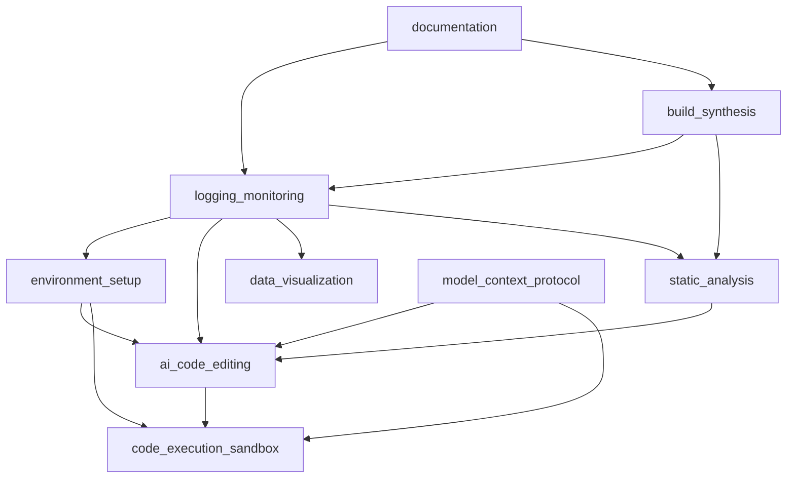

# Codomyrmex Package - Core Modules

The main Codomyrmex package containing all core functionality for AI-assisted software development, code analysis, testing, and documentation. This modular architecture enables extensible, maintainable workflows across multiple programming languages and development paradigms.

## Package Overview

**Package**: `codomyrmex` v0.1.0  
**Python**: 3.10+ required  
**Installation**: `pip install -e .` (from project root)

```python
import codomyrmex
print(codomyrmex.__version__)  # 0.1.0
```

## Module Status Matrix

|| Module | Status | API Stability | Tests | Documentation | MCP Tools | Key Features |
||--------|--------|---------------|-------|---------------|-----------|--------------|
|| **[ai_code_editing/](./ai_code_editing/)** | ✅ Active | 🔄 Evolving | ✅ Complete | ✅ Complete | ✅ 2 tools | OpenAI, Anthropic, Google LLM integration |
|| **[build_synthesis/](./build_synthesis/)** | ✅ Active | 🔄 Evolving | ⚠️ Partial | ✅ Complete | ✅ 2 tools | Build automation, code synthesis |
|| **[code_execution_sandbox/](./code_execution_sandbox/)** | ✅ Active | 🔄 Evolving | ✅ Complete | ✅ Complete | ✅ 1 tool | Secure Docker-based execution |
|| **[data_visualization/](./data_visualization/)** | ✅ Active | ✅ Stable | ✅ Complete | ✅ Complete | ❌ None | Matplotlib, Seaborn, Plotly plots |
|| **[documentation/](./documentation/)** | ✅ Active | 🔄 Evolving | ⚠️ Partial | ✅ Complete | ❌ None | Docusaurus website generation |
|| **[environment_setup/](./environment_setup/)** | ✅ Active | ✅ Stable | ✅ Complete | ✅ Complete | ❌ None | Dev environment automation |
|| **[git_operations/](./git_operations/)** | ✅ Active | 🔄 Evolving | ⚠️ Partial | ✅ Complete | 🔧 WIP | Advanced Git workflows |
|| **[logging_monitoring/](./logging_monitoring/)** | ✅ Active | ✅ Stable | ✅ Complete | ✅ Complete | ❌ None | Structured multi-language logging |
|| **[model_context_protocol/](./model_context_protocol/)** | ✅ Active | ✅ Stable | ✅ Complete | ✅ Complete | ❌ Schema | MCP framework implementation |
|| **[module_template/](./module_template/)** | ✅ Active | ✅ Stable | ⚠️ Template | ✅ Complete | ❌ Template | New module scaffolding |
|| **[pattern_matching/](./pattern_matching/)** | ✅ Active | 🔄 Evolving | ⚠️ Partial | ✅ Complete | 🔧 WIP | Advanced pattern matching |
|| **[static_analysis/](./static_analysis/)** | ✅ Active | 🔄 Evolving | ⚠️ Partial | ✅ Complete | 🔧 WIP | Code quality, security analysis |
|| **[system_discovery/](./system_discovery/)** | ✅ Active | 🔄 Evolving | ⚠️ Partial | ⚠️ Partial | ❌ None | System introspection and capability mapping |
|| **[terminal_interface/](./terminal_interface/)** | ✅ Active | 🔄 Evolving | ⚠️ Partial | ⚠️ Partial | ❌ None | CLI and terminal utilities |
|| **[performance/](./performance/)** | ✅ Active | ✅ Stable | ✅ Complete | ⚠️ Partial | ❌ None | Performance optimization utilities |

**Note**: All modules are now included in the main package exports. See individual module directories for current development status.

### Status Legend
- ✅ **Active**: Production-ready, fully functional
- 🔧 **Development**: Under active development
- ⚠️ **Partial**: Partially implemented or needs updates
- ❌ **None**: Not implemented
- 🔄 **Evolving**: Stable but with ongoing enhancements

## Core Module Categories

### 🤖 AI & LLM Integration
#### [ai_code_editing/](./ai_code_editing/) - AI-Powered Code Generation
- **Purpose**: Intelligent code generation, refactoring, and analysis using LLMs
- **Key Features**: Multi-provider LLM support (OpenAI, Anthropic, Google)
- **MCP Tools**: `generate_code_snippet`, `refactor_code_snippet`
- **Integration**: Works with all other modules for context-aware code generation

#### [model_context_protocol/](./model_context_protocol/) - LLM Interaction Framework
- **Purpose**: Standardized protocol for LLM tool interactions
- **Key Features**: Schema definitions, tool specifications, protocol enforcement
- **Integration**: Foundation for all AI-enhanced modules

### 🛠️ Development Infrastructure
#### [environment_setup/](./environment_setup/) - Development Environment Management
- **Purpose**: Automated setup and configuration of development environments
- **Key Features**: Dependency checking, API key management, environment validation
- **Scripts**: `env_checker.py`, setup automation scripts

#### [code_execution_sandbox/](./code_execution_sandbox/) - Secure Code Execution
- **Purpose**: Safe execution of untrusted or dynamically generated code
- **Key Features**: Docker-based isolation, resource limits, multi-language support
- **MCP Tools**: `execute_code`
- **Security**: Comprehensive sandboxing with network and filesystem isolation

#### [build_synthesis/](./build_synthesis/) - Build Automation
- **Purpose**: Automated build processes and code synthesis
- **Key Features**: Build orchestration, artifact generation, template processing
- **MCP Tools**: `trigger_build`, `synthesize_code_component`

### 📊 Analysis & Visualization
#### [data_visualization/](./data_visualization/) - Rich Data Plotting
- **Purpose**: Comprehensive data visualization capabilities
- **Key Features**: Line plots, scatter plots, bar charts, histograms, pie charts, heatmaps
- **Libraries**: Matplotlib, Seaborn, Plotly integration
- **Output**: Multiple formats (PNG, SVG, HTML, etc.)

#### [static_analysis/](./static_analysis/) - Code Quality & Security
- **Purpose**: Code quality analysis, security scanning, and metrics collection
- **Key Features**: Pylint, Flake8, Bandit integration, custom analyzers
- **Integration**: Pre-commit hooks, CI/CD pipeline integration

#### [pattern_matching/](./pattern_matching/) - Advanced Pattern Recognition
- **Purpose**: Sophisticated pattern matching and code analysis
- **Key Features**: AST analysis, regex patterns, custom matching logic

#### [system_discovery/](./system_discovery/) - System Introspection
- **Purpose**: Comprehensive system discovery and capability mapping
- **Key Features**: Module scanning, function discovery, capability analysis
- **Integration**: Works with all modules to provide system-wide insights

### 🔧 Development Tools
#### [git_operations/](./git_operations/) - Advanced Git Workflows
- **Purpose**: Automated Git workflows and repository management
- **Key Features**: Repository metadata, automated operations, GitHub integration
- **Tools**: `repository_manager.py`, `metadata_cli.py`, `repo_cli.py`

#### [logging_monitoring/](./logging_monitoring/) - Structured Logging
- **Purpose**: Unified logging system across all modules
- **Key Features**: Multi-language support (Python, Java, Go), structured output
- **Integration**: Every module uses this for consistent logging

#### [documentation/](./documentation/) - Documentation Website
- **Purpose**: Automated documentation generation and website creation
- **Key Features**: Docusaurus integration, versioned docs, API documentation
- **Output**: Complete documentation website

#### [terminal_interface/](./terminal_interface/) - CLI and Terminal Utilities
- **Purpose**: Command-line interfaces and terminal utilities
- **Key Features**: Interactive shell, terminal utilities, CLI helpers
- **Integration**: Provides CLI access to all module functionality

### 📝 Templates & Standards
#### [module_template/](./module_template/) - Module Scaffolding
- **Purpose**: Standardized template for creating new modules
- **Key Features**: Complete file structure, documentation templates, test frameworks

#### [performance/](./performance/) - Performance Optimization
- **Purpose**: Performance optimization utilities and monitoring
- **Key Features**: Lazy loading, caching, performance monitoring
- **Integration**: Used by all modules to improve performance

## Module Integration Patterns

### Basic Setup Pattern
```python
from codomyrmex.logging_monitoring import setup_logging, get_logger
from codomyrmex.environment_setup.env_checker import ensure_dependencies_installed

# Initialize logging (required for all modules)
setup_logging()
logger = get_logger(__name__)

# Verify environment
ensure_dependencies_installed()
logger.info("Environment verified successfully")
```

### AI-Enhanced Development Workflow
```python
from codomyrmex.ai_code_editing import generate_code_snippet, refactor_code_snippet
from codomyrmex.code_execution_sandbox import execute_code
from codomyrmex.static_analysis import analyze_code_quality
from codomyrmex.data_visualization import create_line_plot

# 1. Generate code with AI
code = generate_code_snippet(
    prompt="Create a function to calculate fibonacci numbers",
    language="python",
    provider="openai"
)

# 2. Execute safely in sandbox
result = execute_code(code, language="python", timeout=30)

# 3. Analyze code quality
quality_metrics = analyze_code_quality(code)

# 4. Visualize results if applicable
if result.success and quality_metrics.score > 0.8:
    # Generate visualization of results
    create_line_plot(data, title="Fibonacci Sequence", output_path="output/fib.png")
```

### Build & Documentation Workflow
```python
from codomyrmex.build_synthesis import trigger_build, synthesize_code_component
from codomyrmex.documentation import generate_documentation_website
from codomyrmex.git_operations import repository_manager

# 1. Synthesize components
component = synthesize_code_component(
    template="module_template",
    name="new_feature",
    parameters={"author": "developer", "version": "0.1.0"}
)

# 2. Trigger build process
build_result = trigger_build(target="all", config="production")

# 3. Generate documentation
if build_result.success:
    generate_documentation_website(output_dir="docs/build/")
    
# 4. Update repository metadata
repository_manager.update_metadata(build_result.artifacts)
```

## Module Dependencies

### Inter-Module Dependencies


### External Dependencies
- **Python 3.10+**: Core runtime requirement
- **Docker**: Required for `code_execution_sandbox`
- **Node.js 18+**: Required for `documentation` (Docusaurus)
- **Git**: Required for `git_operations`

## Quick Start by Use Case

### Data Analysis & Visualization
```bash
# Setup and basic plotting
python -c "
from codomyrmex.data_visualization import create_scatter_plot
import numpy as np
x, y = np.random.randn(100), np.random.randn(100)
create_scatter_plot(x, y, title='Random Data', output_path='output/scatter.png')
"
```

### AI Code Generation
```bash
# Generate and execute code with AI
python -c "
from codomyrmex.ai_code_editing import generate_code_snippet
from codomyrmex.code_execution_sandbox import execute_code
code = generate_code_snippet('print hello world in python')
result = execute_code(code, language='python')
print(result.output)
"
```

### Code Quality Analysis
```bash
# Analyze code quality
python -c "
from codomyrmex.static_analysis import analyze_code_quality
result = analyze_code_quality('example.py')
print(f'Quality Score: {result.score}/10')
"
```

## Development Guidelines

### Adding New Modules
1. **Use Template**: Start with `module_template/` structure
2. **Follow Patterns**: Maintain consistency with existing modules
3. **Integration**: Add logging, environment checks, and MCP tools where appropriate
4. **Testing**: Comprehensive test coverage with real implementations [[memory:7401885]]
5. **Documentation**: Complete README, API specs, and usage examples

### Code Standards
- **Logging**: All modules must use `logging_monitoring`
- **Environment**: Validate setup with `environment_setup`
- **Testing**: TDD approach with unified modular testing
- **Documentation**: "Show not tell" philosophy with practical examples [[memory:7401883]]
- **Dependencies**: Use latest package versions, avoid version pinning [[memory:7401880]]

### Output Organization [[memory:7401890]]
All module outputs should follow the established pattern:
```
output/
├── 01-analysis/
├── 02-generation/
├── 03-visualization/
└── 04-documentation/
```

## 🔗 Cross-References & Navigation

### **📚 Documentation Hub**
- **[Main Project README](../../README.md)**: Project overview with user journey map
- **[Documentation Hub](../../docs/README.md)**: Complete documentation structure
- **[Architecture Overview](../../docs/project/architecture.md)**: System architecture with diagrams
- **[Module Relationships](../../docs/modules/relationships.md)**: Inter-module dependencies

### **🚀 Getting Started Resources** 
- **[Installation Guide](../../docs/getting-started/installation.md)**: Complete setup instructions
- **[Quick Start Guide](../../docs/getting-started/quickstart.md)**: 5-minute getting started
- **[Module Creation Tutorial](../../docs/getting-started/tutorials/creating-a-module.md)**: Build your own module

### **🔧 Development Resources**
- **[Contributing Guide](../../docs/project/contributing.md)**: How to contribute effectively
- **[Development Setup](../../docs/development/environment-setup.md)**: Development environment
- **[Documentation Guidelines](../../docs/development/documentation.md)**: Writing and maintaining docs

### **📖 Reference Documentation**
- **[Complete API Reference](../../docs/reference/api-complete.md)**: **ACCURATE** API with real function signatures
- **[API Index](../../docs/reference/api.md)**: Quick API overview with source links
- **[CLI Reference](../../docs/reference/cli.md)**: Complete command-line documentation
- **[Troubleshooting Guide](../../docs/reference/troubleshooting.md)**: Common issues and solutions

### **📂 Source Code Navigation**
- **[Source Overview](../README.md)**: Source directory documentation with navigation diagrams
- **[Template Guide](../template/README.md)**: Module template system
- **[Individual Module APIs](./*/API_SPECIFICATION.md)**: Detailed API documentation for each module
- **[MCP Tool Specifications](./*/MCP_TOOL_SPECIFICATION.md)**: AI integration tools
- **[Usage Examples](./*/USAGE_EXAMPLES.md)**: Practical examples for each module

### **🌟 Module Quick Access**
Jump directly to any module's documentation:

|| Module | README | API | MCP Tools | Examples |
||--------|--------|-----|-----------|----------|
|| **[ai_code_editing](./ai_code_editing/)** | [📚](./ai_code_editing/README.md) | [🔌](./ai_code_editing/API_SPECIFICATION.md) | [🤖](./ai_code_editing/MCP_TOOL_SPECIFICATION.md) | [💡](./ai_code_editing/USAGE_EXAMPLES.md) |
|| **[data_visualization](./data_visualization/)** | [📚](./data_visualization/README.md) | [🔌](./data_visualization/API_SPECIFICATION.md) | ❌ | [💡](./data_visualization/USAGE_EXAMPLES.md) |
|| **[code_execution_sandbox](./code_execution_sandbox/)** | [📚](./code_execution_sandbox/README.md) | [🔌](./code_execution_sandbox/API_SPECIFICATION.md) | [🤖](./code_execution_sandbox/MCP_TOOL_SPECIFICATION.md) | [💡](./code_execution_sandbox/USAGE_EXAMPLES.md) |
|| **[static_analysis](./static_analysis/)** | [📚](./static_analysis/README.md) | [🔌](./static_analysis/API_SPECIFICATION.md) | [🤖](./static_analysis/MCP_TOOL_SPECIFICATION.md) | [💡](./static_analysis/USAGE_EXAMPLES.md) |
|| **[build_synthesis](./build_synthesis/)** | [📚](./build_synthesis/README.md) | [🔌](./build_synthesis/API_SPECIFICATION.md) | [🤖](./build_synthesis/MCP_TOOL_SPECIFICATION.md) | [💡](./build_synthesis/USAGE_EXAMPLES.md) |
|| **[pattern_matching](./pattern_matching/)** | [📚](./pattern_matching/README.md) | [🔌](./pattern_matching/API_SPECIFICATION.md) | [🤖](./pattern_matching/MCP_TOOL_SPECIFICATION.md) | [💡](./pattern_matching/USAGE_EXAMPLES.md) |
|| **[git_operations](./git_operations/)** | [📚](./git_operations/README.md) | [🔌](./git_operations/API_SPECIFICATION.md) | [🤖](./git_operations/MCP_TOOL_SPECIFICATION.md) | [💡](./git_operations/USAGE_EXAMPLES.md) |
|| **[documentation](./documentation/)** | [📚](./documentation/README.md) | [🔌](./documentation/API_SPECIFICATION.md) | ❌ | [💡](./documentation/USAGE_EXAMPLES.md) |
|| **[logging_monitoring](./logging_monitoring/)** | [📚](./logging_monitoring/README.md) | [🔌](./logging_monitoring/API_SPECIFICATION.md) | ❌ | [💡](./logging_monitoring/USAGE_EXAMPLES.md) |
|| **[environment_setup](./environment_setup/)** | [📚](./environment_setup/README.md) | [🔌](./environment_setup/API_SPECIFICATION.md) | ❌ | [💡](./environment_setup/USAGE_EXAMPLES.md) |
|| **[model_context_protocol](./model_context_protocol/)** | [📚](./model_context_protocol/README.md) | [🔌](./model_context_protocol/API_SPECIFICATION.md) | 📋 Schema | [💡](./model_context_protocol/USAGE_EXAMPLES.md) |
|| **[system_discovery](./system_discovery/)** | [📚](./system_discovery/README.md) | [🔌](./system_discovery/API_SPECIFICATION.md) | ❌ | [💡](./system_discovery/USAGE_EXAMPLES.md) |
|| **[terminal_interface](./terminal_interface/)** | [📚](./terminal_interface/README.md) | [🔌](./terminal_interface/API_SPECIFICATION.md) | ❌ | [💡](./terminal_interface/USAGE_EXAMPLES.md) |
|| **[performance](./performance/)** | [📚](./performance/README.md) | [🔌](./performance/API_SPECIFICATION.md) | ❌ | [💡](./performance/USAGE_EXAMPLES.md) |

---

*Last Updated: Auto-generated from module analysis*  
*Version: 0.1.0 - Active Development*  
*For module-specific details, see individual README files*