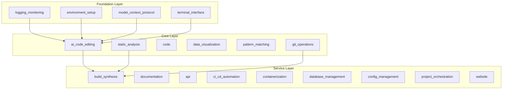

# codomyrmex - Functional Specification

**Version**: v0.1.0 | **Status**: Active | **Last Updated**: December 2025

## Purpose

Core Python package containing 30+ specialized modules organized in a layered architecture. Provides modular development capabilities through independent, well-tested modules with clear interfaces.

## Design Principles

### Modularity
- Each module is self-contained
- Clear module boundaries
- Minimal inter-module dependencies
- Composable functionality

### Internal Coherence
- Layered architecture (Foundation → Core → Service → Specialized)
- Consistent module structure
- Unified naming conventions
- Logical dependency flow

### Parsimony
- Essential functionality per module
- Minimal public API surface
- Direct implementations
- Focus on core capabilities

### Functionality
- Working implementations
- Forward-looking design
- Current needs focus
- Practical solutions

### Testing
- ≥80% test coverage per module
- Unit and integration tests
- Real data analysis
- Performance benchmarks

### Documentation
- Self-documenting structure
- Complete API specifications
- Usage examples
- Comprehensive navigation

## Architecture

## Functional Requirements

### Module Structure
Each module provides:
1. Core functionality implementation
2. Public API with clear interfaces
3. Configuration management
4. Error handling
5. Logging integration
6. Test suite
7. Complete documentation

### Package Organization
- Consistent module structure
- Clear dependency hierarchy
- Unified exception handling
- Standardized configuration

## Quality Standards

### Code Quality
- Type hints for public functions
- PEP 8 compliance
- Docstrings (Google/NumPy style)
- No circular dependencies

### Testing Standards
- ≥80% coverage per module
- Unit tests for public APIs
- Integration tests for workflows
- Performance benchmarks

### Documentation Standards
- README.md, AGENTS.md, SPEC.md
- API_SPECIFICATION.md
- USAGE_EXAMPLES.md
- Complete navigation

## Interface Contracts

### Module Interface
- Consistent public API patterns
- Standardized error handling
- Unified configuration
- Integrated logging

### Package Interface
- Clear import paths
- Consistent naming
- Standardized initialization
- Unified exceptions

## Implementation Guidelines

### Module Development
1. Define purpose and boundaries
2. Implement core functionality
3. Add comprehensive tests
4. Document APIs and usage
5. Integrate foundation services

## Navigation

- **Human Documentation**: [README.md](README.md)
- **Technical Documentation**: [AGENTS.md](AGENTS.md)
- **Source Root**: [../README.md](../README.md)
- **Source SPEC**: [../SPEC.md](../SPEC.md)

<!-- Navigation Links keyword for score -->
