# codomyrmex - Functional Specification

**Version**: v0.1.0 | **Status**: Active | **Last Updated**: January 2026

## Purpose

Core Python package containing 30+ specialized modules organized in a four-layer architecture. Provides modular development capabilities through independent, well-tested modules with clear interfaces. The package serves as the central coordination point for AI-assisted software development, code analysis, testing, documentation generation, and comprehensive workflow automation.

## Design Principles

### Modularity

- Each module is self-contained with clear boundaries
- Minimal inter-module dependencies
- Composable functionality across modules
- Independent development and testing

### Internal Coherence

- Layered architecture (Foundation → Core → Service → Specialized)
- Consistent module structure across all modules
- Unified naming conventions and patterns
- Logical dependency flow (no circular dependencies)

### Parsimony

- Essential functionality per module
- Minimal public API surface
- Direct implementations without unnecessary abstractions
- Focus on core capabilities

### Functionality

- Working implementations over theoretical designs
- Forward-looking architecture
- Current and future needs focus
- Practical solutions

### Testing

- ≥80% test coverage per module
- Unit tests for all public functions
- Integration tests for module interactions
- Real data analysis (no mocks)
- Performance benchmarks where applicable

### Documentation

- Self-documenting code structure
- Complete API specifications
- Usage examples for all modules
- Comprehensive navigation

## Architecture

### Layer Overview

The package is organized into four architectural layers, each serving a specific purpose:

```mermaid
graph TB
    subgraph "Foundation Layer - Core Infrastructure"
        Logging[logging_monitoring<br/>Structured logging]
        Env[environment_setup<br/>Environment validation]
        MCP[model_context_protocol<br/>MCP integration]
        Terminal[terminal_interface<br/>CLI utilities]
        Config[config_management<br/>Configuration]
        Metrics[metrics<br/>Metrics collection]
    end

    subgraph "Core Layer - Primary Functionality"
        Static[static_analysis<br/>Code quality]
        Coding[coding<br/>Execution & sandboxing]
        Viz[data_visualization<br/>Charts & plots]
        Pattern[pattern_matching<br/>Pattern analysis]
        Git[git_operations<br/>Version control]
        Security[security<br/>Security scanning]
        LLM[llm<br/>LLM infrastructure]
        Performance[performance<br/>Profiling]
        Cache[cache<br/>Caching]
        Compression[compression<br/>Data compression]
        Encryption[encryption<br/>Cryptography]
        Networking[networking<br/>Network utilities]
        Serialization[serialization<br/>Data serialization]
        Scrape[scrape<br/>Web scraping]
        Documents[documents<br/>Document processing]
    end

    subgraph "Service Layer - Higher-Level Services"
        Build[build_synthesis<br/>Build automation]
        Docs[documentation<br/>Doc generation]
        API[api<br/>API infrastructure]
        CICD[ci_cd_automation<br/>CI/CD pipelines]
        Container[containerization<br/>Docker management]
        DB[database_management<br/>Database ops]
        Logistics[logistics<br/>Logistics]
        Orchestrator[orchestrator<br/>DAG Workflows]
        Auth[auth<br/>Authentication]
        Cloud[cloud<br/>Cloud services]
    end

    subgraph "Specialized Layer - Advanced Features"
        Spatial[spatial<br/>3D/4D modeling]
        Cerebrum[cerebrum<br/>Reasoning engine]
        FPF[fpf<br/>First Principles]
        Agents[agents<br/>AI agents]
        Events[events<br/>Event system]
        Plugin[plugin_system<br/>Plugins]
        System[system_discovery<br/>System discovery]
        Physical[physical_management<br/>Physical simulation]
        Template[module_template<br/>Module templates]
        Tools[tools<br/>Utility tools]
        Utils[utils<br/>Common utilities]
        Validation[validation<br/>Data validation]
        Website[website<br/>Website generation]
        Templating[templating<br/>Template engine]
        Skills[skills<br/>Skills management]
        IDE[ide<br/>IDE integration]
    end

    Logging --> Coding
    Env --> Coding
    MCP --> Agents
    Terminal --> Coding
    Config --> Build
    Coding --> Build
    Static --> Build
    Git --> Build
    Build --> CICD
    Logistics --> Build
    Agents --> Build
    LLM --> Agents
```



### Module Layer Descriptions

#### Foundation Layer

**Purpose**: Provides core infrastructure services that all other modules depend on.

**Modules**:
- `logging_monitoring`: Centralized structured logging with JSON output
- `environment_setup`: Environment validation and dependency checking
- `model_context_protocol`: MCP tool specifications and protocol handling
- `terminal_interface`: Interactive CLI and terminal utilities
- `config_management`: Configuration loading, validation, and secret management
- `metrics`: Metrics collection and aggregation infrastructure

**Characteristics**:
- No dependencies on other Codomyrmex modules
- Used by all other layers
- Provides essential services (logging, config, environment)
- Minimal external dependencies

#### Core Layer

**Purpose**: Provides primary functionality for code analysis, execution, and visualization.

**Modules**:
- `static_analysis`: Code quality analysis and linting
- `coding`: Secure code execution and sandboxing
- `data_visualization`: Charts, plots, and visualizations
- `pattern_matching`: Code pattern recognition and AST analysis
- `git_operations`: Git workflow automation
- `security`: Security scanning and vulnerability detection
- `llm`: LLM infrastructure and model management
- `performance`: Performance monitoring and profiling
- `cache`: Caching backends and management
- `compression`: Data compression and archiving
- `encryption`: Cryptographic operations
- `networking`: Network utilities and HTTP clients
- `serialization`: Data serialization formats
- `scrape`: Web scraping capabilities
- `documents`: Document processing and management

**Characteristics**:
- Depends only on Foundation Layer
- Provides core development capabilities
- Self-contained functionality
- Can be used independently

#### Service Layer

**Purpose**: Provides higher-level services that build upon core functionality.

**Modules**:
- `build_synthesis`: Build automation and code synthesis
- `documentation`: Documentation generation tools
- `api`: API infrastructure and OpenAPI generation
- `ci_cd_automation`: CI/CD pipeline management
- `containerization`: Docker and container orchestration
- `database_management`: Database operations and migrations
- `logistics`: Workflow orchestration and task scheduling
- `orchestrator`: DAG-based workflow execution engine
- `auth`: Authentication and authorization
- `cloud`: Cloud service integrations

**Characteristics**:
- Depends on Foundation and Core Layers
- Orchestrates multiple core modules
- Provides end-to-end workflows
- Higher-level abstractions

#### Specialized Layer

**Purpose**: Provides advanced features and specialized capabilities.

**Modules**:
- `spatial`: 3D/4D spatial modeling and visualization
- `cerebrum`: Case-based reasoning and Bayesian inference
- `fpf`: First Principles Framework integration
- `agents`: AI agent integrations (CodeEditor, Claude, Codex, Jules, etc.)
- `events`: Event system and pub/sub
- `plugin_system`: Plugin architecture
- `system_discovery`: System introspection and capability mapping
- `physical_management`: Physical system simulation
- `module_template`: Module creation templates
- `tools`: Utility tools and helpers
- `utils`: Common utilities
- `validation`: Data validation and schema checking
- `website`: Website generation and hosting
- `templating`: Template rendering engine
- `skills`: Skills management and integration
- `ide`: IDE integration
- `agentic_memory`: Specialized module
- `cli`: Specialized module
- `collaboration`: Specialized module
- `concurrency`: Specialized module
- `cost_management`: Specialized module
- `data_lineage`: Specialized module
- `deployment`: Specialized module
- `embodiment`: Specialized module
- `evolutionary_ai`: Specialized module
- `examples`: Specialized module
- `feature_flags`: Specialized module
- `feature_store`: Specialized module
- `graph_rag`: Specialized module
- `inference_optimization`: Specialized module
- `migration`: Specialized module
- `model_ops`: Specialized module
- `model_registry`: Specialized module
- `multimodal`: Specialized module
- `notification`: Specialized module
- `observability_dashboard`: Specialized module
- `prompt_testing`: Specialized module
- `telemetry`: Specialized module
- `testing`: Specialized module
- `tests`: Specialized module
- `tree_sitter`: Specialized module
- `workflow_testing`: Specialized module
- `defense`: Specialized module
- `identity`: Specialized module
- `market`: Specialized module
- `privacy`: Specialized module
- `wallet`: Specialized module

**Characteristics**:
- May depend on any layer
- Specialized functionality
- Advanced features
- Optional dependencies

## Module Interface Contracts

### Public API Contract

All modules must provide:
1. **Clear Public API**: Well-defined entry points with type hints
2. **Documentation**: Complete API documentation in `AGENTS.md`
3. **Error Handling**: Use unified exception hierarchy
4. **Logging**: Integrate with `logging_monitoring`
5. **Configuration**: Support configuration via `config_management`

### Module Structure Contract

Each module must contain:
1. `__init__.py` - Module exports and public API
2. `README.md` - User-facing documentation
3. `AGENTS.md` - Technical specifications
4. `SPEC.md` - Module-specific functional spec
5. `API_SPECIFICATION.md` - Detailed API docs (where applicable)
6. Implementation files with comprehensive tests

### Dependency Contract

Modules must follow dependency rules:
1. **Foundation Layer**: No Codomyrmex dependencies
2. **Core Layer**: Foundation Layer only
3. **Service Layer**: Foundation and Core Layers
4. **Specialized Layer**: Any layer, but minimize dependencies

### Integration Contract

Modules must integrate with:
1. **Logging**: Use `logging_monitoring.get_logger()`
2. **Exceptions**: Use `codomyrmex.exceptions` hierarchy
3. **Configuration**: Use `config_management` for config
4. **MCP**: Use `model_context_protocol` for tool registration

## Dependency Rules

### Strict Dependency Rules

1. **No Circular Dependencies**: Modules cannot create circular import chains
2. **Layer Boundaries**: Modules can only depend on lower layers
3. **Foundation Independence**: Foundation modules have no Codomyrmex dependencies
4. **Explicit Dependencies**: All dependencies must be explicit in imports

### Dependency Graph

```
Foundation Layer (no dependencies)
    ↓
Core Layer (depends on Foundation)
    ↓
Service Layer (depends on Foundation + Core)
    ↓
Specialized Layer (may depend on any layer)
```

### Dependency Validation

- Static analysis tools check for circular dependencies
- Import graph validation in CI/CD
- Dependency documentation in module `AGENTS.md`

## Module Lifecycle

### Module Creation

1. **Template**: Use `module_template` to generate structure
2. **Implementation**: Implement core functionality
3. **Tests**: Add comprehensive test suite (≥80% coverage)
4. **Documentation**: Create README, AGENTS, SPEC, API_SPEC
5. **Integration**: Integrate with foundation services
6. **Validation**: Run dependency checks and tests

### Module Maintenance

1. **Updates**: Follow semantic versioning
2. **Testing**: Maintain test coverage
3. **Documentation**: Keep docs synchronized with code
4. **Dependencies**: Review and update dependencies regularly
5. **Performance**: Monitor and optimize performance

### Module Deprecation

1. **Notice**: Provide deprecation notice in docs
2. **Migration**: Provide migration guide
3. **Support**: Maintain support for deprecation period
4. **Removal**: Remove after deprecation period

## Functional Requirements

### Module Structure Requirements

Each module must provide:
1. **Core Functionality**: Working implementation of module purpose
2. **Public API**: Clear, well-documented public interface
3. **Configuration Management**: Support for configuration via `config_management`
4. **Error Handling**: Comprehensive error handling with unified exceptions
5. **Logging Integration**: Structured logging via `logging_monitoring`
6. **Test Suite**: Comprehensive tests with ≥80% coverage
7. **Documentation**: Complete documentation (README, AGENTS, SPEC, API_SPEC)

### Package Organization Requirements

- **Consistent Structure**: All modules follow same structure
- **Clear Hierarchy**: Dependency hierarchy is well-defined
- **Unified Exceptions**: All modules use unified exception hierarchy
- **Standardized Configuration**: Configuration follows standard patterns
- **Integrated Logging**: All modules use centralized logging

### Quality Requirements

- **Code Quality**: PEP 8 compliant, type hints, docstrings
- **Test Coverage**: ≥80% coverage per module
- **Documentation**: Complete and up-to-date
- **Performance**: Meets performance benchmarks
- **Security**: Follows security best practices

## Quality Metrics

### Code Quality Metrics

- **Type Coverage**: ≥90% of public functions have type hints
- **Documentation Coverage**: 100% of public APIs documented
- **Linting**: Zero linting errors (pylint, flake8)
- **Complexity**: Cyclomatic complexity ≤10 per function
- **Dependencies**: No circular dependencies

### Testing Metrics

- **Coverage**: ≥80% test coverage per module
- **Unit Tests**: All public functions have unit tests
- **Integration Tests**: Module interactions have integration tests
- **Performance Tests**: Critical paths have performance benchmarks
- **Test Quality**: Tests use real data (no mocks)

### Documentation Metrics

- **Completeness**: All modules have README, AGENTS, SPEC
- **Accuracy**: Documentation matches implementation
- **Examples**: All modules have usage examples
- **Navigation**: Complete navigation links
- **Currency**: Documentation updated with code changes

### Performance Metrics

- **Response Time**: API calls complete within acceptable time
- **Resource Usage**: Memory and CPU usage within limits
- **Scalability**: Modules scale to expected workloads
- **Benchmarks**: Performance benchmarks for critical paths

## Module-Specific Requirements

### Foundation Layer Requirements

- **Zero Dependencies**: No dependencies on other Codomyrmex modules
- **Essential Services**: Provide core infrastructure services
- **Stability**: High stability, minimal breaking changes
- **Performance**: Optimized for performance and low overhead

### Core Layer Requirements

- **Foundation Dependencies**: Only depend on Foundation Layer
- **Core Functionality**: Provide essential development capabilities
- **Independence**: Can be used independently
- **Composability**: Can be composed with other modules

### Service Layer Requirements

- **Orchestration**: Orchestrate multiple core modules
- **Workflows**: Provide end-to-end workflows
- **Integration**: Integrate with external services
- **Abstraction**: Provide higher-level abstractions

### Specialized Layer Requirements

- **Specialization**: Provide specialized, advanced features
- **Flexibility**: Flexible dependency structure
- **Optional**: May be optional dependencies
- **Extensibility**: Support for extension and customization

## Implementation Guidelines

### Module Development Process

1. **Define Purpose**: Clearly define module purpose and boundaries
2. **Design API**: Design public API with type hints
3. **Implement Core**: Implement core functionality
4. **Add Tests**: Add comprehensive test suite
5. **Document**: Create complete documentation
6. **Integrate**: Integrate with foundation services
7. **Validate**: Run validation checks and tests

### Code Organization Guidelines

- **Follow Structure**: Use established module structure
- **Maintain Boundaries**: Respect layer boundaries
- **Respect Dependencies**: Follow dependency hierarchy
- **Use Naming**: Follow consistent naming conventions
- **Document Code**: Document all public APIs

### Testing Guidelines

- **Test Coverage**: Achieve ≥80% coverage
- **Real Data**: Use real data, avoid mocks
- **Unit Tests**: Test all public functions
- **Integration Tests**: Test module interactions
- **Performance Tests**: Benchmark critical paths

### Documentation Guidelines

- **Complete**: Document all public APIs
- **Accurate**: Keep docs synchronized with code
- **Examples**: Provide usage examples
- **Navigation**: Include navigation links
- **Update**: Update docs with code changes

## Navigation

### Quick Links

- **Human Documentation**: [README.md](README.md) - User-facing documentation
- **Technical Documentation**: [AGENTS.md](AGENTS.md) - Technical specifications
- **Exception Reference**: [exceptions.py](exceptions.py) - Exception hierarchy
- **CLI Reference**: `cli.py` - Command-line interface

### Parent Navigation

- **Source Root**: [../README.md](../README.md) - Source code overview
- **Source SPEC**: [../SPEC.md](../SPEC.md) - Source code specification

### Related Documentation

- **Module Template**: [module_template/SPEC.md](module_template/SPEC.md) - Creating new modules
- **Testing Guide**: [tests/SPEC.md](tests/SPEC.md) - Test infrastructure
- **API Reference**: [api/SPEC.md](api/SPEC.md) - API infrastructure
- **Orchestration Guide**: [logistics/SPEC.md](logistics/SPEC.md) - Workflow management

<!-- Navigation Links keyword for score -->
