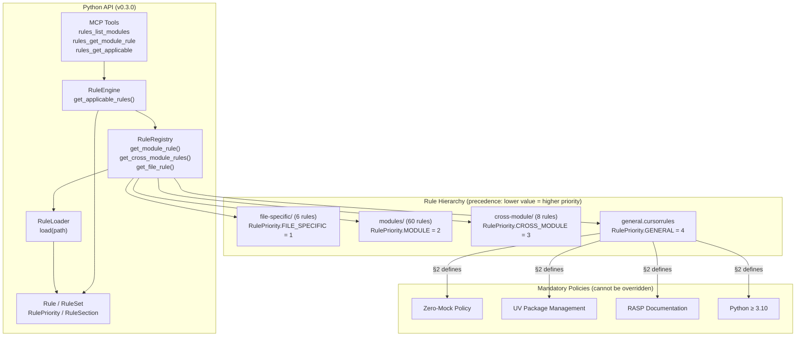

# Rules Submodule — Functional Specification

**Version**: v0.3.0 | **Status**: Active | **Last Updated**: March 2026

## Purpose

Coding standards directory providing hierarchical rules, conventions, and automation guidelines for consistent code quality, style, and development practices across the Codomyrmex platform. As of v0.3.0, the static `.cursorrules` files are wrapped by a Python API enabling programmatic access by agents, tools, and MCP clients.

## Design Principles

### Modularity

- Rules organized by scope and purpose
- Hierarchical rule structure with clear precedence
- Composable rule sets
- Clear rule boundaries
- Python API decoupled from rule file format — rules can evolve independently

### Internal Coherence

- Consistent rule patterns across all 75 rules
- Unified 8-section template
- Logical organization (general → cross-module → modules → file-specific)
- Standardized Python dataclasses mirror rule structure

### Parsimony

- Essential rules only — no redundant coverage
- Clear, concise rule definitions
- Minimal rule complexity
- Focused rule scope

### Functionality

- Enforceable rules backed by tooling (ruff, pytest, pre-commit)
- Practical guidelines with concrete examples
- Working rule implementations
- Current best practices (Zero-Mock, UV, RASP)
- MCP tools for real-time rule lookup by agents

### Testing

- All rules mandate real functional testing (Zero-Mock)
- Environment-gated tests for external services
- Real data factories instead of mock objects
- Rule API tested against real `.cursorrules` files (no mocking)

### Documentation

- Clear rule documentation with rationale
- Usage examples in each rule
- RASP compliance at every directory level
- Cross-referencing between related rules

## Architecture



## Functional Requirements

### Rule Categories

1. **General Rules**: Platform-wide coding standards + mandatory policies (1 rule)
2. **Cross-Module Rules**: Inter-module coordination rules (8 rules)
3. **Module Rules**: Module-specific conventions (60 rules)
4. **File-Specific Rules**: File-type specific standards (6 rules)

### Python API Requirements

| Class | Required Methods |
|-------|-----------------|
| `RuleEngine` | `get_applicable_rules(file_path, module_name) → RuleSet` |
| `RuleEngine` | `get_module_rule(module_name) → Rule | None` |
| `RuleEngine` | `list_module_names() → list[str]` |
| `RuleRegistry` | `get_general() → Rule | None` |
| `RuleRegistry` | `get_module_rule(name) → Rule | None` |
| `RuleRegistry` | `get_cross_module_rules() → list[Rule]` |
| `RuleRegistry` | `get_file_rule(file_path) → Rule | None` |
| `RuleLoader` | `load(path: Path) → Rule` |
| `RuleSet` | `resolved() → list[Rule]` (sorted by priority, FILE_SPECIFIC first) |
| `Rule` | `get_section(number: int) → RuleSection | None` |
| `Rule` | `to_dict() → dict` |

### MCP Tool Requirements

| Tool | Signature | Returns |
|------|-----------|---------|
| `rules_list_modules` | `() → list[str]` | Sorted module names |
| `rules_get_module_rule` | `(module_name: str) → dict | None` | Rule dict or null |
| `rules_get_applicable` | `(file_path: str, module_name: str) → list[dict]` | Rule dicts, highest priority first |

### Mandatory Policies (defined in `general.cursorrules §2`)

1. **Zero-Mock**: No mocks, MagicMock, or test doubles anywhere
2. **UV Package Management**: All deps via `pyproject.toml` + `uv sync`
3. **RASP Documentation**: README.md + AGENTS.md + SPEC.md + PAI.md at every level
4. **Python ≥ 3.10**: Modern Python features, type hints required

### Priority Resolution

When multiple rules apply to a context, they are resolved by specificity:

```
FILE_SPECIFIC (priority 1) → MODULE (2) → CROSS_MODULE (3) → GENERAL (4)

Lowest numeric value = highest priority = returned first in RuleSet.resolved()
```

## Quality Standards

### Rule Quality

- Clear and actionable rules
- Enforceable via pre-commit hooks and CI
- Practical examples from real codebase
- Regularly reviewed and updated

### Python API Quality

- Full type hints + PEP 561 (`py.typed` marker)
- Docstrings on all public classes and methods
- Zero-mock tests using real `.cursorrules` files
- Graceful handling of missing/unknown modules/files

### Enforcement Quality

- Automated enforcement via pre-commit (`ruff`, `mypy`)
- CI/CD pipeline validation (`uv run pytest`)
- Clear violation reporting
- Consistent application across all 75 rules

## Interface Contracts

### Rule File Interface

- Standardized 8-section template (§0 Preamble through §7 Final Check)
- Consistent rule structure across all levels
- Clear rule scope (file → module → cross-module → general)
- Defined enforcement mechanism per rule

### Rule Hierarchy

- General rules as fallback base (always included)
- Specific rules override general (except mandatory policies)
- Clear precedence: file-specific > module > cross-module > general
- Mandatory policies apply at all levels unconditionally

### Python Module Interface

```python
# Primary entry point
from codomyrmex.agentic_memory.rules import RuleEngine

# Full type-safe API
from codomyrmex.agentic_memory.rules import (
    Rule, RuleSet, RulePriority, RuleSection,
    RuleLoader, RuleRegistry, RuleEngine,
)

# Also available at agentic_memory level
from codomyrmex.agentic_memory import (
    Rule, RuleEngine, RuleLoader, RulePriority,
    RuleRegistry, RuleSection, RuleSet,
)
```

## Implementation Guidelines

### Rule Development

1. Define rule purpose and scope
2. Create clear rule definition following 8-section template (§0–§7)
3. Provide examples and rationale
4. Ensure compliance with mandatory policies (Zero-Mock, UV, RASP)
5. Document rule usage and enforcement

### Rule Organization

- Organize by scope and purpose
- Maintain hierarchy integrity
- Keep rules current with codebase
- Remove obsolete rules

## Navigation

- **Human Documentation**: [README.md](README.md)
- **Agent Guidelines**: [AGENTS.md](AGENTS.md)
- **AI Context**: [PAI.md](PAI.md)
- **Parent Module**: [../README.md](../README.md) - Agentic Memory
