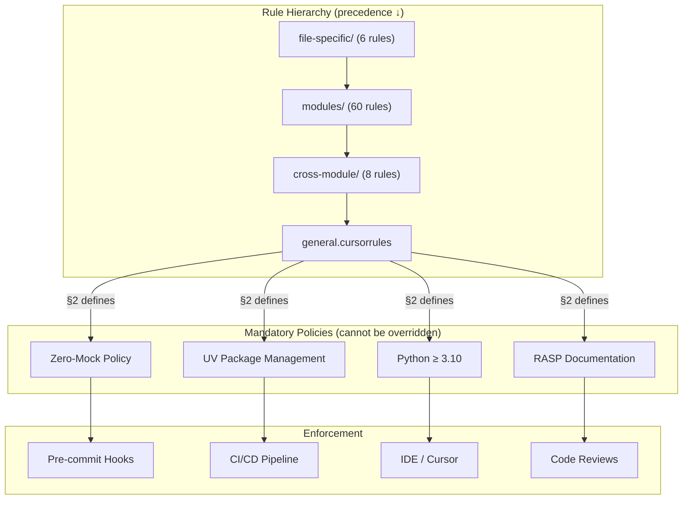

# cursorrules - Functional Specification

**Version**: v0.2.0 | **Status**: Active | **Last Updated**: February 2026

## Purpose

Coding standards directory providing hierarchical rules, conventions, and automation guidelines for consistent code quality, style, and development practices across the Codomyrmex platform.

## Design Principles

### Modularity

- Rules organized by scope and purpose
- Hierarchical rule structure with clear precedence
- Composable rule sets
- Clear rule boundaries

### Internal Coherence

- Consistent rule patterns across all 75 rules
- Unified 8-section template
- Logical organization (general → cross-module → modules → file-specific)
- Standardized rule structure

### Parsimony

- Essential rules only — no redundant coverage
- Clear, concise rule definitions
- Minimal rule complexity
- Focused rule scope

### Functionality

- Enforceable rules backed by tooling (ruff, pytest, pre-commit)
- Practical guidelines with concrete examples
- Working rule implementations
- Current best practices (Zero-Mock, UV, RASP)

### Testing

- All rules mandate real functional testing (Zero-Mock)
- Environment-gated tests for external services
- Real data factories instead of mock objects
- ≥80% coverage target

### Documentation

- Clear rule documentation with rationale
- Usage examples in each rule
- RASP compliance at every directory level
- Cross-referencing between related rules

## Architecture

## Functional Requirements

### Rule Categories

1. **General Rules**: Platform-wide coding standards + mandatory policies
2. **Cross-Module Rules**: Inter-module coordination rules (8 rules)
3. **Module Rules**: Module-specific conventions (60 rules)
4. **File-Specific Rules**: File-type specific standards (6 rules)

### Mandatory Policies (defined in `general.cursorrules §2`)

1. **Zero-Mock**: No mocks, MagicMock, or test doubles anywhere
2. **UV Package Management**: All deps via `pyproject.toml` + `uv sync`
3. **RASP Documentation**: README.md + AGENTS.md + SPEC.md + PAI.md at every level
4. **Python ≥ 3.10**: Modern Python features, type hints required

### Rule Standards

- Clear rule definitions with concrete examples
- Enforceable guidelines backed by tooling
- Practical examples matching current codebase
- Current best practices (updated February 2026)

## Quality Standards

### Rule Quality

- Clear and actionable rules
- Enforceable via pre-commit hooks and CI
- Practical examples from real codebase
- Regularly reviewed and updated

### Enforcement Quality

- Automated enforcement via pre-commit (`ruff`, `mypy`)
- CI/CD pipeline validation (`uv run pytest`)
- Clear violation reporting
- Consistent application across all 75 rules

## Interface Contracts

### Rule Interface

- Standardized 8-section template
- Consistent rule structure across all levels
- Clear rule scope (file → module → cross-module → general)
- Defined enforcement mechanism per rule

### Rule Hierarchy

- General rules as fallback base
- Specific rules override general (except mandatory policies)
- Clear precedence: file-specific > module > cross-module > general
- Mandatory policies apply at all levels unconditionally

## Implementation Guidelines

### Rule Development

1. Define rule purpose and scope
2. Create clear rule definition following 8-section template
3. Provide examples and rationale
4. Ensure compliance with mandatory policies (Zero-Mock, UV, RASP)
5. Document rule usage and enforcement

### Rule Organization

- Organize by scope and purpose
- Maintain hierarchy integrity
- Keep rules current with codebase
- Remove obsolete rules

## Navigation

- **Human Documentation**: [README.md](README.md)
- **Technical Documentation**: [AGENTS.md](AGENTS.md)
- **AI Context**: [PAI.md](PAI.md)
- **Repository Root**: [../README.md](../README.md)
- **Repository SPEC**: [../SPEC.md](../SPEC.md)
