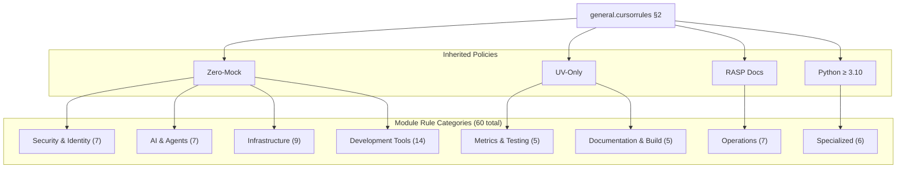

# modules - Functional Specification

**Version**: v0.2.0 | **Status**: Active | **Last Updated**: February 2026

## Purpose

This directory contains module-specific coding standards and conventions for each Codomyrmex module. Each `.cursorrules` file defines standards tailored to the specific requirements, architecture, and purpose of its corresponding module.

## Overview

Contains 60 module-specific rules organized by domain (Security, AI/Agents, Infrastructure, Development, Operations, Specialized). All rules follow a standardized 8-section template and inherit mandatory policies from `general.cursorrules §2`.

## Design Principles

### Modularity

- One `.cursorrules` file per source module
- Clear 1:1 mapping to `src/codomyrmex/{module}/`
- Self-contained standards within each rule

### Internal Coherence

- All 60 rules follow the same 8-section template
- Consistent structure across all domains
- Unified terminology and patterns

### Parsimony

- Essential module-specific standards only
- General patterns delegated to `general.cursorrules`
- Cross-cutting patterns delegated to `cross-module/`

### Functionality

- Focus on working, real implementations
- Zero-Mock testing in every rule
- UV package management throughout

### Testing

- All rules mandate Zero-Mock testing (no mocks, MagicMock, test doubles)
- Environment-gated tests for external services
- Real data factories for test data
- ≥80% test coverage target

### Documentation

- RASP compliance (README, AGENTS, SPEC, PAI) at module level
- Google-style docstrings for all public APIs
- Type hints on all functions (Python ≥ 3.10)

## Architecture

## Functional Requirements

### Module Rule Standards

1. **8-Section Template**: Preamble, Purpose, Key Files, Coding Standards, Testing, Documentation, Specific Considerations, Final Check
2. **Zero-Mock Testing**: Every Testing section mandates real implementations
3. **UV Dependencies**: Every Key Files section references `pyproject.toml`
4. **RASP Documentation**: Every Documentation section enforces the RASP pattern

### Coverage

- 60 rules covering 7 domains
- Each rule maps to one source module in `src/codomyrmex/`
- All rules updated for February 2026 policies

## Quality Standards

### Rule Quality

- Clear and actionable module-specific guidance
- Consistent with mandatory policies (Zero-Mock, UV, RASP)
- Practical examples from real codebase
- Current best practices (Python 3.10+)

### Enforcement

- Pre-commit hooks enforce coding standards
- CI/CD validates test execution via `uv run pytest`
- Code reviews verify RASP compliance

## Interface Contracts

### Rule Template Contract

- All rules follow identical 8-section structure
- Section numbering consistent (0-7)
- Mandatory policies cannot be weakened by any module rule

### Module-Source Mapping

- `modules/{name}.cursorrules` → `src/codomyrmex/{name}/`
- One rule file per source module
- Rule file tracks module's key files and dependencies

## Implementation Guidelines

### Creating a New Module Rule

1. Copy the 8-section template from `module_template.cursorrules`
2. Fill in module-specific purpose and key files referencing `pyproject.toml`
3. Specify testing requirements using Zero-Mock patterns
4. Document RASP compliance requirements
5. Add module-specific considerations

### Maintaining Rules

- Update when module architecture changes
- Keep dependency references pointing to `pyproject.toml`
- Verify Zero-Mock compliance in testing sections
- Remove rules when source modules are deleted

## Navigation

- **Human Documentation**: [README.md](README.md)
- **Technical Documentation**: [AGENTS.md](AGENTS.md)
- **AI Context**: [PAI.md](PAI.md)
- **Parent Directory**: [cursorrules](../README.md)
- **Repository Root**: [../../README.md](../../README.md)
- **Repository SPEC**: [../../SPEC.md](../../SPEC.md)
