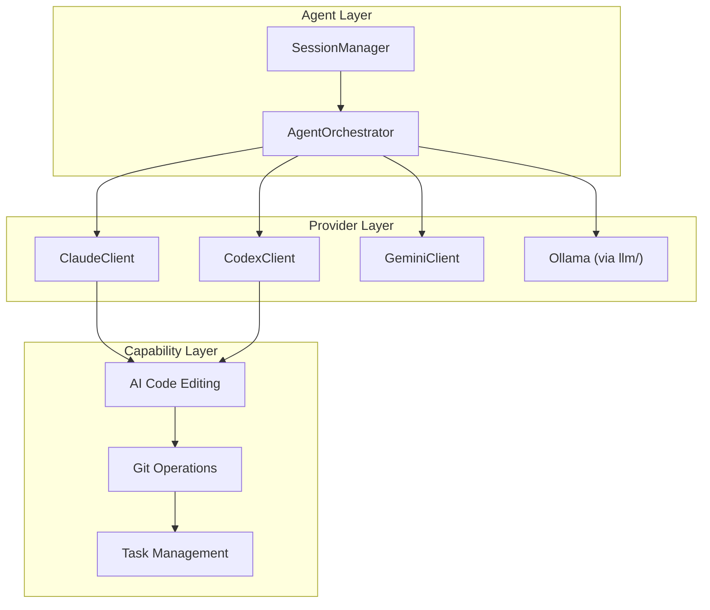

# Personal AI Infrastructure — Agents Module

**Version**: v0.1.0 | **Status**: Active | **Last Updated**: February 2026

## Overview

The Agents module is central to Codomyrmex's Personal AI Infrastructure. It provides the framework for integrating, coordinating, and orchestrating AI agents across multiple providers for code editing, task automation, and intelligent development workflows.

## PAI Capabilities

### Multi-Provider AI Integration

Support for multiple AI providers with consistent interfaces:

| Provider | Client | Type | PAI Use Case |
| :--- | :--- | :--- | :--- |
| Claude | `ClaudeClient` | API | Code review, generation, explanation |
| Codex | `CodexClient` | API | Code completion, transformation |
| Gemini | `GeminiClient` | CLI | Multi-modal code analysis |
| Ollama | via `llm/` | Local | Private local AI processing |

### AI Code Editing

The `ai_code_editing/` submodule provides:

```python
from codomyrmex.agents import CodeEditor

editor = CodeEditor()

# AI-powered refactoring
refactored = editor.refactor(
    code=original_code,
    instruction="Add comprehensive error handling"
)

# AI code review
review = editor.review(code, focus=["security", "performance"])

# AI code generation
generated = editor.generate(
    specification="REST API endpoint for user registration",
    context=existing_codebase
)
```

### Agent Orchestration

Coordinate multiple agents for complex tasks:

```python
from codomyrmex.agents import AgentOrchestrator, ClaudeClient, CodeEditor

orchestrator = AgentOrchestrator()

# Register specialized agents
orchestrator.register("reviewer", ClaudeClient(model="claude-3-opus"))
orchestrator.register("editor", CodeEditor())

# Define multi-agent workflow
workflow = orchestrator.create_workflow([
    {"agent": "reviewer", "action": "analyze"},
    {"agent": "editor", "action": "apply_suggestions"},
    {"agent": "reviewer", "action": "verify_changes"}
])

result = await orchestrator.execute(workflow, code=input_code)
```

### Session Management

Maintain context across AI interactions:

```python
from codomyrmex.agents import AgentSession, SessionManager

# Create persistent session
session = AgentSession(
    agent="claude",
    context={"project": "codomyrmex", "task": "refactoring"}
)

# Session persists across multiple interactions
session.send("Review this function")
session.send("Now optimize it for performance")
session.send("Add unit tests for the optimized version")

# Session manager for multiple concurrent sessions
manager = SessionManager()
manager.create("code_review_session")
manager.create("documentation_session")
```

## PAI Architecture



## PAI Configuration

### Environment Configuration

```bash
# API Keys (optional - only for cloud providers)
export ANTHROPIC_API_KEY="sk-..."
export OPENAI_API_KEY="sk-..."

# Default provider (local-first)
export CODOMYRMEX_DEFAULT_AGENT="ollama"

# Session settings
export CODOMYRMEX_SESSION_TIMEOUT=3600
export CODOMYRMEX_MAX_SESSIONS=10
```

### Agent Configuration

```python
from codomyrmex.agents import AgentConfig

config = AgentConfig(
    provider="claude",
    model="claude-3-sonnet",
    temperature=0.7,
    max_tokens=4096,
    system_prompt="You are a code review assistant.",
    tools=["file_read", "file_edit", "search"]
)
```

## PAI Best Practices

### 1. Local-First Development

```python
# Default to local models for development
config = AgentConfig(
    provider="ollama",
    model="codellama:13b",
    fallback_provider="claude"  # Fall back if local unavailable
)
```

### 2. Audit AI Actions

```python
from codomyrmex.agents import AgentOrchestrator
from codomyrmex.logging_monitoring import get_logger

logger = get_logger("pai.agents")

orchestrator = AgentOrchestrator(audit_log=True)

# All AI actions are logged
orchestrator.on_action(lambda action:
    logger.info("AI action", action=action.type, agent=action.agent)
)
```

### 3. Review AI Outputs

```python
# Always review AI-generated code
result = editor.generate(spec)

# Automatic security scan
from codomyrmex.security import SecurityScanner
scanner = SecurityScanner()
scan_result = scanner.scan(result.code)

if scan_result.has_vulnerabilities:
    logger.warning("AI generated code with vulnerabilities",
                   issues=scan_result.issues)
```

## Signposting

### Navigation

- **Self**: [PAI.md](PAI.md)
- **Parent**: [../PAI.md](../PAI.md) - Source PAI documentation
- **Project Root PAI**: [../../../PAI.md](../../../PAI.md) - Main PAI documentation

### Related Documentation

- [README.md](README.md) - Module overview
- [AGENTS.md](AGENTS.md) - Agent coordination
- [AI Code Editing](ai_code_editing/README.md) - Code editing details
- [../llm/PAI.md](../llm/PAI.md) - LLM PAI features
