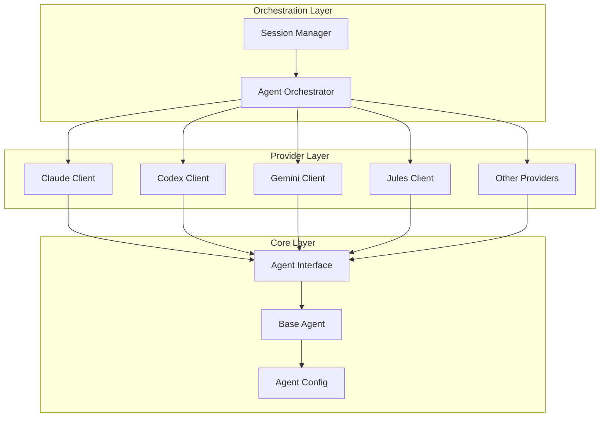

# Agents Module

**Version**: v0.1.0 | **Status**: Active | **Last Updated**: January 2026

## Overview

The Agents module provides integration with various agentic AI frameworks including Claude, Jules, Codex, Gemini, Mistral Vibe, OpenCode, and Every Code. It includes theoretical foundations for agent architectures, generic utilities, and framework-specific implementations for AI-powered code editing and task automation.

## Key Features

- **Multi-Provider Support**: Integrate with Claude, OpenAI Codex, Google Gemini, Mistral, and more
- **Agent Orchestration**: Coordinate multiple agents working on complex tasks
- **AI Code Editing**: Automated code generation, refactoring, and review
- **Session Management**: Persistent agent sessions with context preservation
- **Theoretical Foundations**: Reactive, deliberative, and hybrid agent architectures

## Directory Structure

```
agents/
├── core/              # Base classes, interfaces, and configuration
├── ai_code_editing/   # AI-powered code generation and editing
├── droid/             # Task management and agent coordination
├── claude/            # Claude API integration
├── codex/             # OpenAI Codex integration
├── gemini/            # Google Gemini integration
├── jules/             # Jules CLI integration
├── mistral_vibe/      # Mistral Vibe CLI integration
├── opencode/          # OpenCode CLI integration
├── every_code/        # Multi-agent orchestration
├── git_agent/         # Git operations agent
├── generic/           # Generic agent base classes
└── theory/            # Agent architecture theory
```

## Quick Start

```python
from codomyrmex.agents import (
    AgentOrchestrator,
    ClaudeClient,
    CodeEditor,
    AgentConfig,
)

# Configure agents
config = AgentConfig(provider="claude", model="claude-3-sonnet")

# Use AI code editing
editor = CodeEditor(config)
result = editor.refactor(
    code="def old_fn(x): return x*2",
    instruction="Add type hints and docstring"
)

# Orchestrate multiple agents
orchestrator = AgentOrchestrator()
orchestrator.register_agent("code", editor)
orchestrator.execute_workflow(["analyze", "refactor", "test"])
```

## Available Providers

| Provider | Client Class | Type | Description |
| :--- | :--- | :--- | :--- |
| Claude | `ClaudeClient` | API | Anthropic Claude models |
| Codex | `CodexClient` | API | OpenAI Codex/GPT models |
| Gemini | `GeminiClient` | CLI | Google Gemini models |
| Jules | `JulesClient` | CLI | Jules AI assistant |
| Mistral Vibe | `MistralVibeClient` | CLI | Mistral AI models |
| OpenCode | `OpenCodeClient` | CLI | OpenCode assistant |
| Every Code | `EveryCodeClient` | CLI | Multi-agent orchestration |

## Key Classes

| Class | Purpose |
| :--- | :--- |
| `AgentInterface` | Abstract base class for all agents |
| `BaseAgent` | Concrete base with common functionality |
| `AgentOrchestrator` | Multi-agent workflow coordination |
| `CodeEditor` | AI-powered code editing |
| `AgentConfig` | Configuration management |
| `AgentSession` | Session state management |

## Architecture



## Integration Points

- **logging_monitoring**: All agents use centralized logging
- **llm**: LLM infrastructure for model management
- **coding**: Safe code execution and sandboxing
- **pattern_matching**: Pattern-based code analysis

## Related Documentation

- [API Specification](API_SPECIFICATION.md)
- [Agent Comparison](AGENT_COMPARISON.md)
- [Functional Specification](SPEC.md)
- [AI Code Editing](ai_code_editing/README.md)

## Signposting

### Navigation

- **Self**: [README.md](README.md)
- **Parent**: [src/codomyrmex](../README.md)
- **Siblings**: [llm](../llm/README.md), [coding](../coding/README.md), [cerebrum](../cerebrum/README.md)

### Related Files

- [AGENTS.md](AGENTS.md) - Agent coordination for this module
- [API_SPECIFICATION.md](API_SPECIFICATION.md) - API documentation
- [SPEC.md](SPEC.md) - Functional specification
