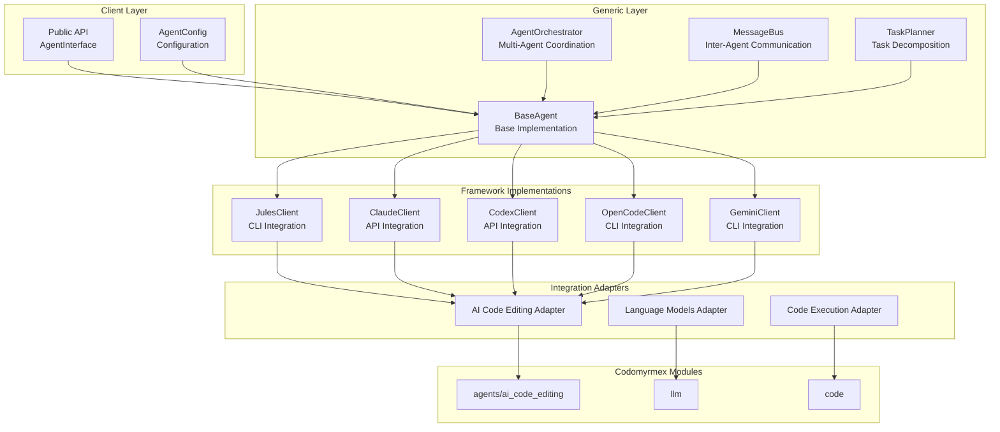

# src/codomyrmex/agents

## Signposting
- **Parent**: [codomyrmex](../README.md)
- **Children**:
    - [theory](theory/README.md)
    - [generic](generic/README.md)
    - [ai_code_editing](ai_code_editing/README.md)
    - [droid](droid/README.md)
    - [jules](jules/README.md)
    - [claude](claude/README.md)
    - [codex](codex/README.md)
    - [opencode](opencode/README.md)
    - [gemini](gemini/README.md)
- **Key Artifacts**:
    - [Agent Guide](AGENTS.md)
    - [Functional Spec](SPEC.md)

**Version**: v0.1.0 | **Status**: Active | **Last Updated**: December 2025

## Overview

The agents module provides integration with various agentic frameworks including Jules CLI, Claude API, OpenAI Codex, OpenCode CLI, and Gemini CLI. It includes theoretical foundations, generic utilities, and framework-specific implementations that integrate seamlessly with Codomyrmex modules.

The agents module serves as the agentic framework integration layer, supporting multiple agent frameworks through a unified interface.

## Agents Architecture



## Key Features

- **Unified Interface**: Consistent interface across all agent frameworks via `AgentInterface`
- **Framework Support**: Integration with Jules CLI, Claude API, OpenAI Codex, OpenCode CLI, and Gemini CLI
- **Code Generation**: Generate code using various agent frameworks
- **Code Editing**: Edit and refactor code using agents
- **Streaming Support**: Support streaming responses where available
- **Multi-Agent Orchestration**: Coordinate multiple agents for complex tasks
- **Integration Ready**: Seamless integration with Codomyrmex modules

## Quick Start

### Basic Usage

```python
from codomyrmex.agents import AgentInterface, AgentRequest, AgentCapabilities
from codomyrmex.agents.claude import ClaudeClient
from codomyrmex.logging_monitoring import setup_logging

# Setup logging
setup_logging()

# Create Claude agent
claude_agent = ClaudeClient()

# Create request
request = AgentRequest(
    prompt="Write a Python function to calculate fibonacci numbers",
    capabilities=[AgentCapabilities.CODE_GENERATION]
)

# Execute request
response = claude_agent.execute(request)

if response.is_success():
    print(response.content)
else:
    print(f"Error: {response.error}")
```

### Using Integration Adapters

```python
from codomyrmex.agents.claude import ClaudeClient, ClaudeIntegrationAdapter
from codomyrmex.agents.ai_code_editing import generate_code_snippet

# Create agent and adapter
claude_agent = ClaudeClient()
adapter = ClaudeIntegrationAdapter(claude_agent)

# Use adapter for code generation
code = adapter.adapt_for_ai_code_editing(
    prompt="Create a REST API endpoint",
    language="python"
)
```

## Module Structure

### Core Components
- `core.py` - Core agent interfaces and base classes
- `config.py` - Configuration management
- `exceptions.py` - Agent-specific exceptions

### Submodules
- `theory/` - Theoretical foundations for agentic systems
- `generic/` - Generic/shared functionality (BaseAgent, AgentOrchestrator, etc.)
- `ai_code_editing/` - AI-powered code generation and editing
- `droid/` - Droid task management system
- `jules/` - Jules CLI integration
- `claude/` - Claude API integration
- `codex/` - OpenAI Codex integration
- `opencode/` - OpenCode CLI integration
- `gemini/` - Gemini CLI integration

## Configuration

Configuration is managed through `AgentConfig` and environment variables:

```python
from codomyrmex.agents import AgentConfig, set_config

# Create custom configuration
config = AgentConfig(
    claude_api_key="your-api-key",
    claude_model="claude-3-opus-20240229",
    claude_timeout=60
)

# Set as global configuration
set_config(config)
```

### Environment Variables

- `ANTHROPIC_API_KEY` - Claude API key
- `OPENAI_API_KEY` - Codex API key
- `CLAUDE_MODEL` - Claude model name
- `CODEX_MODEL` - Codex model name
- `OPENCODE_COMMAND` - OpenCode command name (default: "opencode")
- `OPENCODE_TIMEOUT` - OpenCode operation timeout
- `OPENCODE_WORKING_DIR` - OpenCode working directory
- `OPENCODE_API_KEY` - OpenCode API key (for OpenCode Zen)
- `GEMINI_COMMAND` - Gemini CLI command (default: "gemini")
- `GEMINI_TIMEOUT` - Gemini operation timeout
- `GEMINI_WORKING_DIR` - Gemini working directory
- `GEMINI_API_KEY` - Gemini API key (optional)
- `GEMINI_AUTH_METHOD` - Gemini authentication method: "oauth" or "api_key" (default: "oauth")
- `GEMINI_SETTINGS_PATH` - Path to .gemini/settings.json (optional)
- `AGENT_DEFAULT_TIMEOUT` - Default timeout for agent operations
- `AGENT_ENABLE_LOGGING` - Enable/disable logging
- `AGENT_LOG_LEVEL` - Logging level

## Integration with Codomyrmex Modules

### AI Code Editing

```python
from codomyrmex.agents.claude import ClaudeIntegrationAdapter

adapter = ClaudeIntegrationAdapter(claude_agent)
code = adapter.adapt_for_ai_code_editing(
    prompt="Create a data processing pipeline",
    language="python"
)
```

### Language Models

```python
from codomyrmex.agents.claude import ClaudeIntegrationAdapter

adapter = ClaudeIntegrationAdapter(claude_agent)
result = adapter.adapt_for_llm(
    messages=[
        {"role": "user", "content": "Explain quantum computing"}
    ]
)
```

### Code Execution

```python
from codomyrmex.agents.claude import ClaudeIntegrationAdapter

adapter = ClaudeIntegrationAdapter(claude_agent)
result = adapter.adapt_for_code_execution(
    code="print('Hello, World!')",
    language="python"
)
```

## Error Handling

All agents raise module-specific exceptions:

```python
from codomyrmex.agents.exceptions import (
    AgentError,
    AgentTimeoutError,
    ClaudeError,
    CodexError,
    JulesError,
    OpenCodeError,
    GeminiError
)

try:
    response = agent.execute(request)
except AgentTimeoutError as e:
    print(f"Operation timed out: {e}")
except AgentError as e:
    print(f"Agent error: {e}")
```

## Navigation

- **Technical Documentation**: [AGENTS.md](AGENTS.md)
- **Functional Specification**: [SPEC.md](SPEC.md)
- **Project Root**: [README](../../../../README.md)
- **Parent Directory**: [codomyrmex](../README.md)

## Getting Started

To use this module in your project, import the necessary components:

```python
# Example usage
from codomyrmex.codomyrmex.agents import main_component

def example():
    
    print(f"Result: {result}")
```

<!-- Navigation Links keyword for score -->
