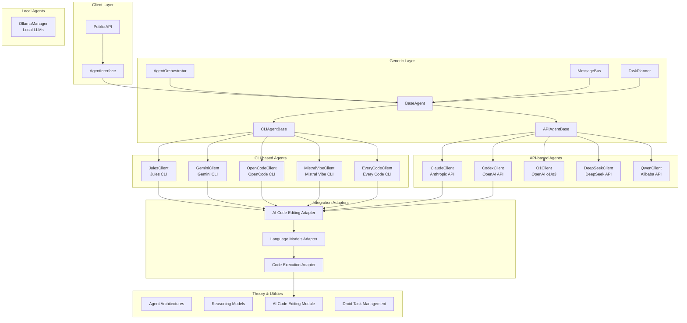

# agents - Functional Specification

**Version**: v1.0.0 | **Status**: Active | **Last Updated**: February 2026

## Purpose

The `agents` module provides integration with various agentic frameworks including Jules CLI, Claude API, OpenAI Codex, OpenCode CLI, Gemini CLI, Mistral Vibe CLI, Every Code CLI, DeepSeek Coder API, OpenAI O1/O3 API, Qwen-Coder API, and local Ollama models. It includes theoretical foundations, generic utilities, and framework-specific implementations that integrate seamlessly with Codomyrmex modules.

## Design Principles

### Modularity

- **Framework Separation**: Each agentic framework is implemented as a separate submodule
  - **CLI-based**: Jules, Gemini, OpenCode, Mistral Vibe, Every Code (extend `CLIAgentBase`)
  - **API-based**: Claude, Codex, O1, DeepSeek, Qwen (extend `APIAgentBase`)
  - **Local**: Ollama (via `llm/ollama/` integration)
- **Clear Interfaces**: All agents implement the `AgentInterface` abstract base class
- **Base Classes**:
  - `BaseAgent`: Common functionality for all agents
  - `CLIAgentBase`: Specialized base for CLI-based agents with subprocess handling
  - `APIAgentBase`: Specialized base for API-based agents with standardized error handling and token extraction
- **Extensibility**: New agentic frameworks can be added by extending appropriate base class

### Internal Coherence

- **Unified Interface**: All agents follow the same request/response pattern
- **Consistent Configuration**: Configuration management follows standard patterns with `get_config_value()` helper method
- **Standardized Error Handling**: API agents use `_handle_api_error()` for consistent error conversion
- **Token Extraction**: API agents use `_extract_tokens_from_response()` for standardized token counting
- **Standardized Integration**: Integration adapters provide consistent interfaces to Codomyrmex modules

### Parsimony

- **Dependencies**: Depends on `logging_monitoring` for logging, `ai_code_editing`, `llm`, and `code` for integration
- **Focus**: Provides agent framework integrations, not direct code execution or file management
- **Minimal External Dependencies**: Uses standard libraries and framework-specific packages (anthropic, openai)

### Functionality

- **Robustness**: Handles API failures, timeouts, and configuration errors gracefully
- **Quality**: Provides structured responses with metadata and error information
- **Performance**: Supports streaming and non-streaming responses

### Testing

- **Unit Tests**: Comprehensive zero-mock test suite in `tests/unit/agents/` (1300+ tests across 69 files)
- **Integration Tests**: Test integration with Codomyrmex modules
- **End-to-End Tests**: Test complete agent workflows
- **Policy**: All tests use real objects, no mocking (zero-mock policy)

## Architecture



## Functional Requirements

### Core Capabilities

1. **Agent Framework Integration**: Integrate with multiple agent frameworks:
   - CLI-based: Jules, Gemini, OpenCode, OpenClaw, Mistral Vibe, Every Code (OpenClaw via `agents/openclaw/`)
   - API-based: Claude, Codex, O1, DeepSeek, Qwen
   - Local: Ollama
2. **Unified Interface**: Provide consistent interface across all agent frameworks
3. **Agent Discovery**: `AgentRegistry` with live health probes for all 12 agents
4. **Code Generation**: Generate code using various agent frameworks
5. **Code Editing**: Edit and refactor code using agents
6. **Streaming Support**: Support streaming responses where available
7. **Multi-Agent Orchestration**: Coordinate multiple agents for complex tasks (via Every Code and AgentOrchestrator)
8. **Config Persistence**: YAML config file at `~/.codomyrmex/agents.yaml`

### Quality Standards

- **Deterministic Output Structure**: All responses follow `AgentResponse` structure
- **Error Handling**: All operations handle errors gracefully with informative messages
- **Configuration Validation**: Validate configuration before agent operations
- **Performance**: Support timeouts and resource limits

## Interface Contracts

### Public API

#### Core Agents (`agents.core`)

```python
class AgentInterface(ABC):
    def get_capabilities() -> List[AgentCapabilities]
    def execute(request: AgentRequest) -> AgentResponse
    def stream(request: AgentRequest) -> Iterator[str]
    def setup() -> None
    def test_connection() -> bool
    def supports_capability(capability: AgentCapabilities) -> bool

class BaseAgent(AgentInterface):
    """Base implementation with common validation and config handling."""
```

#### Discovery & Setup (`agents.agent_setup`)

```python
class AgentRegistry:
    def list_agents() -> List[AgentDescriptor]
    def probe_agent(name: str) -> ProbeResult
    def probe_all() -> List[ProbeResult]
    def get_operative() -> List[str]

@dataclass
class AgentDescriptor:
    name: str; display_name: str; agent_type: str; env_var: str; ...
```

#### Orchestration (`agents.generic`)

```python
class AgentOrchestrator:
    def plan_task(goal: str, agents: List[str]) -> TaskPlan
    def execute_plan(plan: TaskPlan) -> TaskResult
    def coordinate(agent_a: str, agent_b: str, task: str) -> bool
```

#### Tool Management (`agents.core.registry`)

```python
class ToolRegistry:
    def register_function(func: Callable, name: str = None, ...) -> None
    def get_tool(name: str) -> Optional[Tool]
    def execute(tool_name: str, **kwargs) -> Any
```

### Pooling & Health (`agents.pooling`)

```python
class AgentPool:
    def add_agent(agent: AgentInterface) -> None
    def get_agent(name: str) -> AgentInterface
    def get_operative() -> List[AgentInterface]
    def balancing_strategy(strategy: str) -> None
```

### Evaluation & History (`agents.evaluation`, `agents.history`)

```python
class AgentEvaluator:
    def benchmark(agent: AgentInterface, dataset: List[Case]) -> Report
    def score_response(response: AgentResponse, expected: str) -> float

class ConversationHistory:
    def add_message(session_id: str, message: Message) -> None
    def get_history(session_id: str) -> List[Message]
    def persist() -> None
```

### specialized Agents (`agents.infrastructure`, `agents.git_agent`)

```python
class InfrastructureAgent(BaseAgent):
    def provision(resource_type: str, config: dict) -> bool

class GitAgent(BaseAgent):
    def commit_and_push(message: str) -> bool
```

### Dependencies

- `codomyrmex.logging_monitoring`: For structured logging
- `codomyrmex.agents.ai_code_editing`: For code generation workflows
- `codomyrmex.llm`: For LLM infrastructure
- `codomyrmex.code`: For safe code execution

## Implementation Guidelines

### Usage Patterns

- Use `AgentInterface` for type hints and abstract operations
- Use framework-specific clients for direct operations:
  - CLI-based agents: `JulesClient`, `GeminiClient`, `OpenCodeClient`, `MistralVibeClient`, `EveryCodeClient`
  - API-based agents: `ClaudeClient`, `CodexClient`, `O1Client`, `DeepSeekClient`, `QwenClient`
  - Local: Ollama via `llm/ollama/OllamaManager`
- Use `AgentRegistry.probe_all()` to discover operative agents
- Use integration adapters for Codomyrmex module integration
- Use `AgentOrchestrator` or `EveryCodeClient` for multi-agent workflows

### Error Handling

- Catch module-specific exceptions:
  - Base: `AgentError`, `AgentTimeoutError`, `AgentConfigurationError`
  - CLI-based: `JulesError`, `GeminiError`, `OpenCodeError`, `MistralVibeError`, `EveryCodeError`
  - API-based: `ClaudeError`, `CodexError`
- Log errors using `logging_monitoring`
- Return informative error messages in `AgentResponse`

### Performance Considerations

- Set appropriate timeouts for agent operations
- Use streaming for long-running operations
- Cache configuration and client instances where appropriate

## Navigation

- **Human Documentation**: [README.md](README.md)
- **Technical Documentation**: [AGENTS.md](AGENTS.md)
- **Package SPEC**: [../SPEC.md](../SPEC.md)

<!-- Navigation Links keyword for score -->
