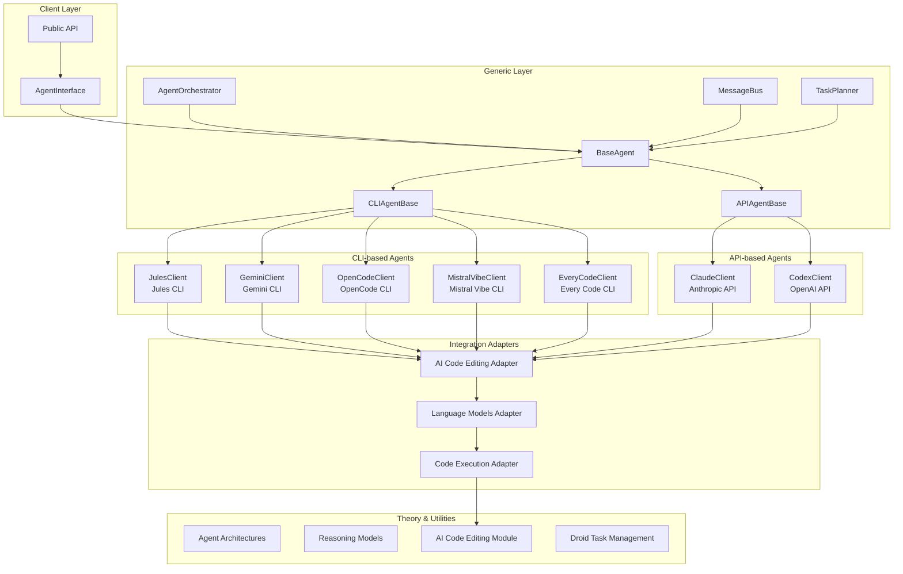

# agents - Functional Specification

**Version**: v0.1.0 | **Status**: Active | **Last Updated**: January 2026

## Purpose

The `agents` module provides integration with various agentic frameworks including Jules CLI, Claude API, OpenAI Codex, OpenCode CLI, Gemini CLI, Mistral Vibe CLI, and Every Code CLI. It includes theoretical foundations, generic utilities, and framework-specific implementations that integrate seamlessly with Codomyrmex modules.

## Design Principles

### Modularity
- **Framework Separation**: Each agentic framework is implemented as a separate submodule
  - **CLI-based**: Jules, Gemini, OpenCode, Mistral Vibe, Every Code (extend `CLIAgentBase`)
  - **API-based**: Claude, Codex (extend `APIAgentBase`)
- **Clear Interfaces**: All agents implement the `AgentInterface` abstract base class
- **Base Classes**: 
  - `BaseAgent`: Common functionality for all agents
  - `CLIAgentBase`: Specialized base for CLI-based agents with subprocess handling
  - `APIAgentBase`: Specialized base for API-based agents with standardized error handling and token extraction
- **Extensibility**: New agentic frameworks can be added by extending appropriate base class

### Internal Coherence
- **Unified Interface**: All agents follow the same request/response pattern
- **Consistent Configuration**: Configuration management follows standard patterns with `get_config_value()` helper method
- **Standardized Error Handling**: API agents use `_handle_api_error()` for consistent error conversion
- **Token Extraction**: API agents use `_extract_tokens_from_response()` for standardized token counting
- **Standardized Integration**: Integration adapters provide consistent interfaces to Codomyrmex modules

### Parsimony
- **Dependencies**: Depends on `logging_monitoring` for logging, `ai_code_editing`, `llm`, and `code` for integration
- **Focus**: Provides agent framework integrations, not direct code execution or file management
- **Minimal External Dependencies**: Uses standard libraries and framework-specific packages (anthropic, openai)

### Functionality
- **Robustness**: Handles API failures, timeouts, and configuration errors gracefully
- **Quality**: Provides structured responses with metadata and error information
- **Performance**: Supports streaming and non-streaming responses

### Testing
- **Unit Tests**: Test each agent framework independently with mocks
- **Integration Tests**: Test integration with Codomyrmex modules
- **End-to-End Tests**: Test complete agent workflows

## Architecture

## Functional Requirements

### Core Capabilities
1. **Agent Framework Integration**: Integrate with multiple agent frameworks:
   - CLI-based: Jules, Gemini, OpenCode, Mistral Vibe, Every Code
   - API-based: Claude, Codex
2. **Unified Interface**: Provide consistent interface across all agent frameworks
3. **Code Generation**: Generate code using various agent frameworks
4. **Code Editing**: Edit and refactor code using agents
5. **Streaming Support**: Support streaming responses where available
6. **Multi-Agent Orchestration**: Coordinate multiple agents for complex tasks (via Every Code and AgentOrchestrator)

### Quality Standards
- **Deterministic Output Structure**: All responses follow `AgentResponse` structure
- **Error Handling**: All operations handle errors gracefully with informative messages
- **Configuration Validation**: Validate configuration before agent operations
- **Performance**: Support timeouts and resource limits

## Interface Contracts

### Public API
- `AgentInterface`: Abstract base class for all agents
- `AgentRequest`, `AgentResponse`: Request/response data structures
- `AgentCapabilities`: Enum of agent capabilities
- `AgentConfig`: Configuration management
- `BaseAgent`: Base implementation class with common functionality
- `CLIAgentBase`: Base class for CLI-based agents with subprocess handling
- `APIAgentBase`: Base class for API-based agents with error handling and token extraction
- `AgentOrchestrator`: Multi-agent coordination
- Framework-specific clients:
  - CLI-based: `JulesClient`, `GeminiClient`, `OpenCodeClient`, `MistralVibeClient`, `EveryCodeClient`
  - API-based: `ClaudeClient`, `CodexClient`

### Dependencies
- `codomyrmex.logging_monitoring`: For structured logging
- `codomyrmex.agents.ai_code_editing`: For code generation workflows
- `codomyrmex.llm`: For LLM infrastructure
- `codomyrmex.code`: For safe code execution

## Implementation Guidelines

### Usage Patterns
- Use `AgentInterface` for type hints and abstract operations
- Use framework-specific clients for direct operations:
  - CLI-based agents: `JulesClient`, `GeminiClient`, `OpenCodeClient`, `MistralVibeClient`, `EveryCodeClient`
  - API-based agents: `ClaudeClient`, `CodexClient`
- Use integration adapters for Codomyrmex module integration
- Use `AgentOrchestrator` or `EveryCodeClient` for multi-agent workflows

### Error Handling
- Catch module-specific exceptions:
  - Base: `AgentError`, `AgentTimeoutError`, `AgentConfigurationError`
  - CLI-based: `JulesError`, `GeminiError`, `OpenCodeError`, `MistralVibeError`, `EveryCodeError`
  - API-based: `ClaudeError`, `CodexError`
- Log errors using `logging_monitoring`
- Return informative error messages in `AgentResponse`

### Performance Considerations
- Set appropriate timeouts for agent operations
- Use streaming for long-running operations
- Cache configuration and client instances where appropriate

## Navigation

- **Human Documentation**: [README.md](README.md)
- **Technical Documentation**: [AGENTS.md](AGENTS.md)
- **Package SPEC**: [../SPEC.md](../SPEC.md)

<!-- Navigation Links keyword for score -->
