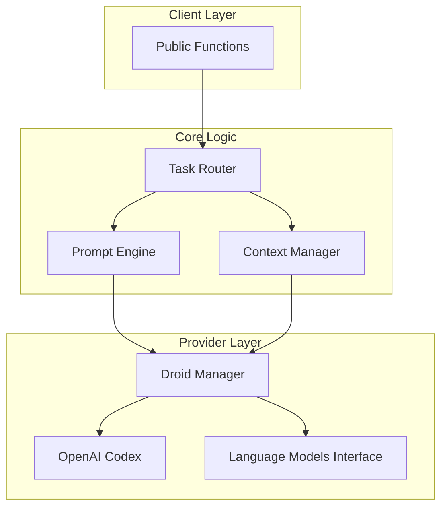

# ai_code_editing - Functional Specification

**Version**: v0.1.0 | **Status**: Active | **Last Updated**: January 2026

## Purpose

The `ai_code_editing` module serves as the semantic intelligence layer of Codomyrmex. It abstracts the complexity of interacting with various LLM providers (OpenAI, Anthropic, Google) to provide high-level code manipulation capabilities: generation, refactoring, analysis, and documentation.

## Design Principles

### Modularity
- **Provider Agnostic**: The core logic is decoupled from specific LLM providers.
- **Task Isolation**: Specific tasks (refactoring, generation) are handled by specialized sub-components (droids).
- **Clear Interfaces**: Public API is stable and provider-independent.

### Internal Coherence
- **Unified Prompting**: Centralized prompt templates (`llm/prompt_templates/`) ensure consistent persona and output format.
- **Standardized Context**: All LLM calls receive context in a uniform structure.
- **Error Handling**: A unified strategy for rate limits and provider failures.

### Parsimony
- **Dependencies**: Depends strictly on `llm` for raw inference and `model_context_protocol` for tool definitions.
- **Focus**: Does NOT execute code. Does NOT manage the file system directly (outside of reading context).

### Functionality
- **Robustness**: capability to retry and fallback between providers.
- **Quality**: Enforces structure (JSON/Code blocks) over free text conversation.

### Testing
- **Mocked Inference**: Unit tests mock LLM responses to test logic without API costs.
- **Integration Tests**: Tested against `llm.ollama` for local validation.

## Architecture

## Functional Requirements

### Core Capabilities
1.  **Code Generation**: Create code from natural language description.
2.  **Refactoring**: Modify existing code based on instructions (e.g., "Extract method", "Improve error handling").
3.  **Analysis**: Explain code, find bugs, or suggest improvements.
4.  **Translation**: Convert code between languages.

### Quality Standards
- **Deterministic Output Structure**: Output must be parsable (e.g., extracted strictly from markdown code blocks).
- **Latency**: Optimization for stream processing where applicable.
- **Safety**: No execution of generated code within this module (delegated to `code`).

## Interface Contracts

### Public API
- `generate_code(prompt: str, context: Optional[str]) -> str`
- `refactor(code: str, instruction: str) -> str`
- `explain(code: str) -> str`

### Dependencies
- `codomyrmex.llm`: For raw text generation.
- `codomyrmex.model_context_protocol`: For defining tools available to the agents.

## Implementation Guidelines

### Usage Patterns
- Use `Android/Droid` abstractions for complex multi-turn tasks.
- Use simple functional API for one-shot tasks.

### Error Handling
- Catch `ProviderError` and retry with exponential backoff.
- Degrade gracefully if a specific model is unavailable.

## Navigation

- **Human Documentation**: [README.md](README.md)
- **Technical Documentation**: [AGENTS.md](AGENTS.md)
- **Package SPEC**: [../SPEC.md](../SPEC.md)

<!-- Navigation Links keyword for score -->
