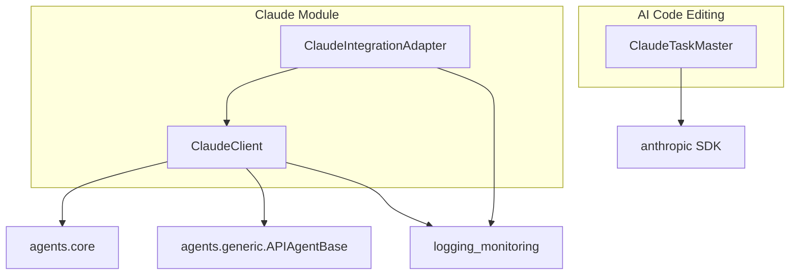

# Claude

**Version**: v1.0.0 | **Status**: Active | **Last Updated**: February 2026

## Overview

The `claude` module provides comprehensive Anthropic Claude API integration for AI-assisted coding. It includes a full-featured API client with retry logic, session management, tool calling, and Claude Code capabilities for agentic coding workflows.

## Architecture



## Quick Start

```python
from codomyrmex.agents.claude import ClaudeClient, ClaudeIntegrationAdapter
from codomyrmex.agents.core import AgentRequest

# Basic API usage
client = ClaudeClient()
response = client.execute(AgentRequest(prompt="Write a Python factorial function"))
print(response.content)

# Streaming responses
for chunk in client.stream(AgentRequest(prompt="Explain recursion")):
    print(chunk, end="", flush=True)

# Code generation with integration adapter
adapter = ClaudeIntegrationAdapter(client)
code = adapter.adapt_for_ai_code_editing(
    prompt="Create a binary search function",
    language="python",
    style="functional"
)

# Multi-turn session
session = client.create_session()
response = client.execute_with_session(
    AgentRequest(prompt="What is the capital of France?"),
    session=session
)
response2 = client.execute_with_session(
    AgentRequest(prompt="What language do they speak there?"),
    session=session
)

# Tool/function calling
client.register_tool(
    name="get_weather",
    description="Get weather for a location",
    input_schema={"type": "object", "properties": {"location": {"type": "string"}}},
    handler=lambda location: f"Weather in {location}: Sunny, 72°F"
)
response = client.execute_with_tools(AgentRequest(prompt="What's the weather in Paris?"))
```

## Claude Code Methods

```python
# File editing (new in v0.2.0)
result = client.edit_file(
    file_path="/path/to/file.py",
    instructions="Add type hints to all function parameters"
)

# Code review
review = client.review_code(
    code="def add(a, b): return a + b",
    language="python"
)

# Project scanning
structure = client.scan_directory("/path/to/project")

# Diff generation
diff = client.generate_diff(original_code, modified_code)
```

## Components

| Component | Purpose |
|-----------|---------|
| `ClaudeClient` | Core API client with retry, sessions, tools |
| `ClaudeIntegrationAdapter` | Bridge to Codomyrmex modules |
| `ClaudeTaskMaster` | Task orchestration (in `ai_code_editing/`) |

## Configuration

Set `ANTHROPIC_API_KEY` environment variable or pass via config:

```python
client = ClaudeClient(config={
    "claude_api_key": "sk-ant-...",
    "claude_model": "claude-sonnet-4-20250514",
    "claude_max_tokens": 4096,
    "claude_temperature": 0.7,
    "max_retries": 3
})
```

## Navigation

- **Specification**: [SPEC.md](SPEC.md)
- **Agent Docs**: [AGENTS.md](AGENTS.md)
- **API Reference**: [API_SPECIFICATION.md](API_SPECIFICATION.md)
- **MCP Tools**: [MCP_TOOL_SPECIFICATION.md](MCP_TOOL_SPECIFICATION.md)
- **Parent**: [agents](../README.md)
- **TaskMaster**: [claude_task_master.py](../ai_code_editing/claude_task_master.py)
