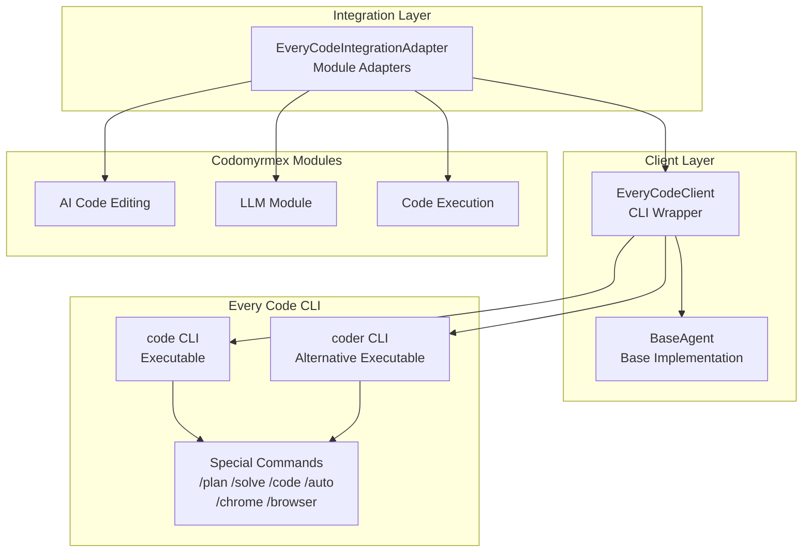

# every_code - Functional Specification

**Version**: v0.1.7 | **Status**: Active | **Last Updated**: February 2026

## Purpose

The `every_code` submodule provides integration with Every Code CLI tool. Every Code is a fork of the Codex CLI that includes validation, automation, browser integration, multi-agents, theming, and enhanced reasoning controls. It can orchestrate agents from OpenAI, Claude, Gemini, or any provider.

## Design Principles

### Functionality

- **CLI Integration**: Wraps Every Code CLI command execution
- **Command Support**: Supports special commands like /plan, /solve, /code, /auto, /chrome, /browser
- **Multi-Agent Orchestration**: Supports multi-agent workflows through Every Code
- **Error Handling**: Handles command failures and timeouts gracefully
- **Integration**: Provides adapters for Codomyrmex modules

### Modularity

- **Framework Separation**: Every Code is implemented as a separate submodule
- **Clear Interfaces**: Implements `AgentInterface` abstract base class
- **Extensibility**: Can be extended with additional Every Code CLI features

### Internal Coherence

- **Unified Interface**: Follows the same request/response pattern as other agents
- **Consistent Configuration**: Configuration management follows standard patterns
- **Standardized Integration**: Integration adapters provide consistent interfaces

### Parsimony

- **Dependencies**: Depends on `logging_monitoring` for logging
- **Focus**: Provides Every Code CLI integration, not direct model access
- **Minimal External Dependencies**: Uses subprocess for CLI execution

### Operational Characteristics

- **Robustness**: Handles CLI failures, timeouts, and authentication errors gracefully
- **Quality**: Provides structured responses with metadata and error information
- **Performance**: Supports streaming and non-streaming responses

### Testing

- **Unit Tests**: Test EveryCodeClient independently with real objects
- **Integration Tests**: Test integration with Codomyrmex modules
- **End-to-End Tests**: Test complete agent workflows

## Architecture

## Functional Requirements

### Core Capabilities

1. **CLI Execution**: Execute Every Code CLI commands programmatically
2. **Command Support**: Support for special commands (/plan, /solve, /code, /auto, /chrome, /browser)
3. **Multi-Agent Support**: Support multi-agent orchestration through Every Code
4. **Streaming**: Support streaming responses
5. **Authentication**: Handle API key authentication via environment variables
6. **Integration**: Provide adapters for Codomyrmex modules

### Quality Standards

- **Deterministic Output Structure**: All responses follow `AgentResponse` structure
- **Error Handling**: All operations handle errors gracefully with informative messages
- **Configuration Validation**: Validate configuration before agent operations
- **Performance**: Support timeouts and resource limits

## Interface Contracts

### Public API

- `EveryCodeClient`: Main client class extending `BaseAgent`
- `EveryCodeIntegrationAdapter`: Integration adapter for Codomyrmex modules
- `EveryCodeError`: Exception class for Every Code-specific errors

### Dependencies

- `codomyrmex.logging_monitoring`: For structured logging
- `codomyrmex.agents.core`: For base agent interfaces
- `codomyrmex.agents.generic`: For BaseAgent implementation

## Implementation Guidelines

### Usage Patterns

- Use `EveryCodeClient` for direct Every Code CLI operations
- Use `EveryCodeIntegrationAdapter` for Codomyrmex module integration
- Use `AgentOrchestrator` for multi-agent workflows

### Error Handling

- Catch `EveryCodeError` for Every Code-specific errors
- Log errors using `logging_monitoring`
- Return informative error messages in `AgentResponse`

### Performance Considerations

- Set appropriate timeouts for CLI operations (default 120s for complex operations)
- Use streaming for long-running operations
- Cache configuration and client instances where appropriate

### Safety Considerations

- File paths are validated before inclusion
- Authentication credentials are handled securely via environment variables
- Command execution is sandboxed via subprocess

## Special Commands

Every Code supports several special commands:

- `/plan "description"` - Plan code changes with multi-agent consensus (Claude, Gemini, GPT-5)
- `/solve "problem"` - Solve complex problems with fastest agent preference
- `/code "description"` - Write code with multi-agent consensus, creates worktrees
- `/auto "task"` - Hand off multi-step tasks to Auto Drive for coordination
- `/chrome [port]` - Connect to external Chrome browser via CDP
- `/browser [url]` - Use internal headless browser

## Configuration

Every Code uses configuration from `~/.code/config.toml` (or `CODE_HOME` environment variable). The client respects:

- `OPENAI_API_KEY` - API key for OpenAI/OpenAI-compatible providers
- `CODE_HOME` - Override config directory location
- `OPENAI_BASE_URL` - Use OpenAI-compatible API endpoints

## Navigation

- **Human Documentation**: [README.md](README.md)
- **Technical Documentation**: [AGENTS.md](AGENTS.md)
- **Parent SPEC**: [../SPEC.md](../SPEC.md)

<!-- Navigation Links keyword for score -->
