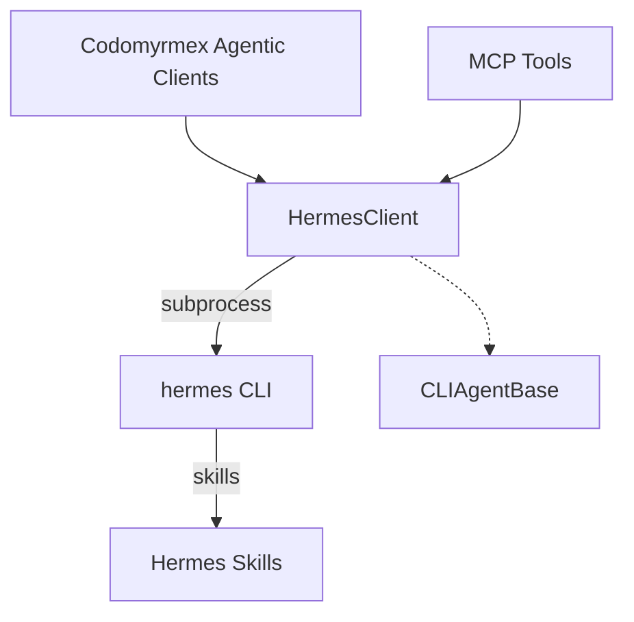

# Hermes Agent - Functional Specification

**Version**: v1.1.4 | **Status**: Active | **Last Updated**: March 2026

## Purpose

To integrate the independent NousResearch `hermes-agent` CLI application within the Codomyrmex agent ecosystem, standardizing its response artifacts under `AgentResponse` and providing Model Context Protocol exposure.

## Architecture

## Requirements

1. **Existence Parsing**: Fails gracefully with `HermesError` if `hermes` is not in `$PATH`.
2. **Command Delegation**: Distinguishes single-turn completion prompts (`chat -q <prompt>`) from diagnostic/system queries (e.g. `status` or `skills`).
3. **Execution Safety**: Relies on underlying Hermes containerization backend (e.g., Docker, Modal, Local) defined in `~/.hermes/config.yaml`.
4. **Standard Subclassing**: Must inherit from generic `CLIAgentBase` to adhere to internal Codomyrmex standard interface compliance.

## Integration Points

- Plugs cleanly into `AgentRegistry`.
- Exposes tools to Claude via `codomyrmex.model_context_protocol.decorators.mcp_tool`.
