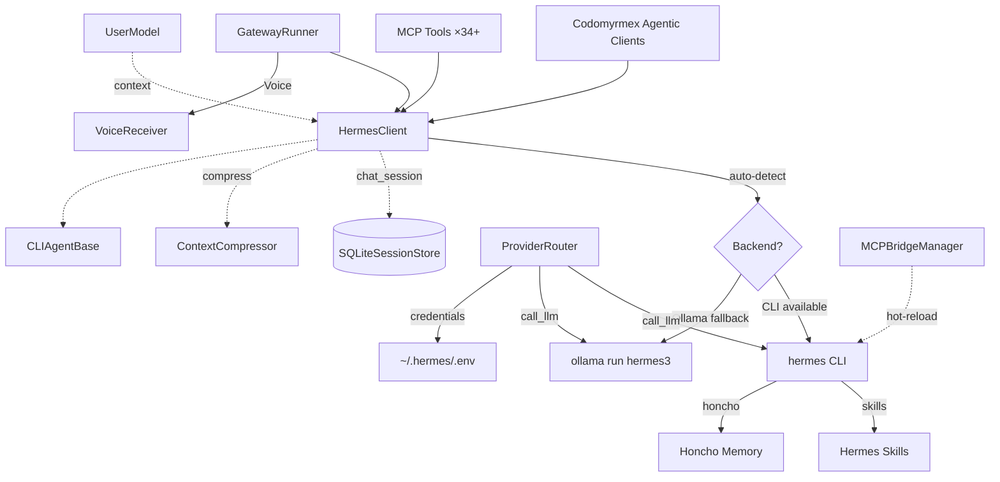

# Hermes Agent - Functional Specification

**Version**: v2.2.1 | **Status**: Active | **Last Updated**: March 2026

## Purpose

To integrate NousResearch Hermes capabilities within the Codomyrmex agent ecosystem via a dual-backend client. This client exposes both stateless queries and stateful multi-turn persistent sessions, scaling flexibly between the official `hermes` CLI and local Ollama deployments. Provider routing, context compression, and cross-session user modeling ensure resilient, context-aware operation. v2.2.1 introduces a non-git-tracked LLM rotation strategy for free models, cooldown tracking, `ollama pull` automation, and advanced session merging.

## Architecture

## Core Requirements

1. **Dual-Backend**:   - Auto-detect the `hermes` CLI vs `ollama`; configurable via `hermes_backend`.
   - Supported values: `auto`, `cli`, `ollama`.
2. **Graceful Fallback**:   - If the CLI is not in `$PATH`, seamlessly fall back to using Ollama with the `hermes3` model.
3. **Persistent Sessions**:   - The `HermesClient.chat_session` method MUST track conversation history via `SQLiteSessionStore` locally in `~/.codomyrmex/hermes_sessions.db`.
   - History must be unrolled and appended into the final prompt transparently when crossing the boundary to stateless backends (like `ollama run`).
   - `ContextCompressor` auto-compresses long conversations before dispatch.
4. **Provider Routing**:
   - `ProviderRouter` abstracts LLM invocation across OpenRouter, Ollama, Anthropic, OpenAI, z.ai, and Nous.
   - Automatic credential resolution from environment variables and `~/.hermes/.env`.
5. **Discord Voice Support (v2.2.0)**:
   - Integrates `VoiceReceiver` for RTP capture and DAVE E2EE decryption in Discord voice channels.
   - Native `/voice` commands for real-time TTS and listening toggle.
6. **Standard Subclassing**:   - Inherits from `CLIAgentBase` according to standard Codomyrmex agent implementation rules.
7. **Zero-Mock Policy**:   - All tests against the Hermes framework must execute functional logic (e.g., using `echo` as a mock-free proxy when the real CLI is too slow or unavailable).

## Model Context Protocol (MCP) Interface

The module exposes 37+ tools to the swarm:

| Tool | Purpose | Category |
| :--- | :--- | :--- |
| `hermes_execute` | Single-turn, stateless execution | Core |
| `hermes_chat_session` | Multi-turn stateful chat | Core |
| `hermes_stream` | Real-time streaming output | Core |
| `hermes_batch_execute` | Parallel multi-prompt dispatch (v2.2.0) | Core |
| `hermes_set_system_prompt` | Persist system instructions to session (v2.2.0) | Core |
| `hermes_status` | Backend availability diagnostics | Diagnostic |
| `hermes_doctor` | Comprehensive health check (CLI v0.2.0+) | Diagnostic |
| `hermes_version` | CLI version info | Diagnostic |
| `hermes_provider_status` | Multi-provider credential status | Diagnostic |
| `hermes_skills_list` | Available Hermes skills (CLI only) | Skills |
| `hermes_template_list` | Prompt template names | Templates |
| `hermes_template_render` | Template rendering with variables | Templates |
| `hermes_session_list` | All active session IDs | Sessions |
| `hermes_session_detail` | Rich metrics/last-message for session (v2.2.0) | Sessions |
| `hermes_session_stats` | Database-wide storage/count metrics (v2.2.0) | Sessions |
| `hermes_session_fork` | Copy history to new child session (v2.2.0) | Sessions |
| `hermes_session_export_md` | Export conversation to Markdown (v2.2.0) | Sessions |
| `hermes_session_merge` | Consolidate context (v2.2.1) | Sessions |
| `hermes_prune_sessions` | Archive and delete old sessions (v2.2.0) | Sessions |
| `hermes_rotation_status` | Free model health/cooldown (v2.2.1) | Diagnostic |
| `hermes_health_check` | Deep agentic diagnostics (v2.2.1) | Diagnostic |
| `hermes_session_clear` | Delete a session | Sessions |
| `hermes_session_search` | Search sessions by name | Sessions |
| `hermes_honcho_status` | Honcho AI memory status | Memory |
| `hermes_insights` | Usage analytics (tokens, costs, trends) | Analytics |
| `hermes_worktree_create` | Git worktree isolation for sessions | Isolation |
| `hermes_worktree_cleanup` | Worktree teardown | Isolation |
| `hermes_mcp_reload` | Hot-reload MCP server config | Admin |
| `hermes_user_context` | Cross-session user model management | User Model |

## Configuration Parameters

| Key | Default | Description |
| --- | --- | --- |
| `hermes_backend` | `auto` | Forced backend (`auto`, `cli`, `ollama`) |
| `hermes_model` | `hermes3` | Fallback Ollama model name |
| `hermes_command` | `hermes` | Path/alias to the official CLI binary |
| `hermes_timeout` | `120` | Subprocess command timeout (seconds) |
| `hermes_session_db` | `~/.codomyrmex/hermes_sessions.db` | Path to persistent SQLite storage |
| `hermes_provider` | `openrouter` | Primary inference provider |
| `fallback_model` | `None` | Fallback model on provider errors |
| `fallback_provider` | `None` | Fallback provider (e.g. `ollama`) |
| `yolo` | `False` | Bypass CLI dangerous command prompts |
| `continue_session` | `None` | Resume session by name via `--continue` |
| `pass_session_id` | `False` | Include session ID in system prompt |
| `max_context_tokens` | `100000` | ContextCompressor token threshold |
| `worktree_base_dir` | `~/.codomyrmex/worktrees` | Git worktree base directory |

## Evolution Submodule

The `evolution/` git submodule ([NousResearch/hermes-agent-self-evolution](https://github.com/NousResearch/hermes-agent-self-evolution)) provides evolutionary self-improvement capabilities to Hermes:

- **DSPy + GEPA**: Genetic-Pareto Prompt Evolution reads execution traces to understand failures and proposes targeted prompt/skill improvements.
- **Guardrails**: Evolved variants MUST pass the repository-wide test suite before prompting PR reviews.

## Honcho Integration

Hermes v0.2.0 integrates with [Honcho](https://docs.honcho.dev) for persistent cross-session memory:

- **Modes**: `hybrid` (Honcho + local MEMORY.md), `honcho` (Honcho only), `local` (MEMORY.md only)
- **Dialectic reasoning**: Configurable peer interactions with user context
- **Session mapping**: `hermes honcho map` maps directories to Honcho sessions
