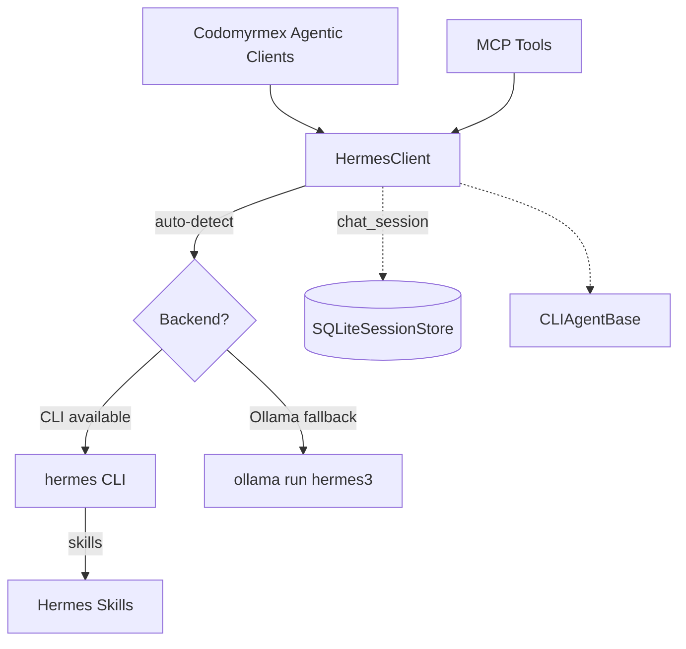

# Hermes Agent - Functional Specification

**Version**: v2.0.0 | **Status**: Active | **Last Updated**: March 2026

## Purpose

To integrate NousResearch Hermes capabilities within the Codomyrmex agent ecosystem via a dual-backend client. This client exposes both stateless queries and stateful multi-turn persistent sessions, scaling flexibly between the official `hermes` CLI and local Ollama deployments.

## Architecture

## Core Requirements

1. **Dual-Backend**: 
   - Auto-detect the `hermes` CLI vs `ollama`; configurable via `hermes_backend`.
   - Supported values: `auto`, `cli`, `ollama`.
2. **Graceful Fallback**: 
   - If the CLI is not in `$PATH`, seamlessly fall back to using Ollama with the `hermes3` model.
3. **Persistent Sessions**: 
   - The `HermesClient.chat_session` method MUST track conversation history via `SQLiteSessionStore` locally in `~/.codomyrmex/hermes_sessions.db`.
   - History must be unrolled and appended into the final prompt transparently when crossing the boundary to stateless backends (like `ollama run`).
4. **Standard Subclassing**: 
   - Inherits from `CLIAgentBase` according to standard Codomyrmex agent implementation rules.
5. **Zero-Mock Policy**: 
   - All tests against the Hermes framework must execute functional logic (e.g., using `echo` as a mock-free proxy when the real CLI is too slow or unavailable).

## Model Context Protocol (MCP) Interface

The module exposes the following crucial tools to the swarm:

| Tool | Purpose | Persistence |
| :--- | :--- | :--- |
| `hermes_execute` | Single-turn, stateless execution. | Stateless |
| `hermes_chat_session` | Appends user message to an SQLite-backed session, returns context-aware response. | Stateful |
| `hermes_session_list` | Lists all active persistent conversation IDs. | Database Mgmt |
| `hermes_session_clear`| Deletes a given session's history. | Database Mgmt |
| `hermes_status` | Reports backend availability (`cli` vs `ollama`). | Diagnostic |
| `hermes_skills_list` | Lists tools available directly to the Hermes CLI. | Informational |
| `hermes_stream` | Collects raw output lines dynamically. | Real-time |

## Configuration Parameters

| Key | Default | Description |
| --- | --- | --- |
| `hermes_backend` | `auto` | Forced backend (`auto`, `cli`, `ollama`) |
| `hermes_model` | `hermes3` | Fallback Ollama model name |
| `hermes_command` | `hermes` | Path/alias to the official CLI binary |
| `hermes_timeout` | `120` | Subprocess command timeout (seconds) |
| `hermes_session_db` | `~/.codomyrmex/hermes_sessions.db` | Path to persistent SQLite storage |

## Evolution Submodule

The `evolution/` git submodule ([NousResearch/hermes-agent-self-evolution](https://github.com/NousResearch/hermes-agent-self-evolution)) provides evolutionary self-improvement capabilities to Hermes:

- **DSPy + GEPA**: Genetic-Pareto Prompt Evolution reads execution traces to understand failures and proposes targeted prompt/skill improvements.
- **Guardrails**: Evolved variants MUST pass the repository-wide test suite before prompting PR reviews.
