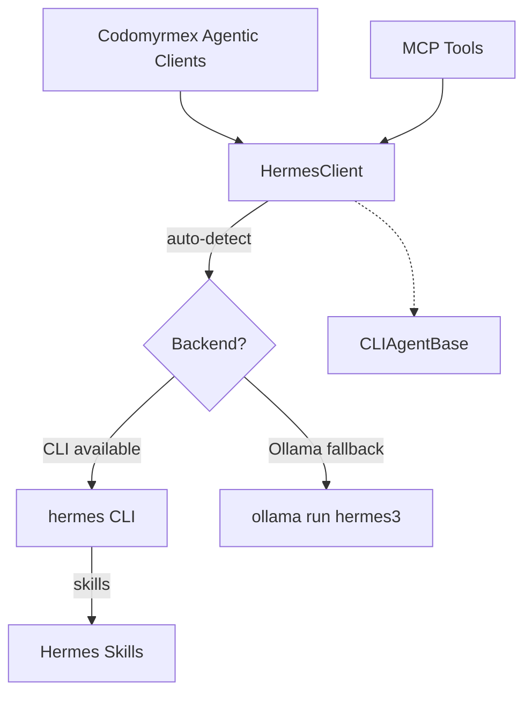
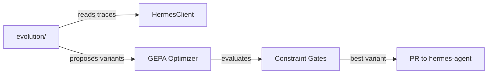

# Hermes Agent - Functional Specification

**Version**: v2.0.0 | **Status**: Active | **Last Updated**: March 2026

## Purpose

To integrate NousResearch Hermes capabilities within the Codomyrmex agent ecosystem via a dual-backend client supporting both the `hermes` CLI and Ollama-served Hermes 3 models.

## Architecture

## Requirements

1. **Dual-Backend**: Auto-detect CLI vs Ollama; configurable via `hermes_backend`.
2. **Graceful Fallback**: If CLI not in `$PATH`, use Ollama with `hermes3` model.
3. **Command Delegation**: CLI mode: `chat -q <prompt>` vs `status`/`skills`. Ollama mode: `ollama run <model> <prompt>`.
4. **Standard Subclassing**: Inherits from `CLIAgentBase` per Codomyrmex standards.
5. **Error Translation**: All failures wrapped in `HermesError` (extends `AgentError`).

## Configuration

| Key | Default | Description |
| --- | --- | --- |
| `hermes_backend` | `auto` | `auto` / `cli` / `ollama` |
| `hermes_model` | `hermes3` | Ollama model name |
| `hermes_command` | `hermes` | CLI binary path |
| `hermes_timeout` | `120` | Subprocess timeout (s) |

## Evolution Submodule

The `evolution/` git submodule ([NousResearch/hermes-agent-self-evolution](https://github.com/NousResearch/hermes-agent-self-evolution)) provides evolutionary self-improvement capabilities:

- **DSPy + GEPA**: Genetic-Pareto Prompt Evolution reads execution traces to understand *why* things fail, then proposes targeted improvements.
- **Targets**: Skills, tool descriptions, system prompts, and code.
- **Guardrails**: Every evolved variant must pass the full test suite, stay within size limits, preserve semantic intent, and go through PR review.

## Integration Points

- Plugs into `AgentRegistry` via standard `CLIAgentBase` interface.
- Exposes tools via `codomyrmex.model_context_protocol.decorators.mcp_tool`.
- MCP tools accept `backend` and `model` parameters for runtime override.
