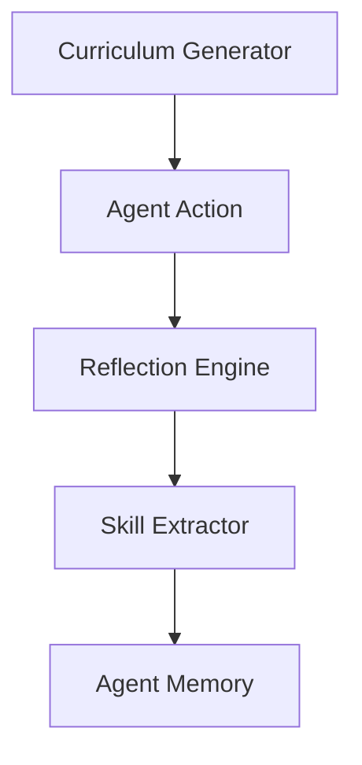

# Agent Learning - Functional Specification

**Version**: v1.0.0 | **Status**: Active | **Last Updated**: February 2026

## Purpose

Enable agents to improve over time by learning from experience, success, and failure.

## Design Principles

### Autonomy

- Self-directed learning goals
- Automated post-task analysis

### Transferability

- Skills extracted from one context can be applied to others

## Architecture

## Functional Requirements

1. **Skill Acquisition**: Identify and codify repeatable patterns.
2. **Reflection**: Analyze execution logs to find inefficiencies.
3. **Curriculum**: Generate synthetic tasks to practice weak areas.

## Interface Contracts

- `Reflector.analyze(trace)`
- `SkillExtractor.codify(pattern)`
- `CurriculumGenerator.next_task(agent_profile)`

## Navigation

- [README](README.md) | [AGENTS](AGENTS.md) | [Parent](../SPEC.md)
