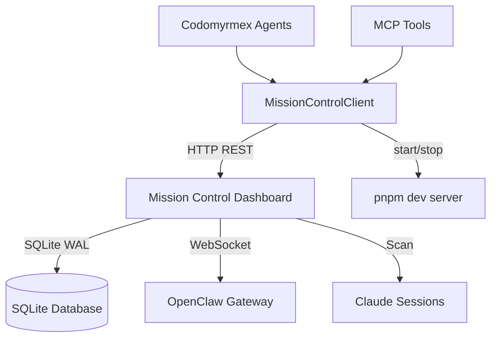

# Mission Control Agent - Functional Specification

**Version**: v1.0.0 | **Status**: Active | **Last Updated**: March 2026

## Purpose

To integrate the builderz-labs/mission-control open-source agent orchestration dashboard within the Codomyrmex agent ecosystem. This module provides a Python client that communicates with the dashboard's REST API for agent fleet management, task orchestration, and cost monitoring.

## Architecture

## Core Requirements

1. **REST API Client**:
   - Communicate with all Mission Control API endpoints via stdlib `urllib.request`.
   - Support session-cookie and API-key authentication modes.
2. **Server Lifecycle**:
   - Start the Mission Control dev server (`pnpm dev`) as a subprocess.
   - Stop it cleanly via process termination.
3. **Error Handling**:
   - Raise `MissionControlError` for HTTP errors, connectivity issues, and auth failures.
4. **Zero-Mock Policy**:
   - Tests must hit the real API or skip gracefully when the server is unavailable.

## Model Context Protocol (MCP) Interface

| Tool | Purpose | Auth |
|:---|:---|:---|
| `mission_control_status` | Check dashboard availability | API key |
| `mission_control_list_agents` | List registered agents | API key |
| `mission_control_list_tasks` | List tasks with optional status filter | API key |
| `mission_control_create_task` | Create a new task on the Kanban board | API key |
| `mission_control_get_task` | Get task details by ID | API key |
| `mission_control_start` | Start the dashboard dev server | Local |

## Configuration Parameters

| Key | Default | Description |
|:---|:---|:---|
| `mc_base_url` | `http://localhost:3000` | Dashboard base URL |
| `mc_api_key` | `""` | API key for authentication |
| `mc_auth_user` | `admin` | Login username |
| `mc_auth_pass` | `""` | Login password |
| `mc_app_path` | `<module>/app` | Path to the git submodule |
| `mc_timeout` | `30` | HTTP request timeout (seconds) |

## Dashboard Features (Upstream)

The Mission Control dashboard provides:
- **32 panels**: Tasks, agents, skills, logs, tokens, memory, security, cron, alerts, webhooks, pipelines
- **Kanban board**: 6 columns (inbox → assigned → in progress → review → quality review → done)
- **Real-time**: WebSocket + SSE push updates
- **RBAC**: Viewer, operator, admin roles
- **Claude Code bridge**: Read-only integration for Claude Code sessions and team tasks
- **Skills Hub**: Browse, install, and security-scan agent skills
- **Memory Knowledge Graph**: Interactive relationship visualization
