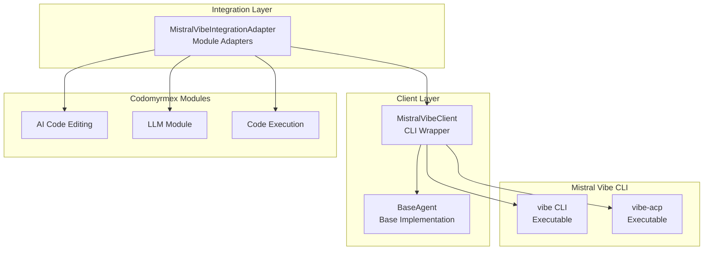

# mistral_vibe - Functional Specification

**Version**: v0.1.0 | **Status**: Active | **Last Updated**: January 2026

## Purpose

The `mistral_vibe` submodule provides integration with Mistral Vibe CLI tool. It includes a client wrapper for executing vibe commands and integration adapters for Codomyrmex modules.

## Design Principles

### Functionality
- **CLI Integration**: Wraps Mistral Vibe CLI command execution
- **Command Support**: Supports standard vibe commands and file operations
- **Session Management**: Supports multi-turn conversations
- **Error Handling**: Handles command failures and timeouts gracefully
- **Integration**: Provides adapters for Codomyrmex modules

### Modularity
- **Framework Separation**: Mistral Vibe is implemented as a separate submodule
- **Clear Interfaces**: Implements `AgentInterface` abstract base class
- **Extensibility**: Can be extended with additional Mistral Vibe CLI features

### Internal Coherence
- **Unified Interface**: Follows the same request/response pattern as other agents
- **Consistent Configuration**: Configuration management follows standard patterns
- **Standardized Integration**: Integration adapters provide consistent interfaces

### Parsimony
- **Dependencies**: Depends on `logging_monitoring` for logging
- **Focus**: Provides Mistral Vibe CLI integration, not direct model access
- **Minimal External Dependencies**: Uses subprocess for CLI execution

### Functionality
- **Robustness**: Handles CLI failures, timeouts, and authentication errors gracefully
- **Quality**: Provides structured responses with metadata and error information
- **Performance**: Supports streaming and non-streaming responses

### Testing
- **Unit Tests**: Test MistralVibeClient independently with mocks
- **Integration Tests**: Test integration with Codomyrmex modules
- **End-to-End Tests**: Test complete agent workflows

## Architecture

## Functional Requirements

### Core Capabilities
1. **CLI Execution**: Execute Mistral Vibe CLI commands programmatically
2. **Command Support**: Support for standard vibe commands and file operations
3. **Session Management**: Support multi-turn conversations
4. **Streaming**: Support streaming responses
5. **Authentication**: Handle API key authentication via environment variables
6. **Integration**: Provide adapters for Codomyrmex modules

### Quality Standards
- **Deterministic Output Structure**: All responses follow `AgentResponse` structure
- **Error Handling**: All operations handle errors gracefully with informative messages
- **Configuration Validation**: Validate configuration before agent operations
- **Performance**: Support timeouts and resource limits

## Interface Contracts

### Public API
- `MistralVibeClient`: Main client class extending `BaseAgent`
- `MistralVibeIntegrationAdapter`: Integration adapter for Codomyrmex modules
- `MistralVibeError`: Exception class for Mistral Vibe-specific errors

### Dependencies
- `codomyrmex.logging_monitoring`: For structured logging
- `codomyrmex.agents.core`: For base agent interfaces
- `codomyrmex.agents.generic`: For BaseAgent implementation

## Implementation Guidelines

### Usage Patterns
- Use `MistralVibeClient` for direct Mistral Vibe CLI operations
- Use `MistralVibeIntegrationAdapter` for Codomyrmex module integration
- Use `AgentOrchestrator` for multi-agent workflows

### Error Handling
- Catch `MistralVibeError` for Mistral Vibe-specific errors
- Log errors using `logging_monitoring`
- Return informative error messages in `AgentResponse`

### Performance Considerations
- Set appropriate timeouts for CLI operations
- Use streaming for long-running operations
- Cache configuration and client instances where appropriate

### Safety Considerations
- File paths are validated before inclusion
- Authentication credentials are handled securely via environment variables
- Command execution is sandboxed via subprocess

## Navigation

- **Human Documentation**: [README.md](README.md)
- **Technical Documentation**: [AGENTS.md](AGENTS.md)
- **Parent SPEC**: [../SPEC.md](../SPEC.md)

## Detailed Architecture and Implementation

The implementation of this component follows the core principles of the Codomyrmex ecosystem: modularity, performance, and reliability. By adhering to standardized interfaces, this module ensures seamless integration with the broader platform.

### Design Principles
1. **Strict Modularity**: Each component is isolated and communicates via well-defined APIs.
2. **Performance Optimization**: Implementation leverages lazy loading and intelligent caching to minimize resource overhead.
3. **Error Resilience**: Robust exception handling ensures system stability even under unexpected conditions.
4. **Extensibility**: The architecture is designed to accommodate future enhancements without breaking existing contracts.

### Technical Implementation
The codebase utilizes modern Python features (version 3.10+) to provide a clean, type-safe API. Interaction patterns are documented in the corresponding `AGENTS.md` and `SPEC.md` files, ensuring that both human developers and automated agents can effectively utilize these capabilities.

