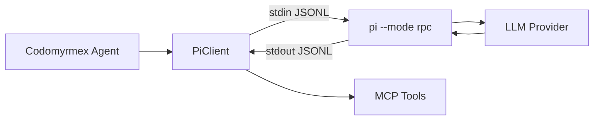

# Pi Coding Agent — Functional Specification

**Version**: v1.0.0 | **Status**: Active | **Last Updated**: March 2026

## Purpose

Integrate the pi coding agent (`pi.dev`) into Codomyrmex as a programmable agent, enabling multi-provider LLM interactions through a Python RPC client and MCP tool interface.

## Architecture

## RPC Protocol

The Pi RPC protocol uses newline-delimited JSON (JSONL) over stdin/stdout:

### Commands (stdin → pi)

| Command | Fields | Description |
| :--- | :--- | :--- |
| `prompt` | `message`, `images?`, `streamingBehavior?` | Send prompt |
| `steer` | `message`, `images?` | Interrupt with new instruction |
| `follow_up` | `message`, `images?` | Queue for after completion |
| `abort` | — | Abort current operation |
| `new_session` | `parentSession?` | Start fresh session |
| `set_model` | `model` | Switch model mid-session |
| `set_thinking` | `level` | Set thinking level |
| `get_state` | — | Request current state |
| `compact` | — | Trigger compaction |

### Events (pi → stdout)

| Event | Description |
| :--- | :--- |
| `agent_start` / `agent_end` | Agent lifecycle |
| `turn_start` / `turn_end` | Turn lifecycle |
| `message_start` / `message_end` | Message lifecycle |
| `message_update` | Streaming text/thinking deltas |
| `tool_execution_*` | Tool call lifecycle |
| `auto_compaction_*` | Compaction events |

## Provider Support

Anthropic, OpenAI, Google Gemini, Google Vertex, Azure OpenAI, Amazon Bedrock, Mistral, Groq, Cerebras, xAI, OpenRouter, Vercel AI Gateway, ZAI, OpenCode, Hugging Face, Kimi, MiniMax, Ollama.

## Authentication

| Method | Provider Examples |
| :--- | :--- |
| API key (env var) | `ANTHROPIC_API_KEY`, `GEMINI_API_KEY`, `OPENAI_API_KEY` |
| OAuth (`/login`) | Claude Pro/Max, ChatGPT Plus, GitHub Copilot, Gemini CLI |
| Custom models.json | Any OpenAI/Anthropic/Google-compatible API |
