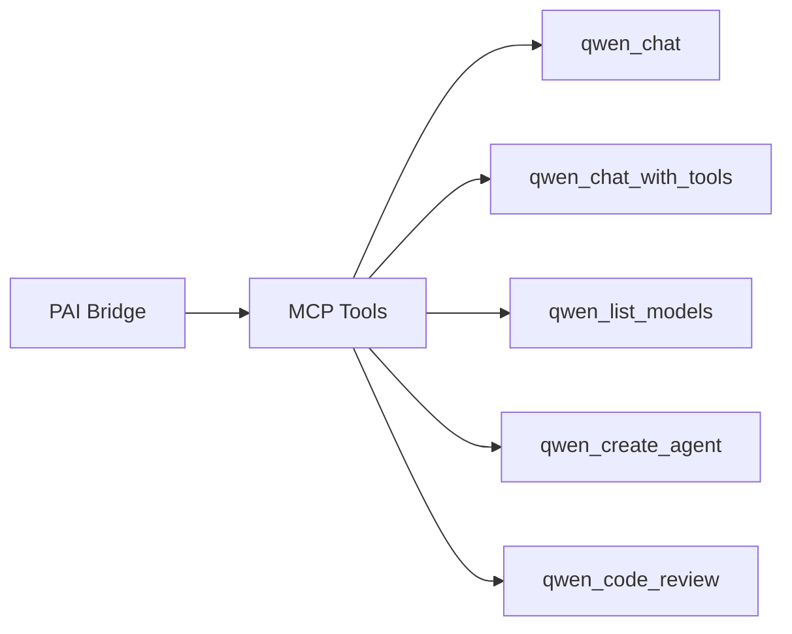

# Qwen Agent — PAI Integration

**Version**: v1.1.9 | **Status**: Active | **Last Updated**: March 2026

## Purpose

PAI (Personal AI Infrastructure) integration for the Qwen agent module.

## PAI Bridge Points

| PAI Component | Qwen Integration |
|---------------|-----------------|
| Trust Gateway | API key validation via DashScope |
| MCP Bridge | 5 tools: chat, tool-calling, models, agents, code review |
| Agent Tiers | Tier 1 (editor) via QwenClient |
| Awareness | Model registry for capability matching |

## MCP Tool Mapping

## Configuration

PAI manages Qwen credentials via the trust gateway:

- `DASHSCOPE_API_KEY` → API authentication
- Model selection via awareness for task-appropriate matching

## Navigation

- **README**: [README.md](README.md)
- **SPEC**: [SPEC.md](SPEC.md)
- **AGENTS**: [AGENTS.md](AGENTS.md)
- **Parent**: [agents/](../README.md)
