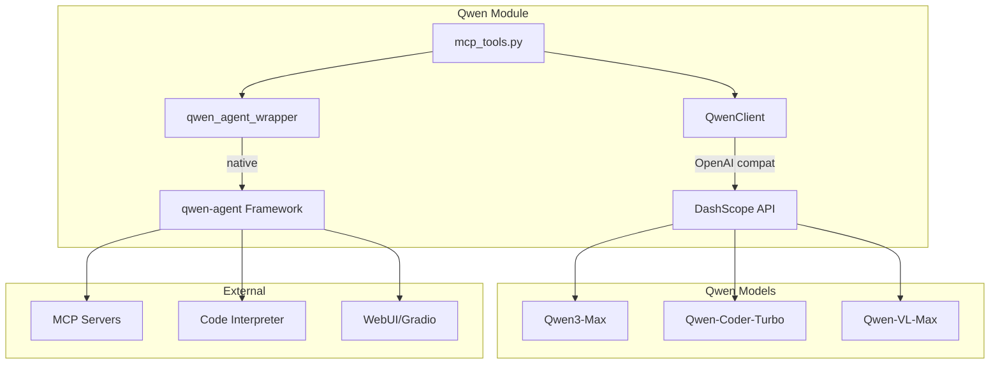

# Technical Specification - Qwen

**Version**: v1.1.9 | **Status**: Active | **Last Updated**: March 2026

**Module**: `codomyrmex.agents.qwen`

## 1. Purpose

Comprehensive Qwen model integration providing DashScope API access, native qwen-agent framework support, tool/function calling, MCP tool exposure, and multi-agent orchestration for the Codomyrmex ecosystem.

## 2. Architecture

### 2.1 Components

```
qwen/
├── __init__.py              # Exports, lazy imports for qwen-agent
├── qwen_client.py           # QwenClient (APIAgentBase subclass)
├── qwen_agent_wrapper.py    # qwen-agent Assistant/WebUI wrapper
├── mcp_tools.py             # 5 MCP tool definitions
├── README.md                # Human documentation
├── AGENTS.md                # Agent coordination
├── SPEC.md                  # This file
├── PAI.md                   # PAI integration
└── py.typed                 # PEP 561 marker
```

### 2.2 Dependencies

- Python >=3.11
- `openai` — DashScope compatible-mode API client
- `qwen-agent` (optional) — Native agent framework
- Parent module: `codomyrmex.agents`

### 2.3 Architecture Diagram



## 3. Interfaces

### 3.1 Public API

```python
# Core client
from codomyrmex.agents.qwen import QwenClient, QWEN_MODELS, DEFAULT_MODEL

class QwenClient(APIAgentBase):
    def __init__(self, config: dict | None = None): ...
    def _execute_impl(self, request: AgentRequest) -> AgentResponse: ...
    def _stream_impl(self, request: AgentRequest) -> Iterator[str]: ...
    def chat_with_tools(self, messages, tools, *, tool_executor=None) -> list: ...
    @staticmethod
    def list_models() -> dict: ...
    @staticmethod
    def get_code_models() -> list[str]: ...

# Qwen-Agent framework (lazy imports)
from codomyrmex.agents.qwen import (
    create_assistant,
    run_assistant,
    stream_assistant,
    launch_webui,
    create_codomyrmex_assistant,
)
```

### 3.2 MCP Tools

| Tool | Parameters | Returns |
|------|-----------|---------|
| `qwen_chat` | message, model, system_prompt, temperature, max_tokens | content, tokens_used |
| `qwen_chat_with_tools` | messages, tools, model, max_iterations | messages (full history) |
| `qwen_list_models` | — | models, code_models, total |
| `qwen_create_agent` | model, tools, system_message | agent_info |
| `qwen_code_review` | code, language, focus, model | review content |

### 3.3 Configuration

| Key | Env Variable | Default |
|-----|-------------|---------|
| `qwen_api_key` | `DASHSCOPE_API_KEY` / `QWEN_API_KEY` | — |
| `qwen_model` | — | `qwen-coder-turbo` |
| `qwen_base_url` | `QWEN_BASE_URL` | DashScope URL |
| `qwen_timeout` | — | 30s |
| `qwen_max_tokens` | — | 4096 |
| `qwen_temperature` | — | 0.7 |

## 4. Implementation Notes

### 4.1 Design Decisions

1. **Dual interface**: OpenAI-compatible client (simple, proven) + native qwen-agent framework (rich tools, MCP)
2. **Model registry**: 14 models with context lengths, categorized (code, general, vision, long)
3. **Tool calling**: Full OpenAI-format function calling with multi-turn executor loop
4. **Lazy imports**: qwen-agent framework only loaded when accessed (avoids hard dependency)
5. **MCP-native**: qwen-agent has built-in `mcpServers` support in `function_list`

### 4.2 Limitations

- DashScope API requires `DASHSCOPE_API_KEY` from Alibaba Cloud
- Self-hosted Qwen requires QWEN_BASE_URL override
- qwen-agent WebUI requires `gradio` (optional dep)

## 5. Testing

```bash
# Run tests for this module
uv run pytest src/codomyrmex/tests/unit/agents/qwen/ -v

# Check imports
python -c "from codomyrmex.agents.qwen import QwenClient, QWEN_MODELS; print(f'{len(QWEN_MODELS)} models')"
```

## 6. Navigation

- **Human Documentation**: [README.md](README.md)
- **Agent Coordination**: [AGENTS.md](AGENTS.md)
- **PAI Integration**: [PAI.md](PAI.md)
- **Parent Module**: [agents/](../README.md)
