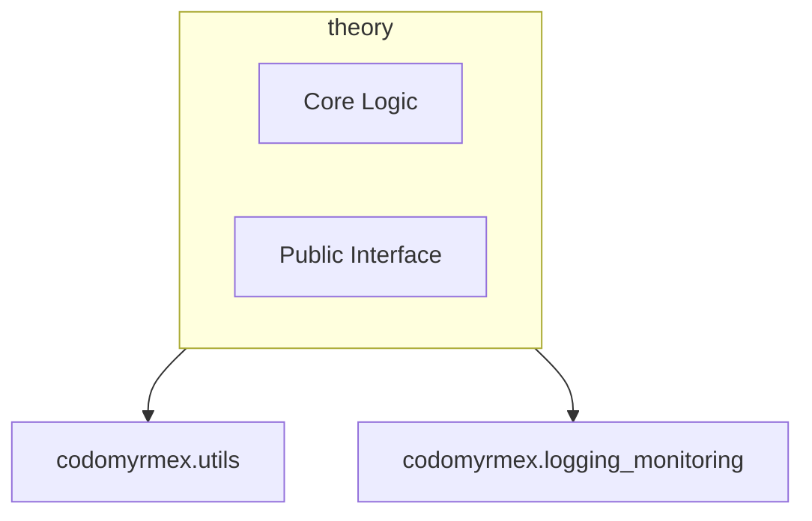

# Theory

**Version**: v0.1.0 | **Status**: Active

## Overview

The `theory` module provides core functionality for Theory.

## Architecture



## Components

- **Core**: Implementation logic.
- **API**: Exposed functions and classes.

## Usage

```python
from codomyrmex.theory import ...

# Example usage
# result = process(...)
```

## Navigation

- **Parent**: [codomyrmex](../README.md)
- **Spec**: [SPEC.md](SPEC.md)
- **Agents**: [AGENTS.md](AGENTS.md)
