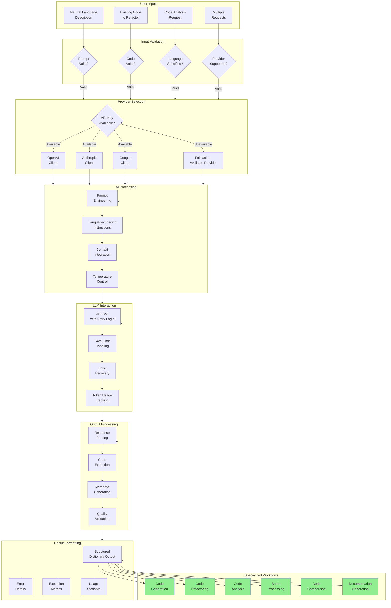

# src/codomyrmex/ai_code_editing

**Version**: v0.1.0 | **Status**: Active | **Last Updated**: December 2025

## Overview

Core module providing AI-powered code assistance and generation capabilities for the Codomyrmex platform. This module enables intelligent code creation, refactoring, and enhancement through integration with multiple Large Language Models (LLMs) including OpenAI, Anthropic, and Google AI.

## AI Code Editing Workflow

## Key Features

- **Multi-Provider Support**: Integration with OpenAI GPT, Anthropic Claude, and Google Gemini
- **Intelligent Prompt Engineering**: Context-aware prompt composition and optimization
- **Comprehensive Code Operations**: Generation, refactoring, analysis, documentation, and comparison
- **Batch Processing**: Efficient handling of multiple code requests
- **Robust Error Handling**: Automatic retry logic, rate limiting, and fallback providers
- **Quality Validation**: Built-in code quality assessment and improvement suggestions
- **Performance Monitoring**: Token usage tracking, execution time measurement, and metrics collection

## Directory Contents
- `.cursor/` – Subdirectory
- `.gitignore` – File
- `API_SPECIFICATION.md` – File
- `CHANGELOG.md` – File
- `MCP_TOOL_SPECIFICATION.md` – File
- `PROMPT_ENGINEERING.md` – File
- `SECURITY.md` – File
- `USAGE_EXAMPLES.md` – File
- `__init__.py` – File
- `ai_code_helpers.py` – File
- `claude_task_master.py` – File
- `docs/` – Subdirectory
- `droid/` – Subdirectory
- `droid_manager.py` – File
- `openai_codex.py` – File
- `prompt_composition.py` – File
- `prompt_templates/` – Subdirectory
- `requirements.txt` – File
- `tests/` – Subdirectory

## Navigation
- **Project Root**: [README](../../../README.md)
- **Parent Directory**: [codomyrmex](../README.md)
- **Src Hub**: [src](../../../src/README.md)
