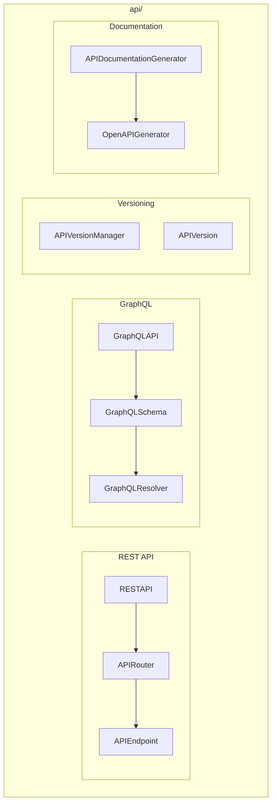

# API Module

**Version**: v0.1.0 | **Status**: Active | **Last Updated**: January 2026

## Overview

The API module provides comprehensive API functionality for the Codomyrmex platform, including REST API frameworks, GraphQL support, API versioning, and OpenAPI specification generation.

## Architecture



## Key Classes

### REST API

| Class | Purpose |
|-------|---------|
| `RESTAPI` | REST API framework |
| `APIRouter` | Route grouping |
| `APIEndpoint` | Endpoint definition |
| `APIRequest` | Request wrapper |
| `APIResponse` | Response wrapper |
| `HTTPMethod` | HTTP methods enum |
| `HTTPStatus` | HTTP status codes |

### GraphQL

| Class | Purpose |
|-------|---------|
| `GraphQLAPI` | GraphQL API framework |
| `GraphQLSchema` | Schema definition |
| `GraphQLResolver` | Resolver decorator |
| `GraphQLMutation` | Mutation definition |
| `GraphQLQuery` | Query definition |
| `GraphQLObjectType` | Object type |

### Documentation

| Class | Purpose |
|-------|---------|
| `APIDocumentationGenerator` | Generate API docs |
| `OpenAPIGenerator` | OpenAPI spec generation |
| `OpenAPISpecification` | OpenAPI spec object |

## Quick Start

### REST API

```python
from codomyrmex.api import RESTAPI, create_api, create_router

api = create_api(title="My API", version="1.0")

@api.get("/users/{user_id}")
def get_user(user_id: str):
    return {"id": user_id, "name": "John"}

@api.post("/users")
def create_user(data: dict):
    return {"id": "123", **data}
```

### GraphQL

```python
from codomyrmex.api import (
    GraphQLAPI,
    create_schema,
    resolver,
    mutation
)

@resolver("Query", "user")
def resolve_user(_, info, id: str):
    return {"id": id, "name": "John"}

@mutation("createUser")
def create_user(_, info, name: str):
    return {"id": "123", "name": name}

schema = create_schema(resolvers=[resolve_user, create_user])
```

### API Versioning

```python
from codomyrmex.api import (
    APIVersionManager,
    APIVersion,
    version,
    deprecated_version
)

manager = create_version_manager()

@version("1.0")
def get_user_v1(user_id):
    return {"id": user_id}

@version("2.0")
@deprecated_version("1.0")
def get_user_v2(user_id):
    return {"id": user_id, "email": "..."}
```

### OpenAPI Generation

```python
from codomyrmex.api import (
    generate_openapi_spec_from_api,
    validate_openapi_spec
)

spec = generate_openapi_spec_from_api(api)
print(spec.to_yaml())

# Validate existing spec
errors = validate_openapi_spec("openapi.yaml")
```

## Integration Points

- **networking**: HTTP infrastructure
- **documentation**: API documentation
- **security**: API authentication

## Navigation

- **Parent**: [../README.md](../README.md)
- **Siblings**: [networking](../networking/), [auth](../auth/)
- **Spec**: [SPEC.md](SPEC.md)
