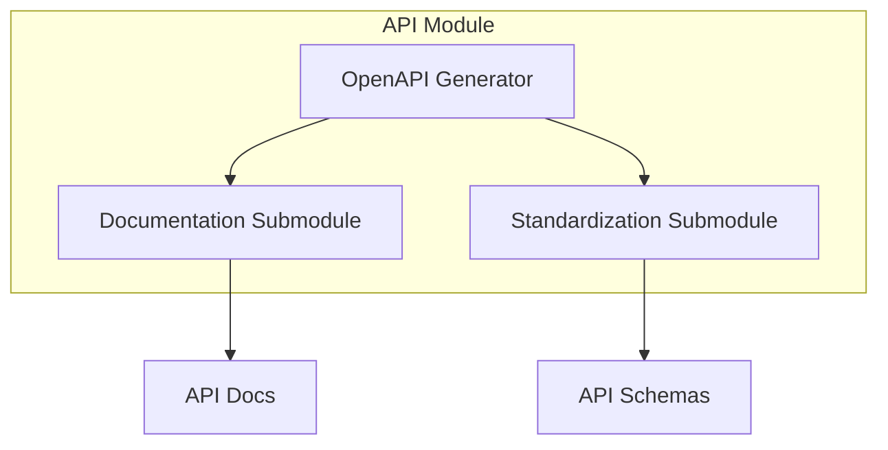

# api - Functional Specification

**Version**: v0.1.0 | **Status**: Active | **Last Updated**: December 2025

## Purpose

API module providing OpenAPI specification generation, API documentation, and standardization utilities for the Codomyrmex platform.

## Design Principles

### Modularity
- Separate concerns for documentation and standardization
- Pluggable output formats
- Clear component boundaries

### Internal Coherence
- Consistent API patterns
- Unified configuration
- Standardized outputs

## Architecture

## Functional Requirements

### OpenAPI Generation
- Generate OpenAPI 3.0 specifications from code
- Support multiple output formats (YAML, JSON)
- Include examples and schemas

### Documentation
- Generate human-readable API documentation
- Support Swagger UI integration
- Provide interactive API exploration

### Standardization
- Enforce API naming conventions
- Validate API schemas
- Support versioning strategies

## Navigation Links

- **Human Documentation**: [README.md](README.md)
- **Technical Documentation**: [AGENTS.md](AGENTS.md)
- **Parent**: [codomyrmex](../README.md)
