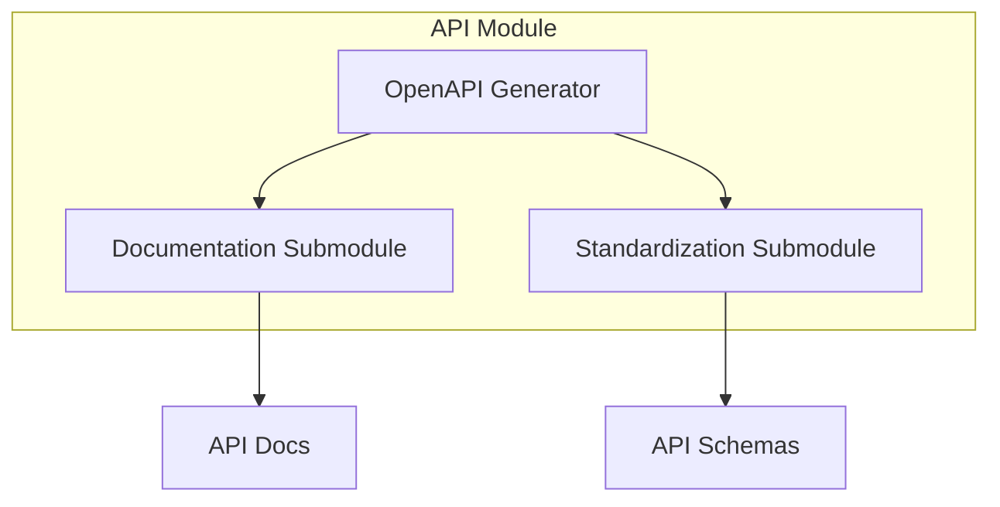

# api - Functional Specification

**Version**: v0.1.0 | **Status**: Active | **Last Updated**: February 2026

## Purpose

API module providing OpenAPI specification generation, API documentation, and standardization utilities for the Codomyrmex platform.

## Design Principles

### Modularity

- Separate concerns for documentation and standardization
- Pluggable output formats
- Clear component boundaries

### Internal Coherence

- Consistent API patterns
- Unified configuration
- Standardized outputs

## Architecture



## Functional Requirements

### OpenAPI Generation

- Generate OpenAPI 3.0 specifications from code
- Support multiple output formats (YAML, JSON)
- Include examples and schemas

### Documentation

- Generate human-readable API documentation
- Support Swagger UI integration
- Provide interactive API exploration

### Standardization

- Enforce API naming conventions
- Validate API schemas
- Support versioning strategies

## Navigation Links

- **Human Documentation**: [README.md](README.md)
- **Technical Documentation**: [AGENTS.md](AGENTS.md)
- **Parent**: [codomyrmex](../README.md)

## Detailed Architecture and Implementation


### Design Principles

1. **Strict Modularity**: Each component is isolated and communicates via well-defined APIs.
2. **Performance Optimization**: Implementation leverages lazy loading and intelligent caching to minimize resource overhead.
3. **Error Resilience**: Robust exception handling ensures system stability even under unexpected conditions.
4. **Extensibility**: The architecture is designed to accommodate future enhancements without breaking existing contracts.

### Technical Implementation

The codebase utilizes modern Python features (version 3.10+) to provide a clean, type-safe API. Interaction patterns are documented in the corresponding `AGENTS.md` and `SPEC.md` files, ensuring that both human developers and automated agents can effectively utilize these capabilities.

## Testing

```bash
uv run python -m pytest src/codomyrmex/tests/ -k api -v
```
