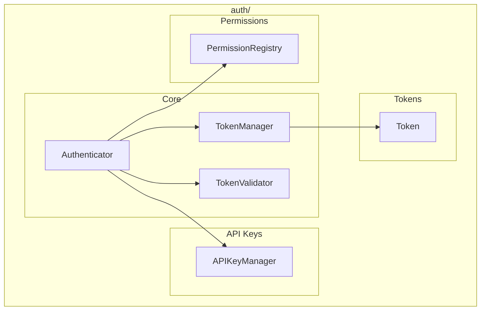

# Auth Module

**Version**: v0.1.0 | **Status**: Active | **Last Updated**: January 2026

## Overview

The Auth module provides authentication and authorization capabilities for the Codomyrmex platform, including API key management, OAuth integration, token handling, and permission-based access control.

## Architecture



## Key Classes

| Class | Purpose |
|-------|---------|
| `Authenticator` | Main authentication orchestrator |
| `Token` | Authentication token |
| `TokenManager` | Token lifecycle management |
| `TokenValidator` | Token validation |
| `APIKeyManager` | API key management |
| `PermissionRegistry` | Permission definitions |

## Functions

| Function | Purpose |
|----------|---------|
| `authenticate(credentials)` | Authenticate with credentials |
| `authorize(token, resource, permission)` | Check authorization |
| `get_authenticator()` | Get authenticator instance |

## Quick Start

### Authentication

```python
from codomyrmex.auth import authenticate, Authenticator

# Simple authentication
token = authenticate({
    "username": "admin",
    "password": "secret"
})

if token:
    print(f"Authenticated! Token expires: {token.expires_at}")
```

### Authorization

```python
from codomyrmex.auth import authorize, authenticate

token = authenticate(credentials)

# Check permissions
if authorize(token, "database", "read"):
    print("User can read database")
    
if authorize(token, "admin", "write"):
    print("User has admin write access")
```

### API Key Management

```python
from codomyrmex.auth import APIKeyManager

api_keys = APIKeyManager()

# Create a new API key
key = api_keys.create(
    name="my-service",
    permissions=["read", "write"],
    expires_in_days=90
)
print(f"API Key: {key.value}")

# Validate an API key
result = api_keys.validate(key.value)
if result.is_valid:
    print(f"Key belongs to: {result.name}")
```

### Token Management

```python
from codomyrmex.auth import TokenManager, TokenValidator

token_mgr = TokenManager(secret_key="your-secret")

# Create a token
token = token_mgr.create(
    user_id="user123",
    claims={"role": "admin"},
    expires_in_hours=24
)

# Validate a token
validator = TokenValidator(secret_key="your-secret")
if validator.validate(token.value):
    claims = validator.get_claims(token.value)
    print(f"User: {claims['user_id']}, Role: {claims['role']}")
```

### Permission Registry

```python
from codomyrmex.auth import PermissionRegistry

registry = PermissionRegistry()

# Define permissions
registry.register("database:read", description="Read database")
registry.register("database:write", description="Write database")
registry.register("admin:*", description="All admin permissions")

# Check permission hierarchy
if registry.has_permission("admin:*", "admin:delete"):
    print("Admin wildcard includes delete")
```

## Integration Points

- **security**: Security infrastructure
- **encryption**: Token encryption
- **config_management**: Auth configuration
- **logging_monitoring**: Authentication logging

## Navigation

- **Parent**: [../README.md](../README.md)
- **Siblings**: [security](../security/), [encryption](../encryption/)
- **Spec**: [SPEC.md](SPEC.md)
