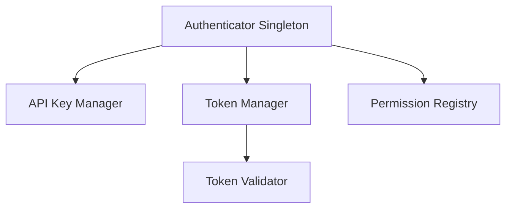

# auth - Functional Specification

**Version**: v1.1.9 | **Status**: Active | **Last Updated**: March 2026

## Purpose

Authentication and authorization module providing API key management, OAuth integration, and Role-Based Access Control (RBAC). It provides a secure mechanism for user identification and permission enforcement.

## Design Principles

### Modularity

- Provider-agnostic auth interface via the `Authenticator` singleton.
- Pluggable components for token management, API key management, and RBAC.

### Internal Coherence

- Unified `Token` dataclass used across all authentication methods.
- Consistent permission enforcement via `PermissionRegistry`.
- Integrated user registration and RBAC assignment.

### Parsimony

- Minimal external dependencies (standard library and internal logging).
- Focus on essential authentication patterns: password, API key, and OAuth.

### Functionality

- **Registration**: Support for registering users with specific roles.
- **Authentication**: Multi-method authentication (password, API key).
- **Authorization**: Granular RBAC with hierarchy and wildcard support.
- **Token Lifecycle**: Signed tokens (JWT-like) with expiry and revocation.
- **API Keys**: Secure generation, validation, and rotation.

## Architecture


```mermaid
graph TD
    Authenticator[Authenticator Singleton]
    APIKeyManager[API Key Manager]
    TokenManager[Token Manager]
    PermissionRegistry[Permission Registry]
    TokenValidator[Token Validator]
    
    Authenticator --> APIKeyManager
    Authenticator --> TokenManager
    Authenticator --> PermissionRegistry
    TokenManager --> TokenValidator
```

## Interface Contracts

### Authenticator

```python
class Authenticator:
    def register_user(username: str, password: str, roles: List[str] = None) -> bool
    def authenticate(credentials: dict) -> Token | None
    def authorize(token: Token | str, resource: str, permission: str) -> bool
    def refresh_token(token: Token) -> Token | None
    def revoke_token(token: Token | str) -> bool
```

### PermissionRegistry

```python
class PermissionRegistry:
    def register_role(role: str, permissions: List[str]) -> None
    def add_inheritance(child: str, parent: str) -> None
    def assign_role(user_id: str, role: str) -> None
    def check(user_id: str, permission: str, resource: str = "") -> bool
```

### TokenManager

```python
class TokenManager:
    def create_token(user_id: str, permissions: List[str] = None, ttl: int = 3600) -> Token
    def validate_token(token: Token | str) -> bool
    def revoke_token(token: Token | str) -> bool
```

### APIKeyManager

```python
class APIKeyManager:
    def generate(user_id: str, permissions: List[str] = None, ttl_seconds: float = None) -> str
    def validate(key_str: str) -> APIKey | None
    def rotate(old_key_str: str, ttl_seconds: float = None) -> str | None
```

## Quality Standards

### Code Quality

- Type hints for all public methods.
- Singleton pattern for shared authentication state.
- HMAC-based token signing for stateless verification.

### Testing Standards

- **Zero-Mock Policy**: All unit tests use real objects to ensure integrated functionality.
- ≥90% coverage for core authentication logic.
- Security-focused tests for token tampering and signature verification.

## Navigation

- **Parent**: [codomyrmex](../AGENTS.md)
- **Related**: [security](../security/AGENTS.md), [api](../api/AGENTS.md)
