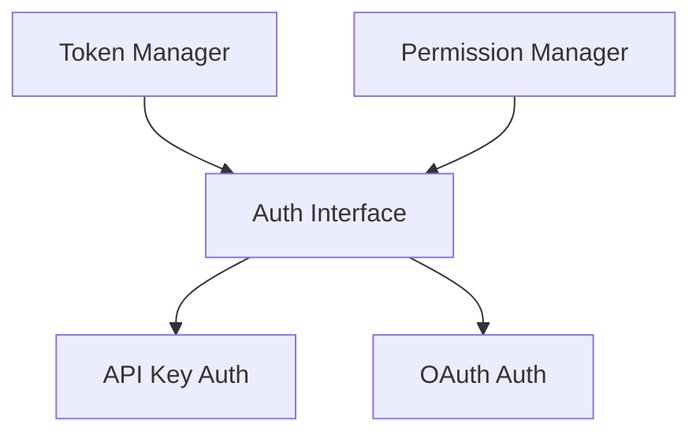

# auth - Functional Specification

**Version**: v1.0.0 | **Status**: Active | **Last Updated**: February 2026

## Purpose

Authentication and authorization module providing API key management, OAuth integration, and access control. Integrates with `security` and `api` modules.

## Design Principles

### Modularity

- Provider-agnostic auth interface
- Support for multiple auth methods
- Pluggable auth system

### Internal Coherence

- Unified auth token handling
- Consistent permission patterns
- Integration with security

### Parsimony

- Essential auth operations
- Minimal dependencies
- Focus on common auth patterns

### Functionality

- Working implementations for common auth methods
- Support for OAuth 2.0
- API key management

### Testing

- Unit tests for all auth methods
- Integration tests with auth providers
- Security testing

### Documentation

- Complete API specifications
- Usage examples for each auth method
- Security best practices

## Architecture



## Functional Requirements

### Core Operations

1. **Authentication**: Verify user credentials
2. **Authorization**: Check user permissions
3. **Token Management**: Issue, validate, and revoke tokens
4. **API Keys**: Generate and manage API keys
5. **OAuth**: OAuth 2.0 flow support

### Integration Points

- `security/` - Security integration
- `api/` - API authentication
- `config_management/` - Secret management

## Quality Standards

### Code Quality

- Type hints for all functions
- PEP 8 compliance
- Comprehensive security handling

### Testing Standards

- ≥80% coverage
- Auth method-specific tests
- Security testing

### Documentation Standards

- README.md, AGENTS.md, SPEC.md
- API_SPECIFICATION.md
- SECURITY.md

## Interface Contracts

### Auth Interface

```python
class Authenticator:
    def authenticate(credentials: dict) -> Token | None
    def authorize(token: Token, resource: str, permission: str) -> bool
    def refresh_token(token: Token) -> Token | None
    def revoke_token(token: Token) -> bool
```

### Supporting Registries

```python
class PermissionRegistry:
    def register_role(role: str, permissions: List[str]) -> None
    def add_inheritance(role: str, parent_role: str) -> None
    def get_permissions(role: str) -> Set[str]
    def has_permission(role: str, permission: str) -> bool

class TokenManager:
    def create_token(user_id: str, permissions: List[str] = None, ttl: int = 3600) -> Token
    def validate_token(token: Token) -> bool
    def revoke_token(token: Token) -> bool
    def refresh_token(token: Token, ttl: int = 3600) -> Token | None

class APIKeyManager:
    def generate_api_key(user_id: str, permissions: List[str] = None) -> str
    def validate_api_key(api_key: str) -> dict | None
    def revoke_api_key(api_key: str) -> bool
```

## Implementation Guidelines

### Auth Implementation

1. Implement Auth interface for each method
2. Handle token generation and validation
3. Support permission checking
4. Provide secure credential storage

### Integration

1. Integrate with security module
2. Add auth to API endpoints
3. Support secret management

## Navigation

- **Parent**: [codomyrmex](../AGENTS.md)
- **Related**: [security](../security/AGENTS.md), [api](../api/AGENTS.md)

<!-- Navigation Links keyword for score -->
