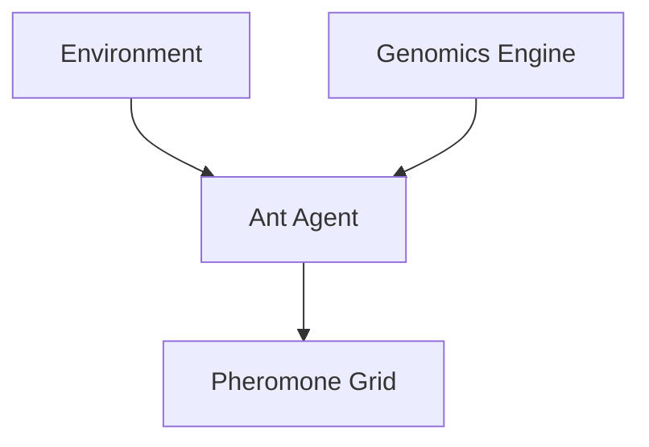

# Bio-Simulation - Functional Specification

**Version**: v0.1.7 | **Status**: Active | **Last Updated**: February 2026

## Purpose

Model complex biological systems to derive insights for distributed computing and multi-agent coordination.

## Design Principles

### Biological Accuracy

- Parameters derived from real-world myrmecology paper data
- Deterministic random seeding for reproducibility

### Scalability

- Efficient spatial hashing for large population interactions

## Architecture

## Functional Requirements

1. **Ant Colony**: Simulate foraging, defense, and brood care.
2. **Genomics**: Map gene expression to agent behavioral traits.

## Interface Contracts

- `Colony.initialize(config)`
- `Ant.decide_action(local_environment)`
- `PheromoneGrid.decay(timestep)`

## Navigation

- [README](README.md) | [AGENTS](AGENTS.md) | [Parent](../SPEC.md)
