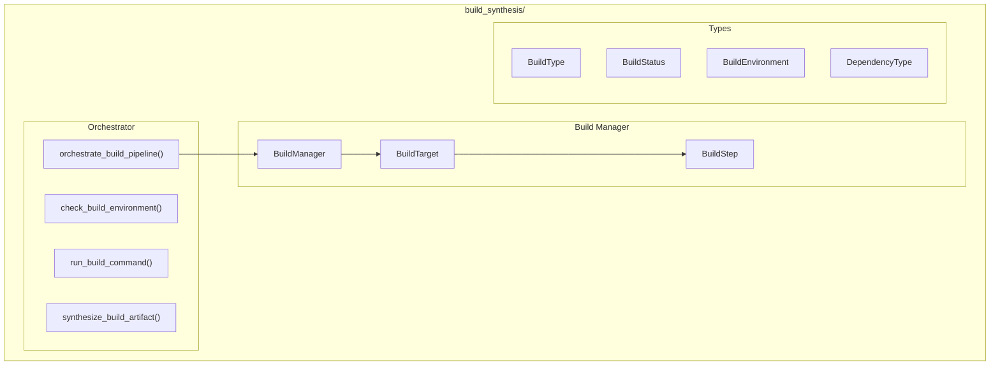

# Build Synthesis Module

**Version**: v0.1.0 | **Status**: Active | **Last Updated**: January 2026

## Overview

The Build Synthesis module provides build automation, dependency management, artifact synthesis, and deployment orchestration for the Codomyrmex ecosystem. It supports Python, Docker, and static site builds.

## Architecture



## Key Classes

| Class | Purpose |
|-------|---------|
| `BuildManager` | Main build orchestrator |
| `BuildTarget` | Build target definition |
| `BuildStep` | Individual build step |
| `BuildResult` | Build result |
| `Dependency` | Dependency definition |
| `BuildType` | Build type enum |
| `BuildStatus` | Status enum |
| `BuildEnvironment` | Environment enum |
| `DependencyType` | Dependency type enum |

## Functions

| Function | Purpose |
|----------|---------|
| `check_build_environment()` | Check environment |
| `run_build_command()` | Execute build command |
| `synthesize_build_artifact()` | Create artifact |
| `validate_build_output()` | Validate output |
| `orchestrate_build_pipeline()` | Run full pipeline |
| `trigger_build()` | Trigger build |
| `create_python_build_target()` | Python target |
| `create_docker_build_target()` | Docker target |
| `create_static_build_target()` | Static site target |

## Quick Start

### Create Build Targets

```python
from codomyrmex.build_synthesis import (
    create_python_build_target,
    create_docker_build_target,
    create_static_build_target
)

# Python package
python_target = create_python_build_target(
    name="my-package",
    source_dir="src/",
    output_dir="dist/"
)

# Docker image
docker_target = create_docker_build_target(
    name="my-app",
    dockerfile="Dockerfile",
    tag="my-app:latest"
)

# Static site
static_target = create_static_build_target(
    name="docs",
    source_dir="docs/",
    output_dir="site/"
)
```

### Build Manager

```python
from codomyrmex.build_synthesis import BuildManager, trigger_build

manager = BuildManager()

# Add targets
manager.add_target(python_target)
manager.add_target(docker_target)

# Build specific target
result = trigger_build("my-package")
print(f"Status: {result.status}")
print(f"Artifacts: {result.artifacts}")
```

### Build Pipeline

```python
from codomyrmex.build_synthesis import (
    orchestrate_build_pipeline,
    check_build_environment
)

# Check environment first
check_build_environment()

# Run full pipeline
result = orchestrate_build_pipeline(
    targets=["lint", "test", "build", "package"],
    environment="production"
)
```

### Custom Build Steps

```python
from codomyrmex.build_synthesis import (
    BuildTarget,
    BuildStep,
    run_build_command
)

target = BuildTarget(
    name="custom",
    steps=[
        BuildStep(name="clean", command="rm -rf build/"),
        BuildStep(name="compile", command="make all"),
        BuildStep(name="test", command="make test"),
    ]
)

result = run_build_command("make install", cwd="./project")
```

## Integration Points

- **ci_cd_automation**: Pipeline builds
- **containerization**: Container builds
- **logging_monitoring**: Build logging

## Navigation

- **Parent**: [../README.md](../README.md)
- **Siblings**: [ci_cd_automation](../ci_cd_automation/), [containerization](../containerization/)
- **Spec**: [SPEC.md](SPEC.md)
