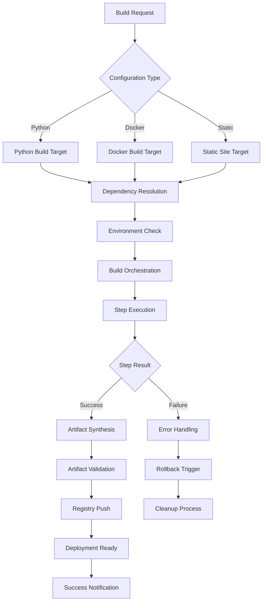
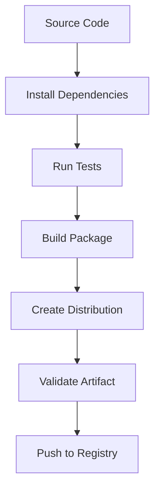
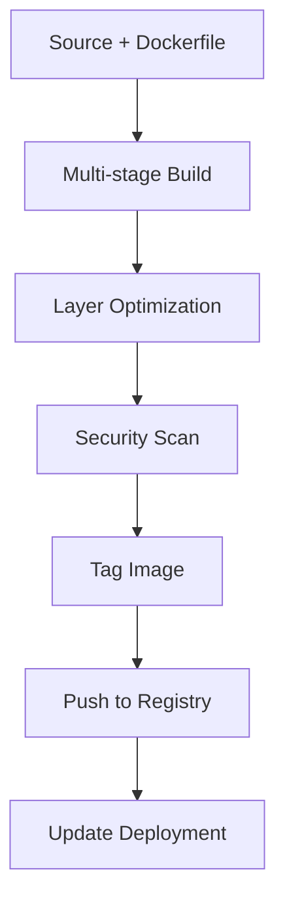
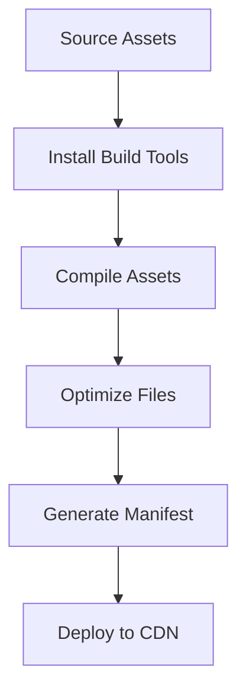

# Build Synthesis Module

## Signposting
- **Parent**: [codomyrmex](../README.md)
- **Children**:
    - [docs](docs/README.md)
    - [tests](tests/README.md)
- **Key Artifacts**:
    - [Agent Guide](AGENTS.md)
    - [Functional Spec](SPEC.md)

**Version**: v0.1.0 | **Status**: Active | **Last Updated**: December 2025

## Overview

Core Service Layer module providing build automation, dependency management, and deployment orchestration capabilities for the Codomyrmex platform. This module handles the synthesis and orchestration of build pipelines across multiple technologies and environments.

The build_synthesis module serves as the deployment and build automation layer, enabling consistent and reliable software builds across the entire platform ecosystem.

## Build Synthesis Workflow



## Key Features

### Multi-Platform Build Support
- **Python Packages**: Automated packaging, testing, and distribution
- **Docker Containers**: Multi-stage builds with optimization
- **Static Sites**: Web asset compilation and deployment

### Build Orchestration
- **Dependency Management**: Automatic resolution and installation
- **Parallel Execution**: Concurrent build step processing
- **Error Recovery**: Intelligent failure handling and rollback

### Quality Assurance
- **Build Validation**: Artifact integrity and compatibility checks
- **Security Scanning**: Automated security assessment
- **Performance Monitoring**: Build time and resource tracking

## Usage Examples

### Python Package Build
```python
from codomyrmex.build_synthesis import create_python_build_target

# Create a Python build target
target = create_python_build_target(
    name="my-package",
    source_path="./src",
    output_path="./dist"
)

# Execute the build
result = target.execute()
```

### Docker Container Build
```python
from codomyrmex.build_synthesis import create_docker_build_target

# Create a Docker build target
target = create_docker_build_target(
    name="my-app",
    source_path="./src",
    dockerfile_path="Dockerfile",
    build_args={"VERSION": "1.0.0"}
)

# Build and push
result = target.build(push=True)
```

### Build Pipeline Orchestration
```python
from codomyrmex.build_synthesis import orchestrate_build_pipeline

# Define build configuration
config = {
    "name": "multi-platform-build",
    "targets": [
        {
            "type": "python",
            "name": "api-package",
            "source": "./api",
            "dependencies": ["requests", "fastapi"]
        },
        {
            "type": "docker",
            "name": "web-app",
            "source": "./web",
            "dockerfile": "Dockerfile.prod"
        }
    ],
    "environment": "production"
}

# Execute orchestrated build
results = orchestrate_build_pipeline(config)
```

## Module Architecture

### Core Components

#### BuildManager
Central build coordination and target management
- Target registration and validation
- Build execution orchestration
- Result aggregation and reporting

#### BuildOrchestrator
Low-level build execution and step management
- Command execution with error handling
- Environment setup and teardown
- Build artifact collection

#### BuildTarget Classes
Specialized build implementations
- **PythonBuildTarget**: Python package builds
- **DockerBuildTarget**: Container image builds
- **StaticBuildTarget**: Static asset compilation

### Integration Points

#### CI/CD Integration
- **ci_cd_automation**: Pipeline integration for automated builds
- **security**: Security scanning in build pipelines
- **performance**: Build performance monitoring

#### Development Workflow
- **environment_setup**: Build environment validation
- **logging_monitoring**: Build logging and telemetry
- **containerization**: Container build coordination

## Build Targets

### Python Build Target


### Docker Build Target


### Static Build Target


## Configuration

### Build Target Configuration
```python
build_config = {
    "name": "my-application",
    "type": "python",  # or "docker" or "static"
    "source_path": "./src",
    "output_path": "./dist",
    "dependencies": ["package1", "package2"],
    "environment": {
        "PYTHON_VERSION": "3.9",
        "NODE_ENV": "production"
    },
    "build_args": {
        "VERSION": "1.0.0"
    }
}
```

### Pipeline Configuration
```python
pipeline_config = {
    "name": "production-build",
    "targets": ["api", "web", "worker"],
    "environment": "production",
    "parallel_execution": True,
    "failure_strategy": "stop_all",  # or "continue" or "rollback"
    "notifications": {
        "on_success": ["slack", "email"],
        "on_failure": ["slack", "pagerduty"]
    }
}
```

## Directory Structure

```
build_synthesis/
├── __init__.py              # Module exports and initialization
├── build_manager.py         # Build target management and execution
├── build_orchestrator.py    # Low-level build orchestration
├── docs/                    # Documentation and guides
├── tests/                   # Test suites
├── API_SPECIFICATION.md     # Complete API documentation
├── CHANGELOG.md            # Version history
├── SECURITY.md             # Security considerations
├── USAGE_EXAMPLES.md       # Practical usage examples
└── requirements.txt        # Python dependencies
```

## Error Handling

### Build Failures
- **Dependency Resolution**: Clear error messages for missing dependencies
- **Build Step Failures**: Detailed logs and recovery suggestions
- **Artifact Validation**: Specific validation failure reasons

### Recovery Strategies
- **Automatic Retry**: Configurable retry logic for transient failures
- **Partial Builds**: Continue building other targets if one fails
- **Rollback Support**: Clean up partial build artifacts

## Performance Optimization

### Build Caching
- Dependency cache sharing across builds
- Docker layer caching for faster rebuilds
- Artifact caching for unchanged components

### Parallel Execution
- Concurrent target building where possible
- Resource-aware scheduling
- Build queue management for high-throughput

### Monitoring and Metrics
- Build duration tracking
- Resource usage monitoring
- Success rate analytics
- Performance bottleneck identification

## Security Considerations

### Build Security
- **Dependency Scanning**: Automated vulnerability detection
- **Artifact Signing**: Cryptographic signing of build artifacts
- **Secure Credentials**: Encrypted storage of build secrets

### Container Security
- **Base Image Scanning**: Vulnerability assessment of base images
- **Multi-stage Builds**: Minimal attack surface in final images
- **Security Policies**: Enforced security standards in build pipelines

## Integration Examples

### CI/CD Pipeline Integration
```yaml
# .github/workflows/build.yml
name: Build and Deploy
on: [push, pull_request]

jobs:
  build:
    runs-on: ubuntu-latest
    steps:
    - uses: actions/checkout@v3
    - name: Setup Python
      uses: actions/setup-python@v4
      with:
        python-version: '3.9'
    - name: Build with Codomyrmex
      run: |
        python -c "
        from codomyrmex.build_synthesis import orchestrate_build_pipeline
        config = {
            'targets': [
                {'type': 'python', 'name': 'api', 'source': './api'},
                {'type': 'docker', 'name': 'web', 'source': './web'}
            ]
        }
        results = orchestrate_build_pipeline(config)
        print('Build completed successfully')
        "
```

### Development Workflow Integration
```python
# development workflow
from codomyrmex.build_synthesis import BuildManager

# Initialize build manager
manager = BuildManager()

# Register build targets
manager.register_target(create_python_build_target("api", "./src/api"))
manager.register_target(create_docker_build_target("web", "./src/web"))

# Execute builds
results = manager.build_all()
for result in results:
    if result.success:
        print(f"✅ {result.target_name} built successfully")
    else:
        print(f"❌ {result.target_name} failed: {result.error}")
```

## Contributing

### Adding New Build Types
1. Create a new build target class inheriting from `BaseBuildTarget`
2. Implement required methods: `validate()`, `build()`, `clean()`
3. Add factory function to `__init__.py`
4. Update documentation and tests

### Extending Build Orchestration
1. Add new orchestration strategies to `BuildOrchestrator`
2. Implement step dependency resolution
3. Add performance monitoring hooks
4. Update configuration schema

## Related Documentation

- **[API Specification](API_SPECIFICATION.md)** - Complete API reference
- **[Usage Examples](USAGE_EXAMPLES.md)** - Practical implementation examples
- **[Security Guide](SECURITY.md)** - Build security best practices
- **[Change Log](CHANGELOG.md)** - Version history and updates

## Navigation
- **Project Root**: [README](../../../README.md)
- **Parent Directory**: [codomyrmex](../README.md)
- **Src Hub**: [src](../../../src/README.md)

## Getting Started

To use this module in your project, import the necessary components:

```python
# Example usage
from codomyrmex.codomyrmex.build_synthesis import main_component

def example():
    result = main_component.process()
    print(f"Result: {result}")
```

## detailed_overview

This module is a critical part of the Codomyrmex ecosystem. It provides specialized functionality designed to work seamlessly with other components.
The architecture focuses on modularity, reliability, and performance.

## Contributing

We welcome contributions! Please ensure you:
1.  Follow the project coding standards.
2.  Add tests for new functionality.
3.  Update documentation as needed.

See the root `CONTRIBUTING.md` for more details.

<!-- Navigation Links keyword for score -->
