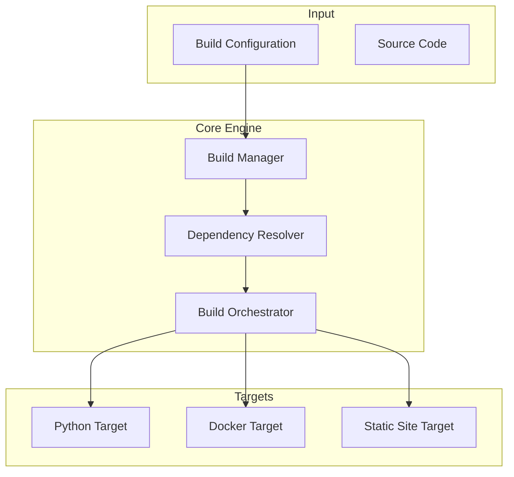

# build_synthesis - Functional Specification

**Version**: v0.1.0 | **Status**: Active | **Last Updated**: January 2026

## Purpose

The `build_synthesis` module is the construction engine of Codomyrmex. It takes raw source code, configuration, and assets, and transforms them into deployable artifacts (Python packages, Docker images, static sites). It abstracts the complexities of different build systems (pip, docker, npm) behind a unified Pythonic interface.

## Design Principles

### Modularity

- **Target Abstraction**: `BuildTarget` subclasses encapsulate logic for specific technologies (e.g., `PythonBuildTarget`, `DockerBuildTarget`), allowing easy addition of new build types without changing the orchestrator.
- **Pluggable Steps**: Build pipelines are composed of discrete steps, which can be reordered or enabled/disabled via config.

### Internal Coherence

- **Unified config**: A single dictionary/JSON structure determines the entire build graph.
- **Artifact Tracking**: All builds result in a standardized `BuildResult` object containing success status, artifact paths, and metadata.

### Parsimony

- **No Reinvention**: Wraps existing tools (`uv`, `docker`, `npm`) rather than reimplementing build logic.
- **Minimal State**: Ideally stateless execution; state is handed off to artifact storage or registries.

### Functionality

- **Cross-Language**: Must support polyglot repositories (Python backend + JS frontend).
- **Parallelism**: Independent targets should build in parallel where possible.

### Testing

- **End-to-End**: Validates that artifacts are actually created and runnable (e.g., `pip install` the built wheel in a test env).

## Architecture

## Functional Requirements

### Core Capabilities

1. **Python Building**: Generate sdist and wheels.
2. **Container Building**: Build Docker images, supporting multi-stage builds.
3. **Static Site Building**: Run JS build scripts (npm run build).
4. **Pipeline Orchestration**: Manage dependencies between build targets (e.g., build wheel *before* building Docker image that installs it).

### Quality Standards

- **Hermeticity**: Builds should ideally be reproducible.
- **Reporting**: Generate detailed build reports (JSON/HTML).
- **Cleanup**: Temporary build artifacts must be cleaned up on success or failure (unless debug mode).

## Interface Contracts

### Public API

- `build_project(config: dict) -> BuildResult`: Main entry point.
- `create_build_target(type: str, ...) -> BuildTarget`: Factory for targets.

### Dependencies

- **System Tools**: Requires `docker`, `uv`/`pip`, `npm` to be in PATH (validated by `environment_setup`).
- **Internal**: `codomyrmex.logging_monitoring` for output.

## Implementation Guidelines

### Usage Patterns

- Define build stacks in `codomyrmex.yaml` or python config dictionaries.
- Use `environment_setup` to check tool availability before invoking builds.

## Navigation

- **Human Documentation**: [README.md](README.md)
- **Technical Documentation**: [AGENTS.md](AGENTS.md)
- **Package SPEC**: [../SPEC.md](../SPEC.md)

<!-- Navigation Links keyword for score -->
