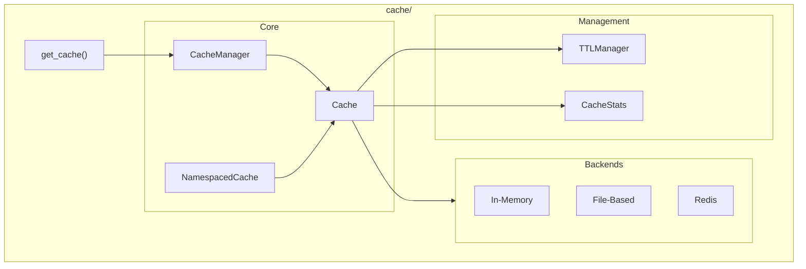

# Cache Module

**Version**: v0.1.0 | **Status**: Active | **Last Updated**: January 2026

## Overview

The Cache module provides unified caching strategies for the Codomyrmex platform. It supports multiple backends (in-memory, file-based, Redis) with TTL management, namespacing, and comprehensive statistics.

## Architecture



## Key Classes

| Class | Purpose |
|-------|---------|
| `Cache` | Core cache interface |
| `CacheManager` | Cache instance factory and registry |
| `NamespacedCache` | Isolated cache with key prefixes |
| `TTLManager` | Time-to-live enforcement |
| `CacheStats` | Hit/miss statistics and metrics |

## Exceptions

| Exception | When Raised |
|-----------|-------------|
| `CacheError` | Base cache exception |
| `CacheExpiredError` | TTL exceeded |
| `CacheFullError` | Capacity limit reached |
| `CacheConnectionError` | Backend connection failure |
| `CacheKeyError` | Invalid or missing key |
| `CacheSerializationError` | Serialization failure |
| `CacheInvalidationError` | Invalidation failed |

## Quick Start

### Basic Usage

```python
from codomyrmex.cache import get_cache

# Get default in-memory cache
cache = get_cache("my_cache")

# Store and retrieve
cache.set("key", {"data": "value"}, ttl=300)  # 5 min TTL
result = cache.get("key")

# Delete
cache.delete("key")
```

### With Redis Backend

```python
from codomyrmex.cache import get_cache

# Get Redis-backed cache
cache = get_cache("shared_cache", backend="redis")

cache.set("session:123", user_data, ttl=3600)
```

### Namespaced Cache

```python
from codomyrmex.cache import NamespacedCache, get_cache

base = get_cache("app")
user_cache = NamespacedCache(base, namespace="user:")
llm_cache = NamespacedCache(base, namespace="llm:")

# Keys are automatically prefixed
user_cache.set("123", user_data)  # Stored as "user:123"
llm_cache.set("response_abc", response)  # Stored as "llm:response_abc"
```

### Cache Statistics

```python
from codomyrmex.cache import get_cache

cache = get_cache("metrics")

# Use cache...
cache.get("key1")
cache.get("key2")

# Get stats
stats = cache.stats
print(f"Hit rate: {stats.hit_rate:.2%}")
print(f"Total hits: {stats.hits}, misses: {stats.misses}")
```

## Backends

| Backend | Description | Use Case |
|---------|-------------|----------|
| `in_memory` | Python dict-based | Development, single process |
| `file_based` | Disk-backed | Persistent local cache |
| `redis` | Redis server | Distributed, multi-process |

## Integration Points

- **llm**: Cache LLM responses to reduce API calls
- **static_analysis**: Cache analysis results
- **build_synthesis**: Cache build artifacts
- **agents**: Cache agent session state

## Navigation

- **Parent**: [../README.md](../README.md)
- **Siblings**: [serialization](../serialization/), [database_management](../database_management/)
- **Spec**: [SPEC.md](SPEC.md)
