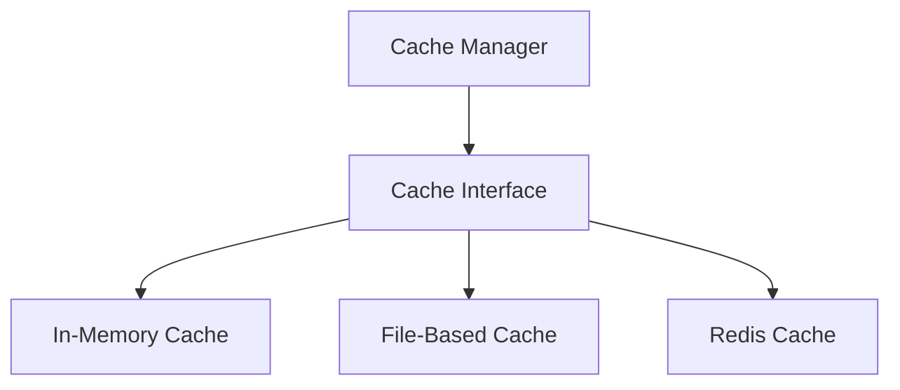

# cache - Functional Specification

**Version**: v0.1.0 | **Status**: Proposed | **Last Updated**: December 2025

## Purpose

Caching module providing unified caching strategies for code analysis results, LLM responses, build artifacts, and other frequently accessed data. Integrates with the `performance` module to optimize platform responsiveness and reduce redundant computations.

## Design Principles

### Modularity
- Provider-agnostic caching interface
- Support for multiple backends (Redis, in-memory, file-based)
- Clear separation between cache strategies and implementations

### Internal Coherence
- Unified cache key generation
- Consistent TTL and invalidation patterns
- Integration with logging and monitoring

### Parsimony
- Essential caching operations only
- Minimal dependencies
- Focus on performance-critical use cases

### Functionality
- Working implementations for common caching scenarios
- Support for cache warming and preloading
- Cache statistics and monitoring

### Testing
- Unit tests for all cache backends
- Integration tests with real data
- Performance benchmarks

### Documentation
- Complete API specifications
- Usage examples for each backend
- Performance characteristics documented

## Architecture



## Functional Requirements

### Core Operations
1. **Get/Set Operations**: Basic cache get and set with TTL
2. **Invalidation**: Clear cache entries by key or pattern
3. **Statistics**: Track hit/miss rates and performance metrics
4. **Multi-Backend Support**: Switch between cache backends
5. **Serialization**: Automatic serialization/deserialization

### Integration Points
- `performance/` - Performance monitoring integration
- `logging_monitoring/` - Cache operation logging
- `config_management/` - Cache configuration

## Quality Standards

### Code Quality
- Type hints for all functions
- PEP 8 compliance
- Comprehensive error handling

### Testing Standards
- ≥80% coverage
- Backend-specific tests
- Performance benchmarks

### Documentation Standards
- README.md, AGENTS.md, SPEC.md
- API_SPECIFICATION.md
- USAGE_EXAMPLES.md

## Interface Contracts

### Cache Interface
```python
class Cache:
    def get(key: str) -> Optional[Any]
    def set(key: str, value: Any, ttl: Optional[int] = None) -> bool
    def delete(key: str) -> bool
    def clear() -> bool
    def exists(key: str) -> bool
    def get_stats() -> CacheStats
```

## Implementation Guidelines

### Backend Implementation
1. Implement Cache interface for each backend
2. Handle serialization/deserialization
3. Support TTL and expiration
4. Provide statistics collection

### Integration
1. Integrate with performance monitoring
2. Add logging for cache operations
3. Support configuration via config_management

## Navigation

- **Parent**: [codomyrmex](../AGENTS.md)
- **Related**: [performance](../performance/AGENTS.md), [config_management](../config_management/AGENTS.md)

